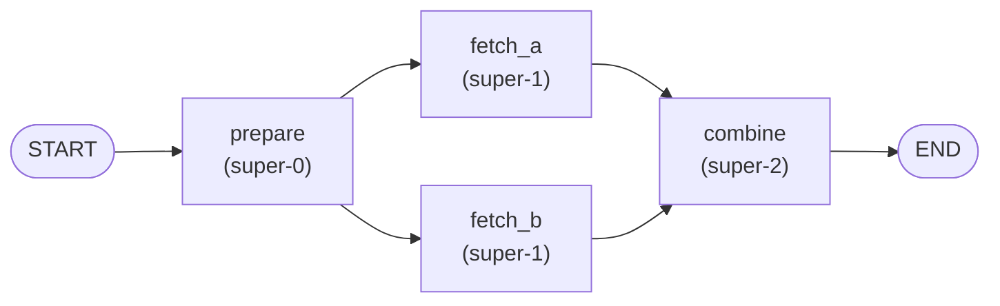
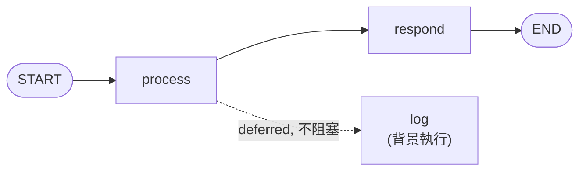
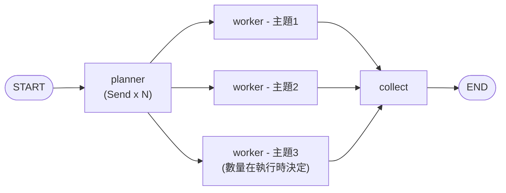
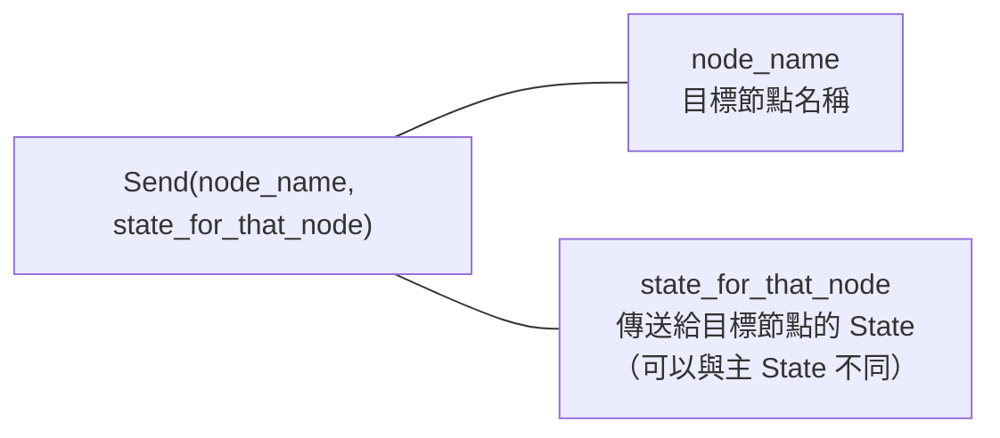
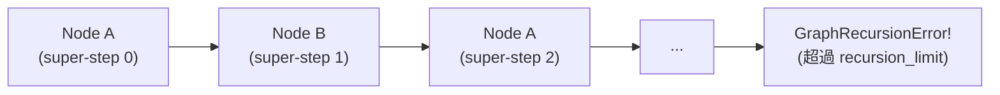

# 3.2 進階控制流程

## 目錄

1. [平行執行（Parallel Nodes）](#1-平行執行parallel-nodes)
2. [延遲執行（Deferred Nodes）](#2-延遲執行deferred-nodes)
3. [Map-Reduce 與 Send API](#3-map-reduce-與-send-api)
4. [遞迴限制（Recursion Limit）](#4-遞迴限制recursion-limit)
5. [重點摘要](#重點摘要)
6. [參考資源](#參考資源)

---

## 1. 平行執行（Parallel Nodes）

### 概念

在 LangGraph 中，當一個節點有**多條出邊**指向不同的目標節點時，這些目標節點會在**同一個 super-step 中平行執行**。這是 Pregel 執行模型的核心特性。

平行執行的兩種實現方式：
1. **多條固定邊**：一個節點用 `add_edge` 連接多個目標
2. **條件邊回傳列表**：路由函數回傳多個節點名稱

### 流程圖



### 完整範例：平行資料擷取

```python
from typing import Annotated
from typing_extensions import TypedDict
from langgraph.graph import StateGraph, START, END
import operator
import time


# 1. 定義 State
# 使用 Annotated + operator.add 作為 reducer，讓多個平行節點的結果合併
class FetchState(TypedDict):
    query: str
    results: Annotated[list[str], operator.add]  # 平行節點的結果會合併
    timing: Annotated[list[str], operator.add]


# 2. 定義 Node 函數
def prepare(state: FetchState) -> dict:
    """準備階段"""
    print(f"[prepare] 收到查詢: '{state['query']}'")
    return {"timing": [f"prepare: 開始"]}


def fetch_database(state: FetchState) -> dict:
    """從資料庫擷取（模擬）"""
    time.sleep(0.1)  # 模擬延遲
    result = f"DB 結果：找到 '{state['query']}' 的 3 筆記錄"
    print(f"[fetch_database] {result}")
    return {"results": [result], "timing": ["fetch_database: 完成"]}


def fetch_api(state: FetchState) -> dict:
    """從外部 API 擷取（模擬）"""
    time.sleep(0.1)  # 模擬延遲
    result = f"API 結果：'{state['query']}' 的即時資料"
    print(f"[fetch_api] {result}")
    return {"results": [result], "timing": ["fetch_api: 完成"]}


def fetch_cache(state: FetchState) -> dict:
    """從快取擷取（模擬）"""
    result = f"快取結果：'{state['query']}' 的歷史資料"
    print(f"[fetch_cache] {result}")
    return {"results": [result], "timing": ["fetch_cache: 完成"]}


def combine(state: FetchState) -> dict:
    """合併所有來源的結果"""
    print(f"[combine] 合併 {len(state['results'])} 個結果")
    return {"timing": [f"combine: 合併了 {len(state['results'])} 個結果"]}


# 3. 建構 Graph（平行分支）
builder = StateGraph(FetchState)
builder.add_node("prepare", prepare)
builder.add_node("fetch_database", fetch_database)
builder.add_node("fetch_api", fetch_api)
builder.add_node("fetch_cache", fetch_cache)
builder.add_node("combine", combine)

# prepare 同時連接三個 fetch 節點 → 平行執行
builder.add_edge(START, "prepare")
builder.add_edge("prepare", "fetch_database")
builder.add_edge("prepare", "fetch_api")
builder.add_edge("prepare", "fetch_cache")

# 三個 fetch 都連到 combine → 全部完成後才執行 combine
builder.add_edge("fetch_database", "combine")
builder.add_edge("fetch_api", "combine")
builder.add_edge("fetch_cache", "combine")

builder.add_edge("combine", END)

graph = builder.compile()

# 4. 執行
result = graph.invoke({
    "query": "LangGraph",
    "results": [],
    "timing": [],
})

print(f"\n=== 結果 ===")
for r in result["results"]:
    print(f"  - {r}")
print(f"\n執行順序:")
for t in result["timing"]:
    print(f"  - {t}")

# [prepare] 收到查詢: 'LangGraph'
# [fetch_database] DB 結果：找到 'LangGraph' 的 3 筆記錄
# [fetch_api] API 結果：'LangGraph' 的即時資料
# [fetch_cache] 快取結果：'LangGraph' 的歷史資料
# [combine] 合併 3 個結果
#
# === 結果 ===
#   - DB 結果：找到 'LangGraph' 的 3 筆記錄
#   - API 結果：'LangGraph' 的即時資料
#   - 快取結果：'LangGraph' 的歷史資料
#
# 執行順序:
#   - prepare: 開始
#   - fetch_database: 完成
#   - fetch_api: 完成
#   - fetch_cache: 完成
#   - combine: 合併了 3 個結果
```

> 📄 完整範例程式碼：[3.2-example-parallel-fetch.py](./3.2-example-parallel-fetch.py)

### 平行執行的關鍵

> **重要**：平行節點寫入同一個 State key 時，**必須使用 reducer**（例如 `Annotated[list, operator.add]`），否則後寫入的值會覆蓋先寫入的值，導致資料遺失。

---

## 2. 延遲執行（Deferred Nodes）

### 概念

延遲節點（Deferred Nodes）是一種特殊的平行執行模式。標記為 `deferred=True` 的節點會在**背景執行**，不會阻塞圖的主流程。主圖不會等待延遲節點完成就繼續往下走。

這適用於不影響主要結果的副作用操作，例如：日誌記錄、通知發送、分析追蹤等。

### 流程圖



### 完整範例：主流程 + 背景日誌

```python
from typing import Annotated
from typing_extensions import TypedDict
from langgraph.graph import StateGraph, START, END
import operator


# 1. 定義 State
class TaskState(TypedDict):
    input_data: str
    processed: str
    response: str
    logs: Annotated[list[str], operator.add]


# 2. 定義 Node 函數
def process_data(state: TaskState) -> dict:
    """主要處理邏輯"""
    processed = state["input_data"].upper()
    print(f"[process_data] 處理: '{state['input_data']}' -> '{processed}'")
    return {"processed": processed}


def log_activity(state: TaskState) -> dict:
    """背景日誌記錄（延遲節點）"""
    log_entry = f"已處理資料: '{state['input_data']}'"
    print(f"[log_activity] (背景) 記錄: {log_entry}")
    return {"logs": [log_entry]}


def generate_response(state: TaskState) -> dict:
    """產生回應"""
    response = f"處理完成: {state['processed']}"
    print(f"[generate_response] {response}")
    return {"response": response}


# 3. 建構 Graph
builder = StateGraph(TaskState)
builder.add_node("process_data", process_data)
builder.add_node("log_activity", log_activity, deferred=True)  # 延遲節點
builder.add_node("generate_response", generate_response)

builder.add_edge(START, "process_data")
builder.add_edge("process_data", "log_activity")
builder.add_edge("process_data", "generate_response")
builder.add_edge("generate_response", END)

graph = builder.compile()

# 4. 執行
result = graph.invoke({
    "input_data": "hello langgraph",
    "processed": "",
    "response": "",
    "logs": [],
})

print(f"\n回應: {result['response']}")
print(f"日誌: {result['logs']}")

# [process_data] 處理: 'hello langgraph' -> 'HELLO LANGGRAPH'
# [generate_response] 處理完成: HELLO LANGGRAPH
# [log_activity] (背景) 記錄: 已處理資料: 'hello langgraph'
#
# 回應: 處理完成: HELLO LANGGRAPH
# 日誌: ['已處理資料: hello langgraph']
```

> 📄 完整範例程式碼：[3.2-example-deferred-node.py](./3.2-example-deferred-node.py)

> **注意**：延遲節點的結果**不會**出現在 `invoke()` 回傳的 State 中（因為主圖已經跑完了）。如果你需要延遲節點的結果，請使用 `stream()` 來觀察完整的執行流程。

---

## 3. Map-Reduce 與 Send API

### 概念

Map-Reduce 是一種強大的平行處理模式：

1. **Map 階段**：將一個工作拆分成多個子任務，平行處理
2. **Reduce 階段**：收集所有子任務的結果，合併成最終輸出

在 LangGraph 中，使用 `Send` API 來實現動態平行。`Send` 的關鍵特性：
- 可以**動態決定**平行分支的數量（不需要事先定義邊）
- 每個分支可以接收**不同的 State**
- 從條件邊的路由函數中回傳 `Send` 物件列表

### 流程圖



### 完整範例：平行文章產生器

```python
from typing import Annotated
from typing_extensions import TypedDict
from langgraph.graph import StateGraph, START, END
from langgraph.types import Send
import operator


# 1. 定義 State
class OverallState(TypedDict):
    topics: list[str]
    articles: Annotated[list[str], operator.add]
    final_report: str


# Worker 節點接收的 State（與主 State 不同）
class WorkerState(TypedDict):
    topic: str


# 2. 定義 Node 函數
def planner(state: OverallState) -> dict:
    """規劃階段：決定要處理哪些主題"""
    topics = state["topics"]
    print(f"[planner] 規劃 {len(topics)} 個主題: {topics}")
    return {}  # topics 已在輸入中，不需更新


def generate_article(state: WorkerState) -> dict:
    """Worker：為單一主題產生文章（Map 階段）"""
    topic = state["topic"]
    article = f"【{topic}】這是關於 {topic} 的深度分析文章，探討了核心概念與實際應用。"
    print(f"[generate_article] 產生文章: {topic}")
    return {"articles": [article]}


def collect_results(state: OverallState) -> dict:
    """收集階段：合併所有文章（Reduce 階段）"""
    articles = state["articles"]
    report = f"報告摘要：共 {len(articles)} 篇文章\n"
    for i, article in enumerate(articles, 1):
        report += f"  {i}. {article[:30]}...\n"
    print(f"[collect_results] 合併 {len(articles)} 篇文章")
    return {"final_report": report}


# 3. 定義 Send 路由函數
def distribute_to_workers(state: OverallState):
    """動態產生 Send 物件，每個主題一個 worker"""
    return [
        Send("generate_article", {"topic": topic})
        for topic in state["topics"]
    ]


# 4. 建構 Graph
builder = StateGraph(OverallState)
builder.add_node("planner", planner)
builder.add_node("generate_article", generate_article)
builder.add_node("collect_results", collect_results)

builder.add_edge(START, "planner")

# 使用條件邊 + Send 實現動態平行
builder.add_conditional_edges("planner", distribute_to_workers, ["generate_article"])

builder.add_edge("generate_article", "collect_results")
builder.add_edge("collect_results", END)

graph = builder.compile()

# 5. 執行
result = graph.invoke({
    "topics": ["LangGraph 基礎", "State 管理", "控制流設計", "多 Agent 架構"],
    "articles": [],
    "final_report": "",
})

print(f"\n=== 最終報告 ===")
print(result["final_report"])
print(f"文章數量: {len(result['articles'])}")

# [planner] 規劃 4 個主題: ['LangGraph 基礎', 'State 管理', '控制流設計', '多 Agent 架構']
# [generate_article] 產生文章: LangGraph 基礎
# [generate_article] 產生文章: State 管理
# [generate_article] 產生文章: 控制流設計
# [generate_article] 產生文章: 多 Agent 架構
# [collect_results] 合併 4 篇文章
#
# === 最終報告 ===
# 報告摘要：共 4 篇文章
#   1. 【LangGraph 基礎】這是關於 LangGraph...
#   2. 【State 管理】這是關於 State 管理的深...
#   3. 【控制流設計】這是關於 控制流設計的深度分...
#   4. 【多 Agent 架構】這是關於 多 Agent ...
#
# 文章數量: 4
```

> 📄 完整範例程式碼：[3.2-example-map-reduce.py](./3.2-example-map-reduce.py)

### Send API 核心概念



| 特性 | 說明 |
|------|------|
| **動態數量** | Send 列表的長度在執行時決定，不需事先宣告邊 |
| **獨立 State** | 每個 Send 可以傳送不同的 State 給目標節點 |
| **平行執行** | 所有 Send 目標在同一 super-step 中平行執行 |
| **結果合併** | 目標節點的輸出透過 reducer 合併回主 State |

---

## 4. 遞迴限制（Recursion Limit）

### 概念

遞迴限制（`recursion_limit`）設定了圖在一次執行中能經過的**最大 super-step 數量**。這是防止無限迴圈的安全機制。

- **預設值**：1000（從 LangGraph v1.0.6 開始）
- 超過限制時拋出 `GraphRecursionError`
- 透過 `config` 傳遞，注意**不是**放在 `configurable` 裡面

### 流程圖：遞迴限制的運作



### 完整範例：設定與處理遞迴限制

```python
from typing_extensions import TypedDict
from langgraph.graph import StateGraph, START, END
from langgraph.errors import GraphRecursionError


# 1. 定義 State
class CounterState(TypedDict):
    count: int
    max_count: int


# 2. 定義 Node
def increment(state: CounterState) -> dict:
    new_count = state["count"] + 1
    return {"count": new_count}


def check_done(state: CounterState) -> str:
    if state["count"] >= state["max_count"]:
        return "done"
    return "continue"


# 3. 建構有迴圈的 Graph
builder = StateGraph(CounterState)
builder.add_node("increment", increment)

builder.add_edge(START, "increment")
builder.add_conditional_edges(
    "increment",
    check_done,
    {"continue": "increment", "done": END}
)

graph = builder.compile()


# === 範例 1：正常執行（在限制內）===
print("=== 範例 1：正常執行 ===")
result = graph.invoke(
    {"count": 0, "max_count": 5},
    config={"recursion_limit": 10}
)
print(f"最終 count: {result['count']}")
# 最終 count: 5


# === 範例 2：觸發遞迴限制 ===
print("\n=== 範例 2：觸發遞迴限制 ===")
try:
    result = graph.invoke(
        {"count": 0, "max_count": 100},
        config={"recursion_limit": 5}  # 故意設很低
    )
except GraphRecursionError as e:
    print(f"捕捉到 GraphRecursionError: {e}")
    print("提示：增加 recursion_limit 或檢查迴圈邏輯")

# 捕捉到 GraphRecursionError: Recursion limit of 5 reached without hitting a stop condition...
# 提示：增加 recursion_limit 或檢查迴圈邏輯
```

> 📄 完整範例程式碼：[3.2-example-recursion-limit.py](./3.2-example-recursion-limit.py)

### 主動式遞迴處理（使用 RemainingSteps）

與其被動地等到 `GraphRecursionError` 爆發，更好的做法是使用 `RemainingSteps` 主動監控剩餘步數：

```python
from typing import Annotated
from typing_extensions import TypedDict
from langgraph.graph import StateGraph, START, END
from langgraph.managed import RemainingSteps


# 1. 定義 State（包含 RemainingSteps）
class SmartState(TypedDict):
    messages: Annotated[list[str], lambda x, y: x + y]
    remaining_steps: RemainingSteps  # 由 LangGraph 自動管理


# 2. 定義 Node
def agent_node(state: SmartState) -> dict:
    """Agent 節點：監控剩餘步數"""
    remaining = state["remaining_steps"]
    step_msg = f"處理中... (剩餘步數: {remaining})"
    print(f"[agent_node] {step_msg}")

    if remaining <= 2:
        # 剩餘步數不夠，提早收尾
        return {"messages": ["接近限制，提供目前最佳結果。"]}

    return {"messages": [step_msg]}


def route_decision(state: SmartState) -> str:
    """基於剩餘步數決定是否繼續"""
    if state["remaining_steps"] <= 2:
        return END
    # 模擬：有 messages 超過 3 條就停止
    if len(state["messages"]) >= 3:
        return END
    return "agent_node"


# 3. 建構 Graph
builder = StateGraph(SmartState)
builder.add_node("agent_node", agent_node)

builder.add_edge(START, "agent_node")
builder.add_conditional_edges("agent_node", route_decision)

graph = builder.compile()

# 4. 執行：設定較低的 recursion_limit 來觀察效果
result = graph.invoke(
    {"messages": []},
    config={"recursion_limit": 8}
)

print(f"\n最終 messages:")
for msg in result["messages"]:
    print(f"  - {msg}")

# [agent_node] 處理中... (剩餘步數: 7)
# [agent_node] 處理中... (剩餘步數: 5)
# [agent_node] 處理中... (剩餘步數: 3)
#
# 最終 messages:
#   - 處理中... (剩餘步數: 7)
#   - 處理中... (剩餘步數: 5)
#   - 處理中... (剩餘步數: 3)
```

> 📄 完整範例程式碼：[3.2-example-remaining-steps.py](./3.2-example-remaining-steps.py)

### 主動 vs 被動處理比較

| 方法 | 偵測時機 | 處理方式 | 優點 |
|------|---------|---------|------|
| **被動（try/except）** | 超過限制後 | 外部 catch `GraphRecursionError` | 實現簡單 |
| **主動（RemainingSteps）** | 接近限制前 | 圖內部 graceful degradation | 體驗更好、可保存中間結果 |

---

## 重點摘要

| 控制流模式 | 實現方式 | 適用場景 |
|-----------|---------|---------|
| **平行執行** | 一個節點連多條 `add_edge` 到不同目標 | 同時擷取多個資料來源 |
| **延遲執行** | `add_node(name, fn, deferred=True)` | 不影響主流程的副作用（日誌、通知） |
| **Map-Reduce** | 條件邊回傳 `Send` 物件列表 | 動態數量的平行子任務 |
| **遞迴限制** | `config={"recursion_limit": N}` | 防止無限迴圈 |
| **RemainingSteps** | State 中加入 `RemainingSteps` managed value | 主動監控步數、優雅收尾 |

---

## 參考資源

- [LangGraph Graph API — Send](https://langchain-ai.github.io/langgraph/concepts/graph_api/#send)
- [LangGraph Graph API — Recursion Limit](https://langchain-ai.github.io/langgraph/concepts/graph_api/#recursion-limit)
- [LangGraph How-to: Map-Reduce](https://langchain-ai.github.io/langgraph/how-tos/use-graph-api/#map-reduce-and-the-send-api)
- [LangGraph Managed Values — RemainingSteps](https://langchain-ai.github.io/langgraph/concepts/graph_api/#proactive-recursion-handling)
- [LangGraph Runtime（Pregel 模型）](https://langchain-ai.github.io/langgraph/concepts/pregel/)
