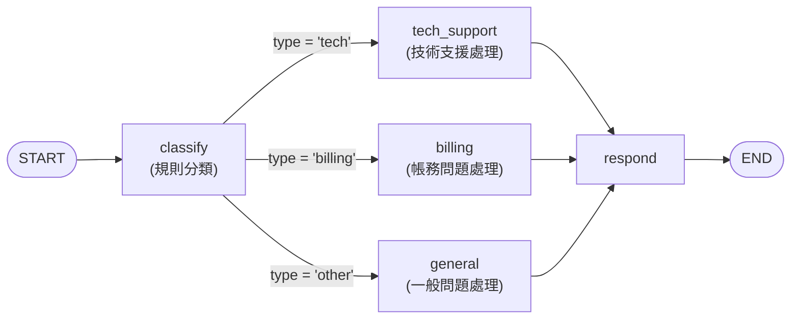
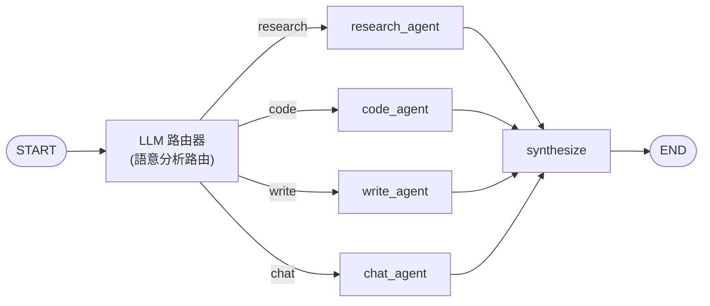

# 3.3 Router 路由模式

## 目錄

1. [基於條件的路由](#1-基於條件的路由)
2. [LLM 驅動的動態路由](#2-llm-驅動的動態路由)
3. [重點摘要](#重點摘要)
4. [參考資源](#參考資源)

---

## 1. 基於條件的路由

### 概念

基於條件的路由是最基本的 Router 模式——使用**確定性的規則**（if/else、字典查找、正則表達式等）來決定將請求導向哪個節點。不需要呼叫 LLM，速度快且可預測。

在 LangGraph 中，有兩種實現方式：
1. **`add_conditional_edges`**：透過路由函數回傳目標節點名稱
2. **`Command`**：在節點內部同時更新 State 和控制路由

### 流程圖



### 完整範例：客服工單路由器

```python
from typing_extensions import TypedDict
from langgraph.graph import StateGraph, START, END


# 1. 定義 State
class TicketState(TypedDict):
    user_message: str
    ticket_type: str
    priority: str
    response: str


# 2. 定義 Node 函數
def classify_ticket(state: TicketState) -> dict:
    """基於關鍵字的規則分類"""
    msg = state["user_message"].lower()

    # 規則一：技術問題
    tech_keywords = ["bug", "error", "crash", "無法登入", "當機", "報錯", "壞了"]
    if any(kw in msg for kw in tech_keywords):
        ticket_type = "tech"
        priority = "high"
    # 規則二：帳務問題
    elif any(kw in msg for kw in ["帳單", "付款", "退款", "收費", "billing"]):
        ticket_type = "billing"
        priority = "medium"
    # 規則三：一般問題
    else:
        ticket_type = "general"
        priority = "low"

    print(f"[classify] 類型={ticket_type}, 優先級={priority}")
    return {"ticket_type": ticket_type, "priority": priority}


def handle_tech(state: TicketState) -> dict:
    """技術支援處理"""
    response = (
        f"[技術支援] 收到您的問題：'{state['user_message']}'\n"
        f"優先級：{state['priority']}\n"
        f"我們的工程團隊會在 2 小時內回覆您。"
    )
    print(f"[handle_tech] 處理技術問題")
    return {"response": response}


def handle_billing(state: TicketState) -> dict:
    """帳務問題處理"""
    response = (
        f"[帳務部門] 收到您的問題：'{state['user_message']}'\n"
        f"優先級：{state['priority']}\n"
        f"帳務專員會在 1 個工作天內回覆。"
    )
    print(f"[handle_billing] 處理帳務問題")
    return {"response": response}


def handle_general(state: TicketState) -> dict:
    """一般問題處理"""
    response = (
        f"[客服中心] 收到您的問題：'{state['user_message']}'\n"
        f"優先級：{state['priority']}\n"
        f"我們會盡快回覆您。"
    )
    print(f"[handle_general] 處理一般問題")
    return {"response": response}


def send_response(state: TicketState) -> dict:
    """發送回應"""
    print(f"[send_response] 回應已發送")
    return {}


# 3. 路由函數
def route_ticket(state: TicketState) -> str:
    """根據工單類型路由"""
    routes = {
        "tech": "handle_tech",
        "billing": "handle_billing",
        "general": "handle_general",
    }
    return routes.get(state["ticket_type"], "handle_general")


# 4. 建構 Graph
builder = StateGraph(TicketState)
builder.add_node("classify", classify_ticket)
builder.add_node("handle_tech", handle_tech)
builder.add_node("handle_billing", handle_billing)
builder.add_node("handle_general", handle_general)
builder.add_node("send_response", send_response)

builder.add_edge(START, "classify")
builder.add_conditional_edges(
    "classify",
    route_ticket,
    ["handle_tech", "handle_billing", "handle_general"]
)
builder.add_edge("handle_tech", "send_response")
builder.add_edge("handle_billing", "send_response")
builder.add_edge("handle_general", "send_response")
builder.add_edge("send_response", END)

graph = builder.compile()

# 5. 測試
test_cases = [
    "我的帳號無法登入，一直報錯",
    "上個月的帳單好像多收了費用",
    "請問你們的營業時間是幾點？",
]

for msg in test_cases:
    print(f"\n{'='*50}")
    print(f"使用者: {msg}")
    result = graph.invoke({
        "user_message": msg,
        "ticket_type": "",
        "priority": "",
        "response": "",
    })
    print(f"\n{result['response']}")

# ==================================================
# 使用者: 我的帳號無法登入，一直報錯
# [classify] 類型=tech, 優先級=high
# [handle_tech] 處理技術問題
# [send_response] 回應已發送
#
# [技術支援] 收到您的問題：'我的帳號無法登入，一直報錯'
# 優先級：high
# 我們的工程團隊會在 2 小時內回覆您。
#
# ==================================================
# 使用者: 上個月的帳單好像多收了費用
# [classify] 類型=billing, 優先級=medium
# [handle_billing] 處理帳務問題
# [send_response] 回應已發送
#
# [帳務部門] 收到您的問題：'上個月的帳單好像多收了費用'
# 優先級：medium
# 帳務專員會在 1 個工作天內回覆。
#
# ==================================================
# 使用者: 請問你們的營業時間是幾點？
# [classify] 類型=general, 優先級=low
# [handle_general] 處理一般問題
# [send_response] 回應已發送
#
# [客服中心] 收到您的問題：'請問你們的營業時間是幾點？'
# 優先級：low
# 我們會盡快回覆您。
```

> 📄 完整範例程式碼：[3.3-example-ticket-router.py](./3.3-example-ticket-router.py)

### 使用 Command 實現路由

除了 `add_conditional_edges`，也可以在節點中回傳 `Command` 來實現路由：

```python
from typing import Literal
from langgraph.types import Command


def classify_and_route(state: TicketState) -> Command[Literal["handle_tech", "handle_billing", "handle_general"]]:
    """分類 + 路由合二為一"""
    msg = state["user_message"].lower()

    if any(kw in msg for kw in ["bug", "error", "crash"]):
        return Command(
            update={"ticket_type": "tech", "priority": "high"},
            goto="handle_tech",
        )
    elif any(kw in msg for kw in ["帳單", "付款", "退款"]):
        return Command(
            update={"ticket_type": "billing", "priority": "medium"},
            goto="handle_billing",
        )
    else:
        return Command(
            update={"ticket_type": "general", "priority": "low"},
            goto="handle_general",
        )
```

> **`Command` vs `add_conditional_edges` 選擇指南**：
> - 如果你需要**同時更新 State 和路由**，用 `Command`
> - 如果你只需要**純路由**（不更新 State），用 `add_conditional_edges`

---

## 2. LLM 驅動的動態路由

### 概念

當路由邏輯太複雜、無法用簡單規則表達時，可以讓 **LLM 來做路由決策**。LLM 根據使用者輸入的語意來判斷應該走哪條路徑。

常見的實現方式：
1. **結構化輸出（Structured Output）**：讓 LLM 回傳固定格式的分類結果
2. **工具呼叫（Tool Calling）**：讓 LLM 選擇要呼叫的「工具」，每個工具對應一個路徑
3. **Prompt 引導**：在 prompt 中要求 LLM 回傳特定的分類標籤

### 流程圖



### 完整範例：模擬 LLM 路由器

以下範例模擬 LLM 的路由決策（不需要實際的 LLM API key）。在實際應用中，你會用真正的 LLM 來做分類。

```python
from typing import Literal
from typing_extensions import TypedDict
from langgraph.graph import StateGraph, START, END
from langgraph.types import Command


# 1. 定義 State
class RouterState(TypedDict):
    user_input: str
    route: str
    result: str


# 2. 模擬 LLM 路由器（實際應用中替換為真正的 LLM 呼叫）
def simulate_llm_classification(user_input: str) -> str:
    """
    模擬 LLM 對使用者輸入的分類。

    在實際應用中，這裡會是：
        response = llm.invoke([
            SystemMessage("你是一個路由器。根據使用者輸入，回傳以下分類之一：research, code, write, chat"),
            HumanMessage(user_input)
        ])
        return response.content.strip()

    或使用 structured output：
        class RouteDecision(BaseModel):
            route: Literal["research", "code", "write", "chat"]
            reasoning: str

        response = llm.with_structured_output(RouteDecision).invoke(...)
        return response.route
    """
    input_lower = user_input.lower()

    # 模擬語意分析
    if any(w in input_lower for w in ["研究", "分析", "比較", "調查", "search", "research"]):
        return "research"
    elif any(w in input_lower for w in ["程式", "code", "寫程式", "python", "javascript", "debug"]):
        return "code"
    elif any(w in input_lower for w in ["寫", "文章", "草稿", "翻譯", "write", "draft"]):
        return "write"
    else:
        return "chat"


# 3. 定義 Node 函數
def llm_router(state: RouterState) -> Command[Literal["research_agent", "code_agent", "write_agent", "chat_agent"]]:
    """LLM 驅動的路由節點"""
    route = simulate_llm_classification(state["user_input"])
    print(f"[llm_router] 輸入='{state['user_input']}' -> 路由='{route}'")

    route_map = {
        "research": "research_agent",
        "code": "code_agent",
        "write": "write_agent",
        "chat": "chat_agent",
    }
    return Command(
        update={"route": route},
        goto=route_map[route],
    )


def research_agent(state: RouterState) -> dict:
    """研究 Agent"""
    result = f"[研究 Agent] 已完成對 '{state['user_input']}' 的研究分析，找到 5 篇相關論文。"
    print(f"[research_agent] 執行研究任務")
    return {"result": result}


def code_agent(state: RouterState) -> dict:
    """程式 Agent"""
    result = f"[程式 Agent] 已為 '{state['user_input']}' 產生程式碼解決方案。"
    print(f"[code_agent] 執行程式任務")
    return {"result": result}


def write_agent(state: RouterState) -> dict:
    """寫作 Agent"""
    result = f"[寫作 Agent] 已完成 '{state['user_input']}' 的文章草稿。"
    print(f"[write_agent] 執行寫作任務")
    return {"result": result}


def chat_agent(state: RouterState) -> dict:
    """聊天 Agent"""
    result = f"[聊天 Agent] 很高興和您聊天！關於 '{state['user_input']}'，讓我來回答。"
    print(f"[chat_agent] 執行聊天任務")
    return {"result": result}


# 4. 建構 Graph
builder = StateGraph(RouterState)
builder.add_node("llm_router", llm_router)
builder.add_node("research_agent", research_agent)
builder.add_node("code_agent", code_agent)
builder.add_node("write_agent", write_agent)
builder.add_node("chat_agent", chat_agent)

builder.add_edge(START, "llm_router")
# Command 的型別標註已告知 LangGraph 可能的路由目標，不需 add_conditional_edges
builder.add_edge("research_agent", END)
builder.add_edge("code_agent", END)
builder.add_edge("write_agent", END)
builder.add_edge("chat_agent", END)

graph = builder.compile()

# 5. 測試不同輸入
test_inputs = [
    "幫我研究一下 LangGraph 和 AutoGen 的比較",
    "寫一個 Python 的快速排序程式",
    "幫我寫一篇關於 AI Agent 的文章草稿",
    "今天天氣真好",
]

for user_input in test_inputs:
    print(f"\n{'='*60}")
    result = graph.invoke({
        "user_input": user_input,
        "route": "",
        "result": "",
    })
    print(f"路由: {result['route']}")
    print(f"結果: {result['result']}")

# ============================================================
# [llm_router] 輸入='幫我研究一下 LangGraph 和 AutoGen 的比較' -> 路由='research'
# [research_agent] 執行研究任務
# 路由: research
# 結果: [研究 Agent] 已完成對 '幫我研究一下 LangGraph 和 AutoGen 的比較' 的研究分析，找到 5 篇相關論文。
#
# ============================================================
# [llm_router] 輸入='寫一個 Python 的快速排序程式' -> 路由='code'
# [code_agent] 執行程式任務
# 路由: code
# 結果: [程式 Agent] 已為 '寫一個 Python 的快速排序程式' 產生程式碼解決方案。
#
# ============================================================
# [llm_router] 輸入='幫我寫一篇關於 AI Agent 的文章草稿' -> 路由='write'
# [write_agent] 執行寫作任務
# 路由: write
# 結果: [寫作 Agent] 已完成 '幫我寫一篇關於 AI Agent 的文章草稿' 的文章草稿。
#
# ============================================================
# [llm_router] 輸入='今天天氣真好' -> 路由='chat'
# [chat_agent] 執行聊天任務
# 路由: chat
# 結果: [聊天 Agent] 很高興和您聊天！關於 '今天天氣真好'，讓我來回答。
```

> 📄 完整範例程式碼：[3.3-example-llm-router.py](./3.3-example-llm-router.py)

### 進階：多路由平行分發（使用 Send）

當一個請求需要同時交給多個 Agent 處理時，使用 `Send` 實現平行路由：

```python
from typing import Annotated
from typing_extensions import TypedDict
from langgraph.graph import StateGraph, START, END
from langgraph.types import Send
import operator


# 1. 定義 State
class MultiRouterState(TypedDict):
    query: str
    selected_agents: list[str]
    results: Annotated[list[str], operator.add]
    final_answer: str


class AgentInput(TypedDict):
    query: str
    agent_name: str


# 2. 模擬 LLM 多路由決策
def simulate_llm_multi_route(query: str) -> list[str]:
    """
    模擬 LLM 決定需要哪些 Agent。
    實際應用中，LLM 可能回傳：
    {"agents": ["research", "code"], "reasoning": "這個問題需要研究+寫程式"}
    """
    query_lower = query.lower()
    agents = []
    if any(w in query_lower for w in ["研究", "分析", "比較"]):
        agents.append("research")
    if any(w in query_lower for w in ["程式", "code", "python"]):
        agents.append("code")
    if any(w in query_lower for w in ["寫", "文章", "報告"]):
        agents.append("write")
    return agents if agents else ["chat"]


# 3. 定義 Node 函數
def multi_router(state: MultiRouterState) -> dict:
    """多路由決策節點"""
    agents = simulate_llm_multi_route(state["query"])
    print(f"[multi_router] 查詢='{state['query']}' -> 分派給: {agents}")
    return {"selected_agents": agents}


def dispatch_agents(state: MultiRouterState):
    """Send 路由函數：動態分派到多個 Agent"""
    return [
        Send("agent_worker", {"query": state["query"], "agent_name": agent})
        for agent in state["selected_agents"]
    ]


def agent_worker(state: AgentInput) -> dict:
    """通用 Agent Worker"""
    agent = state["agent_name"]
    query = state["query"]
    result = f"[{agent}] 針對 '{query}' 的分析結果"
    print(f"[agent_worker:{agent}] 處理完成")
    return {"results": [result]}


def synthesize(state: MultiRouterState) -> dict:
    """合成所有 Agent 的結果"""
    results = state["results"]
    answer = f"綜合 {len(results)} 個 Agent 的結果：\n"
    for r in results:
        answer += f"  - {r}\n"
    print(f"[synthesize] 合成 {len(results)} 個結果")
    return {"final_answer": answer}


# 4. 建構 Graph
builder = StateGraph(MultiRouterState)
builder.add_node("multi_router", multi_router)
builder.add_node("agent_worker", agent_worker)
builder.add_node("synthesize", synthesize)

builder.add_edge(START, "multi_router")
builder.add_conditional_edges("multi_router", dispatch_agents, ["agent_worker"])
builder.add_edge("agent_worker", "synthesize")
builder.add_edge("synthesize", END)

graph = builder.compile()

# 5. 測試：一個請求觸發多個 Agent
result = graph.invoke({
    "query": "研究 Python 的非同步程式設計，並寫一篇分析報告",
    "selected_agents": [],
    "results": [],
    "final_answer": "",
})

print(f"\n=== 最終答案 ===")
print(result["final_answer"])

# [multi_router] 查詢='研究 Python 的非同步程式設計，並寫一篇分析報告' -> 分派給: ['research', 'code', 'write']
# [agent_worker:research] 處理完成
# [agent_worker:code] 處理完成
# [agent_worker:write] 處理完成
# [synthesize] 合成 3 個結果
#
# === 最終答案 ===
# 綜合 3 個 Agent 的結果：
#   - [research] 針對 '研究 Python 的非同步程式設計，並寫一篇分析報告' 的分析結果
#   - [code] 針對 '研究 Python 的非同步程式設計，並寫一篇分析報告' 的分析結果
#   - [write] 針對 '研究 Python 的非同步程式設計，並寫一篇分析報告' 的分析結果
```

> 📄 完整範例程式碼：[3.3-example-multi-router.py](./3.3-example-multi-router.py)

### Router 模式比較

| 路由方式 | 速度 | 靈活性 | 適用場景 |
|---------|------|--------|---------|
| **規則路由**（if/else、字典） | 極快（無 LLM 呼叫） | 低（需預定義規則） | 分類明確、類別固定 |
| **LLM 單路由**（Command） | 中等（一次 LLM 呼叫） | 高（語意理解） | 分類模糊、需要理解意圖 |
| **LLM 多路由**（Send） | 較慢（LLM + 平行執行） | 最高（多 Agent 協作） | 複雜查詢、需要多角度分析 |

### Stateless vs Stateful Router

| 特性 | Stateless Router（無狀態） | Stateful Router（有狀態） |
|------|--------------------------|--------------------------|
| 請求處理 | 每個請求獨立處理 | 維護對話歷史 |
| 上下文 | 不記住上下文 | 可基於歷史做路由決策 |
| 適用場景 | 適合一次性查詢 | 適合多輪對話 |
| 複雜度 | 實現簡單 | 需要 Checkpointer |

> **提示**：如果你需要 stateful router，最簡單的方式是將 stateless router 包裝成一個 tool，讓一個有 memory 的對話 Agent 來呼叫它。這樣 router 本身保持 stateless，由外層 Agent 管理狀態。

---

## 重點摘要

| 路由模式 | 實現方式 | 適用場景 |
|---------|---------|---------|
| **規則路由** | `add_conditional_edges` + if/else 路由函數 | 固定分類、快速路由 |
| **Command 路由** | 節點回傳 `Command(goto=...)` | 需要同時更新 State 和路由 |
| **LLM 單路由** | LLM 分類 + `Command` 導向單一 Agent | 語意模糊的分類任務 |
| **LLM 多路由** | LLM 分類 + `Send` 平行分派多個 Agent | 複雜查詢需多 Agent 協作 |
| **Stateful Router** | 搭配 Checkpointer 或包裝為 tool | 多輪對話場景 |

---

## 參考資源

- [LangGraph Router 模式](https://langchain-ai.github.io/langgraph/concepts/multi_agent/#router)
- [LangGraph Command 文件](https://langchain-ai.github.io/langgraph/concepts/graph_api/#command)
- [LangGraph Send API](https://langchain-ai.github.io/langgraph/concepts/graph_api/#send)
- [Build a multi-source knowledge base with routing](https://langchain-ai.github.io/langgraph/tutorials/router-knowledge-base/)
- [LangGraph Multi-Agent Patterns](https://langchain-ai.github.io/langgraph/concepts/multi_agent/)
