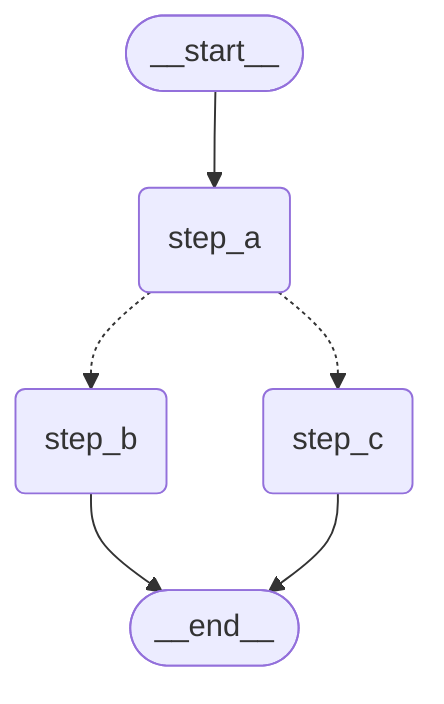

# 3.4 Graph 視覺化

## 目錄

1. [Mermaid 圖表輸出](#1-mermaid-圖表輸出)
2. [PNG 渲染](#2-png-渲染)
3. [重點摘要](#重點摘要)
4. [參考資源](#參考資源)

---

## 1. Mermaid 圖表輸出

### 概念

LangGraph 內建支援將編譯後的圖結構輸出為 [Mermaid](https://mermaid.js.org/) 格式的文字。Mermaid 是一種以純文字描述圖表的標記語言，支援流程圖、序列圖等多種圖表類型。

這個功能非常實用：
- **文件中嵌入圖表**：Mermaid 語法可直接在 GitHub、Notion、HackMD 等平台渲染
- **快速驗證結構**：確認你的圖是否如預期連接
- **除錯**：視覺化確認條件邊、平行分支是否正確

### API 概覽

```
graph.get_graph()              → 取得圖的結構物件（DrawableGraph）
graph.get_graph().draw_mermaid()    → 輸出 Mermaid 語法字串
graph.get_graph().draw_mermaid_png() → 輸出 PNG 圖片（見第 2 節）
```

### 完整範例：基本 Mermaid 輸出

```python
from typing_extensions import TypedDict
from langgraph.graph import StateGraph, START, END


# 1. 定義一個有條件分支的 Graph
class State(TypedDict):
    value: int
    result: str


def step_a(state: State) -> dict:
    return {"value": state["value"] + 1}


def step_b(state: State) -> dict:
    return {"result": "走了 B 路線"}


def step_c(state: State) -> dict:
    return {"result": "走了 C 路線"}


def route(state: State) -> str:
    if state["value"] > 5:
        return "step_b"
    return "step_c"


builder = StateGraph(State)
builder.add_node("step_a", step_a)
builder.add_node("step_b", step_b)
builder.add_node("step_c", step_c)

builder.add_edge(START, "step_a")
builder.add_conditional_edges("step_a", route, ["step_b", "step_c"])
builder.add_edge("step_b", END)
builder.add_edge("step_c", END)

graph = builder.compile()

# 2. 輸出 Mermaid 語法
mermaid_text = graph.get_graph().draw_mermaid()
print(mermaid_text)

# 輸出類似：
# %%{init: {'flowchart': {'curve': 'linear'}}}%%
# graph TD;
#     __start__([<p>__start__</p>]):::first
#     step_a(step_a)
#     step_b(step_b)
#     step_c(step_c)
#     __end__([<p>__end__</p>]):::last
#     __start__ --> step_a;
#     step_a -.-> step_b;
#     step_a -.-> step_c;
#     step_b --> __end__;
#     step_c --> __end__;
#     classDef default fill:#f2f0ff,line-height:1.2
#     classDef first fill-opacity:0
#     classDef last fill:#bfb6fc
```

> 📄 完整範例程式碼：[3.4-example-mermaid-basic.py](./3.4-example-mermaid-basic.py)

> **說明**：
> - `-->` 代表固定邊（Normal Edge）
> - `-.->` 代表條件邊（Conditional Edge），用虛線表示
> - `__start__` 和 `__end__` 是 LangGraph 的特殊虛擬節點

### 在 Markdown 中嵌入 Mermaid 圖表

你可以將輸出的 Mermaid 語法直接嵌入 Markdown 文件中：

````markdown

````

在 GitHub 或支援 Mermaid 的平台上，這段文字會自動渲染為流程圖。

### 完整範例：複雜圖的 Mermaid 輸出

```python
from typing import Annotated, Literal
from typing_extensions import TypedDict
from langgraph.graph import StateGraph, START, END
from langgraph.types import Command
import operator


# 一個包含迴圈、分支、平行的複雜圖
class ComplexState(TypedDict):
    messages: Annotated[list[str], operator.add]
    step_count: int


def entry_node(state: ComplexState) -> dict:
    return {"messages": ["進入"], "step_count": 0}


def process_a(state: ComplexState) -> dict:
    return {"messages": ["處理 A"]}


def process_b(state: ComplexState) -> dict:
    return {"messages": ["處理 B"]}


def check_node(state: ComplexState) -> Command[Literal["process_a", "__end__"]]:
    count = state["step_count"] + 1
    if count >= 3:
        return Command(update={"step_count": count}, goto=END)
    return Command(update={"step_count": count}, goto="process_a")


builder = StateGraph(ComplexState)
builder.add_node("entry_node", entry_node)
builder.add_node("process_a", process_a)
builder.add_node("process_b", process_b)
builder.add_node("check_node", check_node)

builder.add_edge(START, "entry_node")
# entry_node 同時連到 process_a 和 process_b（平行）
builder.add_edge("entry_node", "process_a")
builder.add_edge("entry_node", "process_b")
# 兩個分支都連到 check_node
builder.add_edge("process_a", "check_node")
builder.add_edge("process_b", "check_node")
# check_node 透過 Command 決定是迴圈還是結束

graph = builder.compile()

# 輸出 Mermaid
print("=== Mermaid 圖表 ===")
print(graph.get_graph().draw_mermaid())

# 也可以輸出為 ASCII（取得圖的節點和邊資訊）
print("\n=== 圖結構資訊 ===")
drawable = graph.get_graph()
print(f"節點: {list(drawable.nodes)}")
print(f"邊數: {len(drawable.edges)}")
for edge in drawable.edges:
    edge_type = "條件" if edge.conditional else "固定"
    print(f"  {edge.source} --({edge_type})--> {edge.target}")

# === 圖結構資訊 ===
# 節點: ['__start__', 'entry_node', 'process_a', 'process_b', 'check_node', '__end__']
# 邊數: 7
#   __start__ --(固定)--> entry_node
#   entry_node --(固定)--> process_a
#   entry_node --(固定)--> process_b
#   process_a --(固定)--> check_node
#   process_b --(固定)--> check_node
#   check_node --(條件)--> process_a
#   check_node --(條件)--> __end__
```

> 📄 完整範例程式碼：[3.4-example-mermaid-complex.py](./3.4-example-mermaid-complex.py)

### get_graph() 的參數

```python
# xray 參數：展開子圖的內部結構
# xray=False（預設）：子圖顯示為單一節點
# xray=True：展開子圖，顯示其內部節點和邊
drawable = graph.get_graph(xray=True)
```

---

## 2. PNG 渲染

### 概念

除了文字格式的 Mermaid 輸出，LangGraph 也支援直接渲染為 PNG 圖片。有兩種渲染方式：

| 方法 | 依賴 | 說明 |
|------|------|------|
| **Mermaid.Ink**（預設） | 無額外安裝（需網路） | 透過 Mermaid.Ink 的線上 API 渲染 |
| **Pyppeteer** | `pip install pyppeteer` | 本地 headless Chrome 渲染 |
| **Graphviz** | `pip install pygraphviz` + 系統安裝 Graphviz | 本地 Graphviz 引擎渲染 |

### 完整範例：PNG 輸出（Mermaid.Ink）

```python
from typing_extensions import TypedDict
from langgraph.graph import StateGraph, START, END


# 1. 建構一個範例 Graph
class MyState(TypedDict):
    input: str
    output: str


def node_a(state: MyState) -> dict:
    return {"output": "A 處理完成"}


def node_b(state: MyState) -> dict:
    return {"output": "B 處理完成"}


def route(state: MyState) -> str:
    if len(state["input"]) > 10:
        return "node_b"
    return END


builder = StateGraph(MyState)
builder.add_node("node_a", node_a)
builder.add_node("node_b", node_b)

builder.add_edge(START, "node_a")
builder.add_conditional_edges("node_a", route, ["node_b", END])
builder.add_edge("node_b", END)

graph = builder.compile()


# 2. 方法一：儲存為 PNG 檔案
graph.get_graph().draw_mermaid_png(output_file_path="my_graph.png")
print("圖片已儲存為 my_graph.png")


# 3. 方法二：取得 PNG 的 bytes（適合在 Jupyter Notebook 顯示）
png_bytes = graph.get_graph().draw_mermaid_png()
print(f"PNG 大小: {len(png_bytes)} bytes")

# 在 Jupyter Notebook 中顯示：
# from IPython.display import Image, display
# display(Image(png_bytes))
```

> 📄 完整範例程式碼：[3.4-example-png-output.py](./3.4-example-png-output.py)

### 完整範例：在 Jupyter Notebook 中顯示

```python
# === 適用於 Jupyter Notebook 環境 ===
from typing import Annotated
from typing_extensions import TypedDict
from langgraph.graph import StateGraph, START, END
import operator

# 使用 IPython 的 display 功能
from IPython.display import Image, display


class NoteState(TypedDict):
    notes: Annotated[list[str], operator.add]


def brainstorm(state: NoteState) -> dict:
    return {"notes": ["點子 1", "點子 2"]}


def evaluate(state: NoteState) -> dict:
    return {"notes": ["評估結果"]}


def finalize(state: NoteState) -> dict:
    return {"notes": ["最終版本"]}


builder = StateGraph(NoteState)
builder.add_node("brainstorm", brainstorm)
builder.add_node("evaluate", evaluate)
builder.add_node("finalize", finalize)

builder.add_edge(START, "brainstorm")
builder.add_edge("brainstorm", "evaluate")
builder.add_edge("evaluate", "finalize")
builder.add_edge("finalize", END)

graph = builder.compile()

# 在 Notebook 中直接顯示圖片
display(Image(graph.get_graph().draw_mermaid_png()))
```

### 使用 Pyppeteer 本地渲染

如果你不想依賴外部 API（Mermaid.Ink），可以使用 Pyppeteer 在本地渲染：

```python
# 安裝：pip install pyppeteer
# 或：uv add pyppeteer

from langgraph.graph import StateGraph, START, END
from typing_extensions import TypedDict


class SimpleState(TypedDict):
    value: str


def process(state: SimpleState) -> dict:
    return {"value": "done"}


builder = StateGraph(SimpleState)
builder.add_node("process", process)
builder.add_edge(START, "process")
builder.add_edge("process", END)

graph = builder.compile()

# 使用 pyppeteer 本地渲染
try:
    from langgraph.graph.graph import MermaidDrawMethod

    png_bytes = graph.get_graph().draw_mermaid_png(
        draw_method=MermaidDrawMethod.PYPPETEER
    )
    with open("graph_local.png", "wb") as f:
        f.write(png_bytes)
    print("使用 Pyppeteer 本地渲染成功！")
except ImportError:
    print("Pyppeteer 未安裝，請執行：pip install pyppeteer")
except Exception as e:
    print(f"渲染失敗：{e}")
```

### 實用技巧：開發時快速預覽圖結構

```python
def preview_graph(graph, name="graph"):
    """開發工具：快速預覽圖結構"""
    drawable = graph.get_graph()

    # 1. 印出 Mermaid（永遠可用）
    print(f"=== {name} Mermaid ===")
    print(drawable.draw_mermaid())

    # 2. 印出結構摘要
    print(f"\n=== {name} 結構 ===")
    nodes = [n for n in drawable.nodes if not n.startswith("__")]
    print(f"節點 ({len(nodes)}): {nodes}")

    edges = drawable.edges
    normal = [e for e in edges if not e.conditional]
    conditional = [e for e in edges if e.conditional]
    print(f"固定邊 ({len(normal)}): {[(e.source, e.target) for e in normal]}")
    print(f"條件邊 ({len(conditional)}): {[(e.source, e.target) for e in conditional]}")

    # 3. 嘗試儲存 PNG
    try:
        drawable.draw_mermaid_png(output_file_path=f"{name}.png")
        print(f"\n圖片已儲存: {name}.png")
    except Exception as e:
        print(f"\nPNG 儲存失敗（可忽略）: {e}")


# 使用
# preview_graph(graph, "my_workflow")
```

### 視覺化對照表

以下是 LangGraph 各種控制流在 Mermaid 圖表中的表現：

```
控制流模式              Mermaid 中的表現
─────────────────────────────────────────────────

線性序列                A --> B --> C
                       （實線箭頭）

條件分支                A -.-> B
                       A -.-> C
                       （虛線箭頭）

平行執行                A --> B
                       A --> C
                       （一個節點多條實線出邊）

迴圈                    A -.-> A
                       （虛線箭頭指回自己或前面的節點）

Command 路由            check -.-> node_a
                       check -.-> __end__
                       （Command 的 goto 顯示為虛線）
```

---

## 重點摘要

| 功能 | 方法 | 說明 |
|------|------|------|
| **取得圖結構** | `graph.get_graph()` | 回傳 `DrawableGraph` 物件 |
| **Mermaid 文字** | `graph.get_graph().draw_mermaid()` | 輸出 Mermaid 語法字串 |
| **PNG 圖片** | `graph.get_graph().draw_mermaid_png()` | 回傳 PNG bytes |
| **PNG 存檔** | `draw_mermaid_png(output_file_path="g.png")` | 直接儲存為檔案 |
| **展開子圖** | `graph.get_graph(xray=True)` | 顯示子圖內部結構 |
| **本地渲染** | `draw_mermaid_png(draw_method=MermaidDrawMethod.PYPPETEER)` | 不依賴外部 API |
| **Notebook 顯示** | `from IPython.display import Image, display` | Jupyter 中顯示 |

---

## 參考資源

- [LangGraph Visualization 概念文件](https://langchain-ai.github.io/langgraph/concepts/graph_api/#visualization)
- [LangGraph How-to: Visualize your graph](https://langchain-ai.github.io/langgraph/how-tos/use-graph-api/#visualize-your-graph)
- [Mermaid 官方文件](https://mermaid.js.org/)
- [Mermaid Live Editor](https://mermaid.live/) — 線上即時預覽 Mermaid 圖表
- [Pyppeteer GitHub](https://github.com/pyppeteer/pyppeteer)
