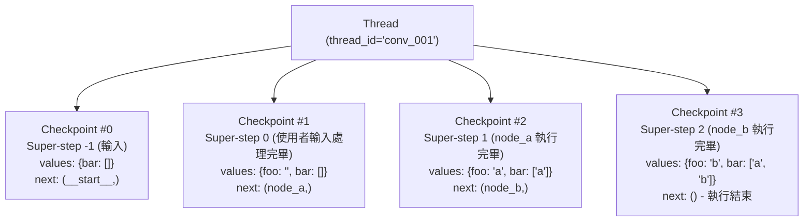
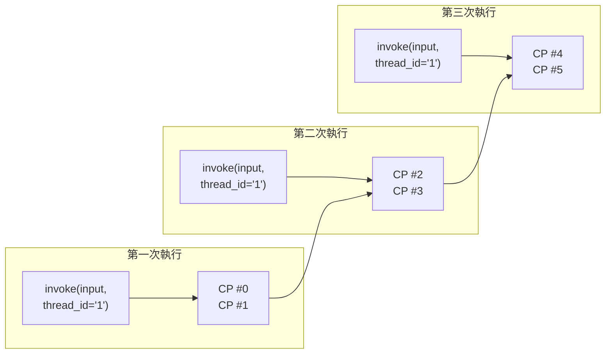
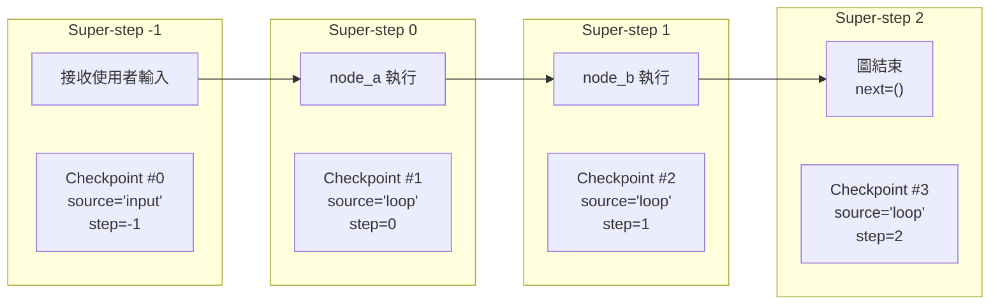
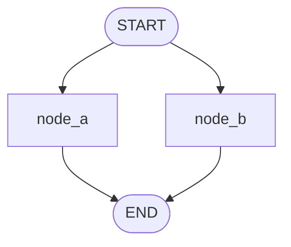
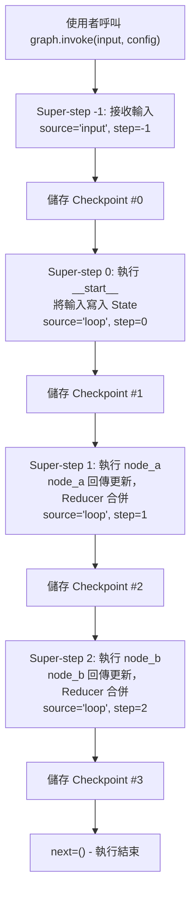

# 4.1 Checkpointing 概念

## 目錄

1. [總覽：持久化三大核心概念](#1-總覽持久化三大核心概念)
2. [Thread（對話/工作階段）](#2-thread對話工作階段)
3. [Checkpoint（State 快照）](#3-checkpointstate-快照)
4. [Super-step（單次執行 tick）](#4-super-step單次執行-tick)
5. [Checkpoint 與 Super-step 的完整流程](#5-checkpoint-與-super-step-的完整流程)
6. [完整範例：觀察 Checkpoint 的建立過程](#6-完整範例觀察-checkpoint-的建立過程)
7. [為什麼需要持久化？](#7-為什麼需要持久化)

---

## 1. 總覽：持久化三大核心概念

LangGraph 內建持久化層（Persistence Layer），在圖的每一步執行時自動儲存 State 快照。這個機制建立在三個核心概念之上：

| 概念 | 說明 |
|------|------|
| **Thread** | 對話/工作階段的唯一識別碼，一個 thread 包含多個 checkpoint，代表一次完整的對話或工作流程 |
| **Checkpoint** | 某個時間點的 State 快照（StateSnapshot），記錄圖在該時刻的完整狀態 |
| **Super-step** | 圖的一次「tick」——同一批被排程的節點全部執行完畢後，產生一個 checkpoint |

三者之間的層級關係：



---

## 2. Thread（對話/工作階段）

### 定義

Thread 是一個**唯一識別碼**（`thread_id`），用來標記一次完整的對話或工作階段。所有在同一個 thread 下的 checkpoint 會被串在一起，形成一條執行歷史鏈。

### 關鍵特性

- **隔離性**：不同的 `thread_id` 彼此完全獨立，互不干擾
- **連續性**：同一個 `thread_id` 下的多次 `invoke` 會接續上一次的 State
- **必要性**：使用 checkpointer 時，**必須**提供 `thread_id`，否則無法儲存或恢復 State

### 基本用法

```python
from langgraph.graph import StateGraph, START, END
from langgraph.checkpoint.memory import InMemorySaver
from typing import TypedDict, Annotated
from operator import add

# === 1. 定義 State ===
class ConversationState(TypedDict):
    messages: Annotated[list[str], add]

# === 2. 定義節點 ===
def echo_node(state: ConversationState) -> dict:
    last_msg = state["messages"][-1]
    return {"messages": [f"Echo: {last_msg}"]}

# === 3. 建構並編譯圖（帶 checkpointer） ===
builder = StateGraph(ConversationState)
builder.add_node("echo", echo_node)
builder.add_edge(START, "echo")
builder.add_edge("echo", END)

checkpointer = InMemorySaver()
graph = builder.compile(checkpointer=checkpointer)

# === 4. 使用 thread_id 進行對話 ===
# 第一次對話
config_thread1 = {"configurable": {"thread_id": "user_alice_001"}}
result1 = graph.invoke({"messages": ["你好"]}, config_thread1)
print(result1["messages"])
# 輸出: ['你好', 'Echo: 你好']

# 同一個 thread 繼續對話——會帶著之前的 State
result2 = graph.invoke({"messages": ["今天天氣如何？"]}, config_thread1)
print(result2["messages"])
# 輸出: ['你好', 'Echo: 你好', '今天天氣如何？', 'Echo: 今天天氣如何？']

# 不同 thread——全新的 State
config_thread2 = {"configurable": {"thread_id": "user_bob_002"}}
result3 = graph.invoke({"messages": ["嗨"]}, config_thread2)
print(result3["messages"])
# 輸出: ['嗨', 'Echo: 嗨']  ← 不包含 Alice 的訊息
```

> 📄 完整範例程式碼：[4.1-example-thread-basics.py](./4.1-example-thread-basics.py)

### Thread 的生命週期



---

## 3. Checkpoint（State 快照）

### 定義

Checkpoint 是圖在某個時間點的**完整 State 快照**。每當一個 super-step 完成，LangGraph 就會自動建立一個 checkpoint。Checkpoint 以 `StateSnapshot` 物件表示。

### StateSnapshot 的欄位

| 欄位 | 說明 |
|------|------|
| **values** | 該時間點的 State 各 channel 值 |
| **next** | 接下來要執行的節點名稱 tuple，空 `()` 代表結束 |
| **config** | 包含 thread_id、checkpoint_ns、checkpoint_id |
| **metadata** | 執行 metadata：source、writes、step |
| **created_at** | ISO 8601 時間戳 |
| **parent_config** | 上一個 checkpoint 的 config，首個 checkpoint 為 None |
| **tasks** | 該步驟要執行的任務 tuple，每個 task 有 id、name、error、interrupts 等屬性 |

### metadata.source 的三種值

| source 值 | 意義 | 說明 |
|-----------|------|------|
| `"input"` | 使用者輸入 | 圖收到外部輸入時建立的第一個 checkpoint（step = -1） |
| `"loop"` | 節點執行 | 每個 super-step 結束後建立的 checkpoint |
| `"update"` | 手動更新 | 透過 `update_state()` 建立的 checkpoint |

### 完整範例：檢視 Checkpoint 結構

```python
from langgraph.graph import StateGraph, START, END
from langgraph.checkpoint.memory import InMemorySaver
from typing import TypedDict, Annotated
from operator import add

# === 1. 定義 State ===
class State(TypedDict):
    foo: str
    bar: Annotated[list[str], add]

# === 2. 定義節點 ===
def node_a(state: State) -> dict:
    return {"foo": "a", "bar": ["a"]}

def node_b(state: State) -> dict:
    return {"foo": "b", "bar": ["b"]}

# === 3. 建構並編譯圖 ===
builder = StateGraph(State)
builder.add_node("node_a", node_a)
builder.add_node("node_b", node_b)
builder.add_edge(START, "node_a")
builder.add_edge("node_a", "node_b")
builder.add_edge("node_b", END)

checkpointer = InMemorySaver()
graph = builder.compile(checkpointer=checkpointer)

# === 4. 執行圖 ===
config = {"configurable": {"thread_id": "1"}}
result = graph.invoke({"foo": "", "bar": []}, config)

# === 5. 取得最新的 checkpoint ===
snapshot = graph.get_state(config)

print("=== 最新 Checkpoint ===")
print(f"values:        {snapshot.values}")
print(f"next:          {snapshot.next}")
print(f"checkpoint_id: {snapshot.config['configurable']['checkpoint_id']}")
print(f"source:        {snapshot.metadata['source']}")
print(f"step:          {snapshot.metadata['step']}")
print(f"writes:        {snapshot.metadata.get('writes', 'N/A')}")
print(f"created_at:    {snapshot.created_at}")
print(f"parent_config: {snapshot.parent_config}")
print(f"tasks:         {snapshot.tasks}")

# 預期輸出:
# === 最新 Checkpoint ===
# values:        {'foo': 'b', 'bar': ['a', 'b']}
# next:          ()
# checkpoint_id: 1ef663ba-28fe-6528-8002-...
# source:        loop
# step:          2
# writes:        {'node_b': {'foo': 'b', 'bar': ['b']}}
# created_at:    2024-08-29T19:19:38.821749+00:00
# parent_config: {'configurable': {'thread_id': '1', ...}}
# tasks:         ()
```

> 📄 完整範例程式碼：[4.1-example-checkpoint-inspection.py](./4.1-example-checkpoint-inspection.py)

---

## 4. Super-step（單次執行 tick）

### 定義

Super-step 是圖的一次「tick」（時間單位）。在一個 super-step 中，所有被排程的節點會**全部執行**（可能是平行的），執行完畢後產生一個 checkpoint。

### 循序圖的 Super-step

對於循序圖 `START -> A -> B -> END`，每個節點各自是一個 super-step：



### 平行圖的 Super-step

如果有平行分支，同一個 super-step 中的節點會**同時執行**：



> node_a 和 node_b 在同一個 Super-step 中同時執行，產生一個 Checkpoint。

### 為什麼 Super-step 很重要？

1. **Time Travel 的粒度**：你只能從 checkpoint（即 super-step 邊界）恢復執行
2. **容錯的粒度**：如果某個 super-step 中有節點失敗，成功的節點結果會被保留（pending writes）
3. **並行執行**：同一個 super-step 中的節點可以平行執行

---

## 5. Checkpoint 與 Super-step 的完整流程



---

## 6. 完整範例：觀察 Checkpoint 的建立過程

```python
from langgraph.graph import StateGraph, START, END
from langgraph.checkpoint.memory import InMemorySaver
from typing import TypedDict, Annotated
from operator import add

# === 1. 定義 State ===
class State(TypedDict):
    foo: str
    bar: Annotated[list[str], add]

# === 2. 定義節點 ===
def node_a(state: State) -> dict:
    print(f"  [node_a] 收到 state: foo={state['foo']}, bar={state['bar']}")
    return {"foo": "a", "bar": ["a"]}

def node_b(state: State) -> dict:
    print(f"  [node_b] 收到 state: foo={state['foo']}, bar={state['bar']}")
    return {"foo": "b", "bar": ["b"]}

# === 3. 建構並編譯圖 ===
builder = StateGraph(State)
builder.add_node("node_a", node_a)
builder.add_node("node_b", node_b)
builder.add_edge(START, "node_a")
builder.add_edge("node_a", "node_b")
builder.add_edge("node_b", END)

checkpointer = InMemorySaver()
graph = builder.compile(checkpointer=checkpointer)

# === 4. 執行圖 ===
config = {"configurable": {"thread_id": "1"}}
result = graph.invoke({"foo": "", "bar": []}, config)

# === 5. 遍歷所有 checkpoint ===
print("\n=== 所有 Checkpoint（從新到舊） ===\n")
for i, state in enumerate(graph.get_state_history(config)):
    print(f"--- Checkpoint #{len(list(graph.get_state_history(config))) - 1 - i} ---")
    print(f"  values:  {state.values}")
    print(f"  next:    {state.next}")
    print(f"  source:  {state.metadata['source']}")
    print(f"  step:    {state.metadata['step']}")
    print(f"  writes:  {state.metadata.get('writes', 'N/A')}")
    print()

# 預期輸出:
#   [node_a] 收到 state: foo=, bar=[]
#   [node_b] 收到 state: foo=a, bar=['a']
#
# === 所有 Checkpoint（從新到舊） ===
#
# --- Checkpoint #3 ---
#   values:  {'foo': 'b', 'bar': ['a', 'b']}
#   next:    ()
#   source:  loop
#   step:    2
#   writes:  {'node_b': {'foo': 'b', 'bar': ['b']}}
#
# --- Checkpoint #2 ---
#   values:  {'foo': 'a', 'bar': ['a']}
#   next:    ('node_b',)
#   source:  loop
#   step:    1
#   writes:  {'node_a': {'foo': 'a', 'bar': ['a']}}
#
# --- Checkpoint #1 ---
#   values:  {'foo': '', 'bar': []}
#   next:    ('node_a',)
#   source:  loop
#   step:    0
#   writes:  None
#
# --- Checkpoint #0 ---
#   values:  {'bar': []}
#   next:    ('__start__',)
#   source:  input
#   step:    -1
#   writes:  {'foo': ''}
```

> 📄 完整範例程式碼：[4.1-example-checkpoint-history.py](./4.1-example-checkpoint-history.py)

---

## 7. 為什麼需要持久化？

持久化是以下功能的基礎：

| 功能 | 為什麼需要 Checkpoint？ |
|------|------------------------|
| **Human-in-the-Loop** | 人類需要查看/修改 State，圖需要暫停後繼續執行 |
| **對話記憶 (Memory)** | 跨多次 invoke 保留對話歷史，透過同一 thread_id |
| **Time Travel** | 回到任一 checkpoint 重新執行或分支探索不同路徑 |
| **容錯 (Fault Tolerance)** | 節點失敗時，從最後成功的 checkpoint 恢復，不需重頭執行 |
| **Pending Writes** | 同一 super-step 中部分節點失敗時，成功的節點結果會被保留，恢復時不需重新執行成功的節點 |

### 沒有 Checkpointer vs. 有 Checkpointer

```python
from langgraph.graph import StateGraph, START, END
from langgraph.checkpoint.memory import InMemorySaver
from typing import TypedDict

class State(TypedDict):
    count: int

def increment(state: State) -> dict:
    return {"count": state["count"] + 1}

builder = StateGraph(State)
builder.add_node("increment", increment)
builder.add_edge(START, "increment")
builder.add_edge("increment", END)

# === 沒有 checkpointer：每次從頭開始 ===
graph_no_cp = builder.compile()
r1 = graph_no_cp.invoke({"count": 0})
print(r1)  # {'count': 1}
r2 = graph_no_cp.invoke({"count": 0})
print(r2)  # {'count': 1}  ← 每次都從 0 開始

# === 有 checkpointer：接續上次的 State ===
graph_with_cp = builder.compile(checkpointer=InMemorySaver())
config = {"configurable": {"thread_id": "counter_thread"}}

r1 = graph_with_cp.invoke({"count": 0}, config)
print(r1)  # {'count': 1}
r2 = graph_with_cp.invoke({"count": 0}, config)
print(r2)  # {'count': 2}  ← 接續上次的 count=1
r3 = graph_with_cp.invoke({"count": 0}, config)
print(r3)  # {'count': 3}  ← 接續上次的 count=2
```

> 📄 完整範例程式碼：[4.1-example-with-vs-without-checkpointer.py](./4.1-example-with-vs-without-checkpointer.py)

> **注意**：第二次 `invoke` 時傳入的 `{"count": 0}` 會被 checkpointer 中已儲存的 State 覆蓋。因為 `count` 沒有 reducer，所以使用 last-write-wins 策略——而 checkpointer 載入的最新值（`count=1`）會作為基準。

---

## 重點摘要

| 概念 | 一句話說明 | 關鍵要點 |
|------|-----------|---------|
| **Thread** | 對話/工作階段的唯一識別碼 | 透過 `{"configurable": {"thread_id": "..."}}` 指定 |
| **Checkpoint** | 某個 super-step 完成後的 State 快照 | 以 `StateSnapshot` 物件表示，包含 values、next、metadata |
| **Super-step** | 圖的一次 tick，同批節點全部執行完畢 | 每個 super-step 邊界產生一個 checkpoint |
| **StateSnapshot.next** | 接下來要執行的節點 | 空 tuple `()` 代表圖已完成 |
| **StateSnapshot.metadata** | 執行元資料 | `source` 區分 input/loop/update，`step` 追蹤第幾步 |

### 快速判斷指南

```
想要跨多次呼叫保留狀態？        → 使用 checkpointer + thread_id
想要查看目前的 State？         → graph.get_state(config)
想要查看所有歷史 State？       → graph.get_state_history(config)
想要從某個 checkpoint 恢復？   → 用該 checkpoint 的 config 呼叫 invoke
想要修改 State 後繼續？        → graph.update_state(config, values)
```

---

## 參考資源

- [LangGraph Persistence 概念文件](https://langchain-ai.github.io/langgraph/concepts/persistence/)
- [LangGraph Checkpointer API Reference](https://langchain-ai.github.io/langgraph/reference/checkpoints/)
- [LangGraph Time Travel 指南](https://langchain-ai.github.io/langgraph/how-tos/use-time-travel/)
- [LangGraph StateSnapshot API Reference](https://langchain-ai.github.io/langgraph/reference/types/#langgraph.types.StateSnapshot)
