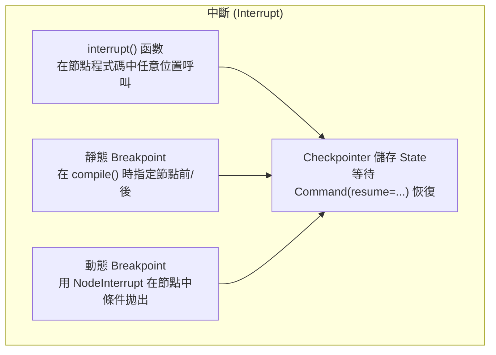
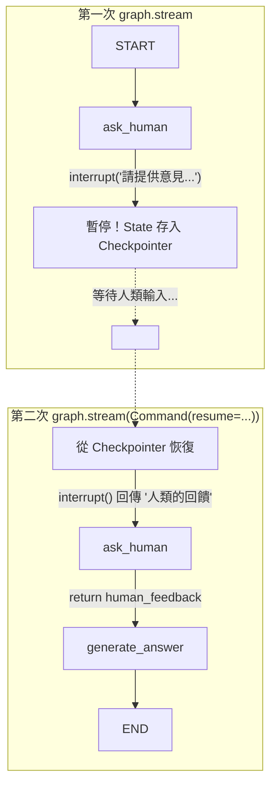
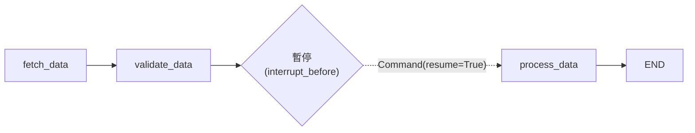
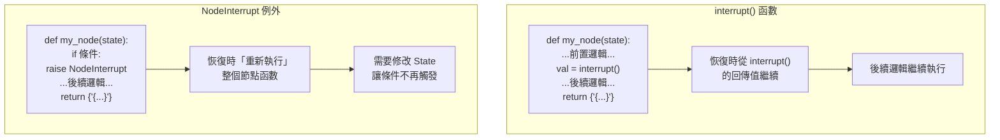
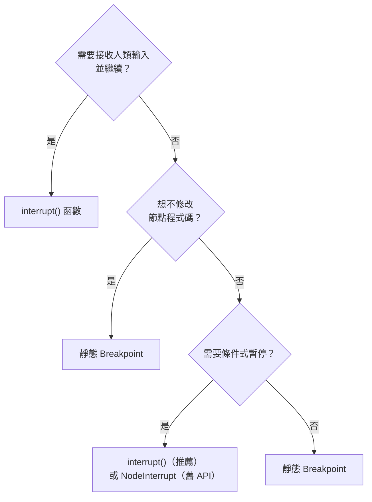
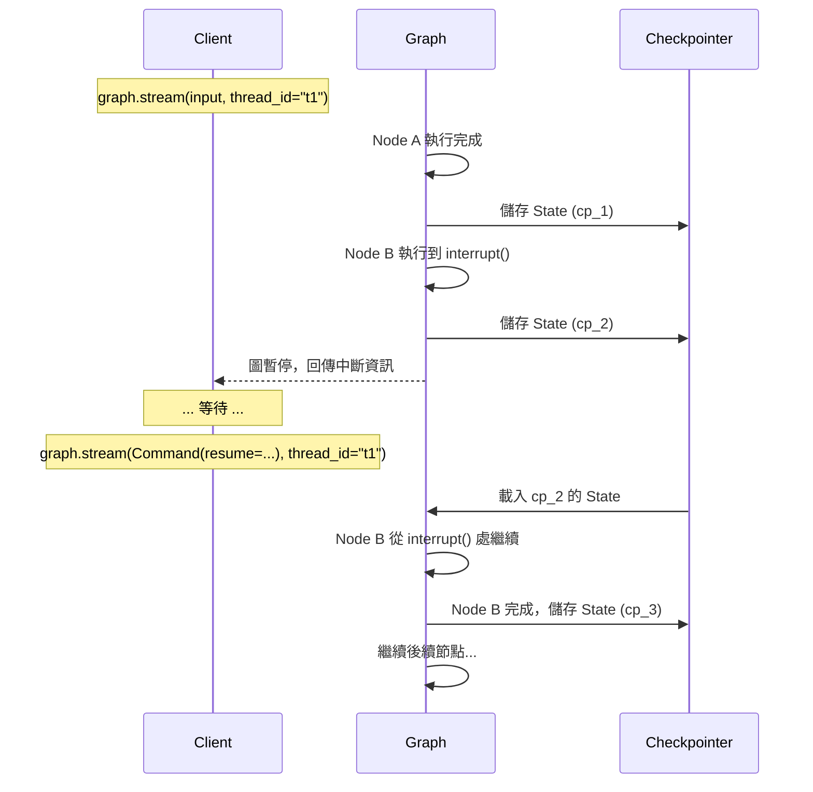

# 5.1 中斷機制 (Interrupt Mechanism)

## 目錄

1. [為什麼需要中斷？](#1-為什麼需要中斷)
2. [interrupt() 函數暫停執行](#2-interrupt-函數暫停執行)
3. [使用 Command 恢復執行](#3-使用-command-恢復執行)
4. [靜態 Breakpoint](#4-靜態-breakpoint)
5. [動態 Breakpoint](#5-動態-breakpoint)
6. [三種中斷方式的比較](#6-三種中斷方式的比較)
7. [中斷的運作原理](#7-中斷的運作原理)

---

## 1. 為什麼需要中斷？

AI Agent 在自主執行任務時，經常需要「暫停」來等待外部輸入：


常見場景：
- **工具呼叫審核**：Agent 想執行刪除操作，需要人類批准
- **資訊補充**：Agent 需要使用者提供額外資訊才能繼續
- **品質把關**：讓人類檢查中間結果再決定下一步
- **錯誤修正**：Agent 走錯方向時，人類介入修正



**核心前提**：所有中斷機制都需要：
1. **Checkpointer** — 持久化圖的 State
2. **thread_id** — 辨識要恢復哪個執行緒

---

## 2. interrupt() 函數暫停執行

`interrupt()` 是最靈活的中斷方式——可以在節點函數中的**任意位置**呼叫，支援條件判斷。

### 基本用法

```python
"""
interrupt() 基本範例：在節點中暫停，等待人類輸入
"""
from typing import TypedDict
from langgraph.graph import StateGraph, START, END
from langgraph.checkpoint.memory import MemorySaver
from langgraph.types import interrupt, Command

# ============================================================
# 1. 定義 State
# ============================================================
class State(TypedDict):
    question: str
    human_feedback: str
    answer: str

# ============================================================
# 2. 定義 Nodes
# ============================================================
def ask_human(state: State) -> dict:
    """此節點會暫停執行，等待人類輸入"""
    question = state["question"]

    # interrupt() 暫停圖的執行
    # 傳入的值會作為中斷的 payload，讓外部知道在等什麼
    feedback = interrupt(f"請針對以下問題提供意見：{question}")

    # 當 Command(resume=...) 恢復執行時，
    # interrupt() 的回傳值就是 resume 傳入的值
    return {"human_feedback": feedback}

def generate_answer(state: State) -> dict:
    """根據人類回饋生成答案"""
    return {
        "answer": f"根據您的回饋「{state['human_feedback']}」，答案是：已處理完成。"
    }

# ============================================================
# 3. 建構 Graph
# ============================================================
builder = StateGraph(State)
builder.add_node("ask_human", ask_human)
builder.add_node("generate_answer", generate_answer)

builder.add_edge(START, "ask_human")
builder.add_edge("ask_human", "generate_answer")
builder.add_edge("generate_answer", END)

# 必須配置 checkpointer！
checkpointer = MemorySaver()
graph = builder.compile(checkpointer=checkpointer)

# ============================================================
# 4. 執行：第一次呼叫（會在 interrupt() 暫停）
# ============================================================
config = {"configurable": {"thread_id": "thread-1"}}

print("=== 第一次呼叫：圖會暫停 ===")
for chunk in graph.stream(
    {"question": "LangGraph 適合什麼場景？"},
    config=config,
    stream_mode="values",
):
    print(f"State: {chunk}")

# 輸出：
# === 第一次呼叫：圖會暫停 ===
# State: {'question': 'LangGraph 適合什麼場景？'}
# （圖在 ask_human 節點暫停，不會到 generate_answer）

# ============================================================
# 5. 檢查中斷狀態
# ============================================================
state = graph.get_state(config)
print(f"\n目前停在的節點: {state.next}")
print(f"中斷 payload: {state.tasks}")
# 目前停在的節點: ('ask_human',)
# 中斷 payload 包含 "請針對以下問題提供意見：LangGraph 適合什麼場景？"

# ============================================================
# 6. 恢復執行：用 Command(resume=...) 傳入人類輸入
# ============================================================
print("\n=== 恢復執行 ===")
for chunk in graph.stream(
    Command(resume="適合需要複雜控制流的 AI 應用"),
    config=config,
    stream_mode="values",
):
    print(f"State: {chunk}")

# 輸出：
# === 恢復執行 ===
# State: {'question': 'LangGraph 適合什麼場景？', 'human_feedback': '適合需要複雜控制流的 AI 應用'}
# State: {'question': 'LangGraph 適合什麼場景？', 'human_feedback': '適合需要複雜控制流的 AI 應用', 'answer': '根據您的回饋「適合需要複雜控制流的 AI 應用」，答案是：已處理完成。'}
```

> 📄 完整範例程式碼：[5.1-example-basic-interrupt.py](./5.1-example-basic-interrupt.py)

### 執行流程圖



### 條件式中斷

```python
"""
條件式 interrupt()：只在特定條件下暫停
"""
from typing import TypedDict
from langgraph.graph import StateGraph, START, END
from langgraph.checkpoint.memory import MemorySaver
from langgraph.types import interrupt, Command

class State(TypedDict):
    action: str
    risk_level: str
    approved: bool
    result: str

def evaluate_risk(state: State) -> dict:
    """評估操作風險"""
    action = state["action"]
    if "delete" in action.lower() or "drop" in action.lower():
        return {"risk_level": "high"}
    return {"risk_level": "low"}

def execute_action(state: State) -> dict:
    """執行操作——高風險需要人類批准"""
    if state["risk_level"] == "high":
        # 只在高風險時中斷
        approval = interrupt({
            "message": f"高風險操作需要審核：{state['action']}",
            "risk_level": state["risk_level"],
        })
        if approval != "approved":
            return {"result": "操作已被拒絕", "approved": False}

    return {"result": f"操作「{state['action']}」已執行完成", "approved": True}

# 建構 Graph
builder = StateGraph(State)
builder.add_node("evaluate_risk", evaluate_risk)
builder.add_node("execute_action", execute_action)
builder.add_edge(START, "evaluate_risk")
builder.add_edge("evaluate_risk", "execute_action")
builder.add_edge("execute_action", END)

checkpointer = MemorySaver()
graph = builder.compile(checkpointer=checkpointer)

# --- 測試低風險操作（不會暫停）---
config_low = {"configurable": {"thread_id": "low-risk-1"}}
result = graph.invoke({"action": "查詢使用者列表", "risk_level": "", "approved": False, "result": ""}, config=config_low)
print(f"低風險結果: {result['result']}")
# 低風險結果: 操作「查詢使用者列表」已執行完成

# --- 測試高風險操作（會暫停）---
config_high = {"configurable": {"thread_id": "high-risk-1"}}
result = graph.invoke({"action": "DELETE 所有資料", "risk_level": "", "approved": False, "result": ""}, config=config_high)
print(f"\n高風險 — 暫停後的 State: next={graph.get_state(config_high).next}")
# 高風險 — 暫停後的 State: next=('execute_action',)

# 批准操作
result = graph.invoke(Command(resume="approved"), config=config_high)
print(f"高風險結果: {result['result']}")
# 高風險結果: 操作「DELETE 所有資料」已執行完成
```

> 📄 完整範例程式碼：[5.1-example-conditional-interrupt.py](./5.1-example-conditional-interrupt.py)

### 同一節點多次 interrupt()

```python
"""
一個節點中可以呼叫多次 interrupt()
每次恢復只會執行到下一個 interrupt()
"""
from typing import TypedDict
from langgraph.graph import StateGraph, START, END
from langgraph.checkpoint.memory import MemorySaver
from langgraph.types import interrupt, Command

class State(TypedDict):
    name: str
    age: str
    email: str

def collect_info(state: State) -> dict:
    """逐步收集使用者資訊——每個欄位都用 interrupt() 請求"""
    name = interrupt("請輸入您的姓名：")
    age = interrupt("請輸入您的年齡：")
    email = interrupt("請輸入您的 Email：")
    return {"name": name, "age": age, "email": email}

builder = StateGraph(State)
builder.add_node("collect_info", collect_info)
builder.add_edge(START, "collect_info")
builder.add_edge("collect_info", END)

checkpointer = MemorySaver()
graph = builder.compile(checkpointer=checkpointer)
config = {"configurable": {"thread_id": "multi-interrupt-1"}}

# 第一次：暫停在第一個 interrupt
graph.invoke({"name": "", "age": "", "email": ""}, config=config)
print(f"等待: {graph.get_state(config).next}")  # ('collect_info',)

# 恢復第一個 interrupt — 然後暫停在第二個
graph.invoke(Command(resume="小明"), config=config)
print(f"等待: {graph.get_state(config).next}")  # ('collect_info',)

# 恢復第二個 interrupt — 然後暫停在第三個
graph.invoke(Command(resume="25"), config=config)
print(f"等待: {graph.get_state(config).next}")  # ('collect_info',)

# 恢復第三個 interrupt — 執行完成
result = graph.invoke(Command(resume="ming@example.com"), config=config)
print(f"收集結果: name={result['name']}, age={result['age']}, email={result['email']}")
# 收集結果: name=小明, age=25, email=ming@example.com
```

> 📄 完整範例程式碼：[5.1-example-multi-interrupt.py](./5.1-example-multi-interrupt.py)

> **重要**：同一節點的多個 `interrupt()` 是**依序**執行的。每次 `Command(resume=...)` 只會恢復到下一個 `interrupt()`，然後再次暫停。

---

## 3. 使用 Command 恢復執行

`Command` 不只能 resume，還可以同時更新 State：

```python
"""
Command 進階用法：resume + update 同時操作
"""
from typing import TypedDict, Annotated
from langgraph.graph import StateGraph, START, END
from langgraph.checkpoint.memory import MemorySaver
from langgraph.types import interrupt, Command
import operator

class State(TypedDict):
    task: str
    logs: Annotated[list[str], operator.add]
    priority: str
    result: str

def process_task(state: State) -> dict:
    """處理任務——中斷等待確認"""
    feedback = interrupt(f"任務「{state['task']}」準備執行，請確認或修改優先級")
    return {
        "result": f"以 {state['priority']} 優先級完成任務",
        "logs": [f"收到人類回饋: {feedback}"],
    }

builder = StateGraph(State)
builder.add_node("process_task", process_task)
builder.add_edge(START, "process_task")
builder.add_edge("process_task", END)

checkpointer = MemorySaver()
graph = builder.compile(checkpointer=checkpointer)
config = {"configurable": {"thread_id": "cmd-1"}}

# 第一次呼叫
graph.invoke(
    {"task": "部署到正式環境", "logs": ["任務建立"], "priority": "medium", "result": ""},
    config=config,
)

# 恢復時同時更新 State 中的 priority
result = graph.invoke(
    Command(
        resume="已確認，提升優先級",
        update={"priority": "high", "logs": ["人類提升優先級為 high"]},
    ),
    config=config,
)

print(f"結果: {result['result']}")
print(f"日誌: {result['logs']}")
# 結果: 以 high 優先級完成任務
# 日誌: ['任務建立', '人類提升優先級為 high', '收到人類回饋: 已確認，提升優先級']
```

> 📄 完整範例程式碼：[5.1-example-command-resume-update.py](./5.1-example-command-resume-update.py)

---

## 4. 靜態 Breakpoint

靜態 Breakpoint 在 `compile()` 時設定，指定在**哪些節點之前或之後**暫停。不需要修改節點程式碼。

```python
"""
靜態 Breakpoint：在 compile() 時設定，不需要修改節點程式碼
"""
from typing import TypedDict
from langgraph.graph import StateGraph, START, END
from langgraph.checkpoint.memory import MemorySaver
from langgraph.types import Command

class State(TypedDict):
    data: str
    validated: bool
    processed: str

def fetch_data(state: State) -> dict:
    """取得資料"""
    return {"data": "從 API 取得的原始資料"}

def validate_data(state: State) -> dict:
    """驗證資料"""
    return {"validated": True}

def process_data(state: State) -> dict:
    """處理資料"""
    return {"processed": f"已處理: {state['data']}"}

# 建構 Graph
builder = StateGraph(State)
builder.add_node("fetch_data", fetch_data)
builder.add_node("validate_data", validate_data)
builder.add_node("process_data", process_data)

builder.add_edge(START, "fetch_data")
builder.add_edge("fetch_data", "validate_data")
builder.add_edge("validate_data", "process_data")
builder.add_edge("process_data", END)

checkpointer = MemorySaver()

# ============================================================
# interrupt_before: 在指定節點「之前」暫停
# interrupt_after: 在指定節點「之後」暫停
# ============================================================
graph = builder.compile(
    checkpointer=checkpointer,
    interrupt_before=["process_data"],  # 在 process_data 之前暫停
)

config = {"configurable": {"thread_id": "static-bp-1"}}

# 第一次呼叫：執行 fetch_data -> validate_data -> [暫停]
print("=== 第一次呼叫 ===")
for chunk in graph.stream(
    {"data": "", "validated": False, "processed": ""},
    config=config,
    stream_mode="updates",
):
    print(f"更新: {chunk}")

state = graph.get_state(config)
print(f"\n暫停在: {state.next}")
# 暫停在: ('process_data',)
print(f"目前 State: validated={state.values['validated']}")
# 目前 State: validated=True

# ============================================================
# 恢復：用 Command(resume=True) 或直接傳 None
# 靜態 breakpoint 不需要傳有意義的 resume 值
# ============================================================
print("\n=== 恢復執行 ===")
for chunk in graph.stream(
    Command(resume=True),
    config=config,
    stream_mode="updates",
):
    print(f"更新: {chunk}")

# 更新: {'process_data': {'processed': '已處理: 從 API 取得的原始資料'}}
```

> 📄 完整範例程式碼：[5.1-example-static-breakpoint.py](./5.1-example-static-breakpoint.py)

### 執行流程



### interrupt_after 範例

```python
"""
interrupt_after：在節點執行完「之後」暫停
適合用來檢查節點的輸出
"""
from typing import TypedDict
from langgraph.graph import StateGraph, START, END
from langgraph.checkpoint.memory import MemorySaver
from langgraph.types import Command

class State(TypedDict):
    query: str
    search_results: list[str]
    summary: str

def search(state: State) -> dict:
    """搜尋"""
    return {"search_results": ["結果A", "結果B", "結果C"]}

def summarize(state: State) -> dict:
    """摘要"""
    return {"summary": f"根據 {len(state['search_results'])} 筆結果生成摘要"}

builder = StateGraph(State)
builder.add_node("search", search)
builder.add_node("summarize", summarize)
builder.add_edge(START, "search")
builder.add_edge("search", "summarize")
builder.add_edge("summarize", END)

checkpointer = MemorySaver()
graph = builder.compile(
    checkpointer=checkpointer,
    interrupt_after=["search"],  # search 執行完後暫停
)

config = {"configurable": {"thread_id": "after-bp-1"}}

# 執行到 search 完成後暫停
graph.invoke({"query": "LangGraph", "search_results": [], "summary": ""}, config=config)

state = graph.get_state(config)
print(f"搜尋結果: {state.values['search_results']}")
# 搜尋結果: ['結果A', '結果B', '結果C']
print(f"下一步: {state.next}")
# 下一步: ('summarize',)

# 人類檢查搜尋結果後，決定繼續
result = graph.invoke(Command(resume=True), config=config)
print(f"摘要: {result['summary']}")
# 摘要: 根據 3 筆結果生成摘要
```

> 📄 完整範例程式碼：[5.1-example-interrupt-after.py](./5.1-example-interrupt-after.py)

---

## 5. 動態 Breakpoint

動態 Breakpoint 使用 `NodeInterrupt` 例外，在節點程式碼中根據條件拋出，效果類似靜態 Breakpoint 但可以有條件邏輯。

> **注意**：官方文件建議優先使用 `interrupt()` 函數，因為它更靈活且是推薦的做法。`NodeInterrupt` 是較早期的 API。

```python
"""
動態 Breakpoint：用 NodeInterrupt 條件性地中斷
"""
from typing import TypedDict
from langgraph.graph import StateGraph, START, END
from langgraph.checkpoint.memory import MemorySaver
from langgraph.errors import NodeInterrupt
from langgraph.types import Command

class State(TypedDict):
    amount: int
    approved: bool
    result: str

def check_and_process(state: State) -> dict:
    """檢查金額——超過閾值時拋出 NodeInterrupt"""
    amount = state["amount"]

    if amount > 10000:
        # 動態 Breakpoint：根據條件拋出
        raise NodeInterrupt(
            f"金額 ${amount:,} 超過 $10,000 限額，需要主管批准"
        )

    return {"result": f"已處理 ${amount:,} 的交易", "approved": True}

builder = StateGraph(State)
builder.add_node("check_and_process", check_and_process)
builder.add_edge(START, "check_and_process")
builder.add_edge("check_and_process", END)

checkpointer = MemorySaver()
graph = builder.compile(checkpointer=checkpointer)

# --- 測試小金額（不會中斷）---
config_small = {"configurable": {"thread_id": "small-amount"}}
result = graph.invoke(
    {"amount": 5000, "approved": False, "result": ""},
    config=config_small,
)
print(f"小金額: {result['result']}")
# 小金額: 已處理 $5,000 的交易

# --- 測試大金額（會中斷）---
config_large = {"configurable": {"thread_id": "large-amount"}}
result = graph.invoke(
    {"amount": 50000, "approved": False, "result": ""},
    config=config_large,
)

state = graph.get_state(config_large)
print(f"\n大金額 — 暫停在: {state.next}")
# 大金額 — 暫停在: ('check_and_process',)

# 恢復時，NodeInterrupt 的節點會「重新執行」
# 需要先修改 State 讓條件不再觸發，或用 update 修改
result = graph.invoke(
    Command(resume=True, update={"amount": 8000}),
    config=config_large,
)
print(f"修改後結果: {result['result']}")
# 修改後結果: 已處理 $8,000 的交易
```

> 📄 完整範例程式碼：[5.1-example-dynamic-breakpoint.py](./5.1-example-dynamic-breakpoint.py)

### interrupt() vs NodeInterrupt 的關鍵差異



---

## 6. 三種中斷方式的比較

| 特性 | interrupt() 函數 | 靜態 Breakpoint | 動態 Breakpoint (NodeInterrupt) |
|------|-------------------|-----------------|-------------------------------|
| **設定位置** | 節點程式碼中 | `compile()` 參數 | 節點程式碼中 |
| **條件式** | 可以 | 不可以（固定暫停） | 可以 |
| **恢復方式** | `Command(resume=值)` | `Command(resume=True)` | `Command(resume=True)` |
| **resume 值** | 作為 interrupt() 回傳值 | 無（忽略） | 無（忽略） |
| **恢復行為** | 從 interrupt() 處繼續 | 執行被暫停的節點 | 重新執行整個節點 |
| **修改程式碼** | 需要 | 不需要 | 需要 |
| **多次中斷** | 支援（同一節點多個 interrupt） | 不支援 | 不適用 |
| **推薦程度** | 最推薦 | 適合簡單場景 | 較不推薦（舊 API） |
| **payload** | interrupt(任意 JSON) | 無 | NodeInterrupt(訊息) |

### 選擇指南



---

## 7. 中斷的運作原理

### Checkpoint 儲存機制



### thread_id 的重要性

```python
# 每個 thread_id 是獨立的執行緒
config_1 = {"configurable": {"thread_id": "user-alice-1"}}
config_2 = {"configurable": {"thread_id": "user-bob-1"}}

# Alice 和 Bob 各自有獨立的 State 和 Checkpoint
graph.invoke(input_1, config=config_1)  # Alice 的執行
graph.invoke(input_2, config=config_2)  # Bob 的執行

# 恢復時必須用同一個 thread_id
graph.invoke(Command(resume="ok"), config=config_1)  # 恢復 Alice
graph.invoke(Command(resume="ok"), config=config_2)  # 恢復 Bob
```

---

## 重點摘要

| 問題 | 答案 |
|------|------|
| 中斷需要什麼前提？ | Checkpointer + thread_id |
| 最推薦的中斷方式？ | `interrupt()` 函數 |
| 怎麼恢復執行？ | `graph.stream(Command(resume=值), config)` |
| interrupt() 可以傳什麼？ | 任意 JSON 可序列化的值 |
| 靜態 Breakpoint 怎麼設定？ | `compile(interrupt_before=[...], interrupt_after=[...])` |
| 同一節點可以多次 interrupt 嗎？ | 可以，每次 resume 恢復到下一個 interrupt |
| Command 可以同時更新 State 嗎？ | 可以，`Command(resume=..., update={...})` |
| NodeInterrupt 和 interrupt() 的差異？ | NodeInterrupt 會重新執行節點；interrupt() 從原位繼續 |

---

## 參考資源

- [LangGraph Interrupts](https://langchain-ai.github.io/langgraph/concepts/interrupts/)
- [LangGraph Human-in-the-Loop](https://langchain-ai.github.io/langgraph/concepts/human_in_the_loop/)
- [LangGraph How-to: Add Breakpoints](https://langchain-ai.github.io/langgraph/how-tos/breakpoints/)
- [LangGraph How-to: Wait for User Input](https://langchain-ai.github.io/langgraph/how-tos/wait-user-input/)
- [LangGraph API: interrupt()](https://langchain-ai.github.io/langgraph/reference/types/#langgraph.types.interrupt)
- [LangGraph API: Command](https://langchain-ai.github.io/langgraph/reference/types/#langgraph.types.Command)
