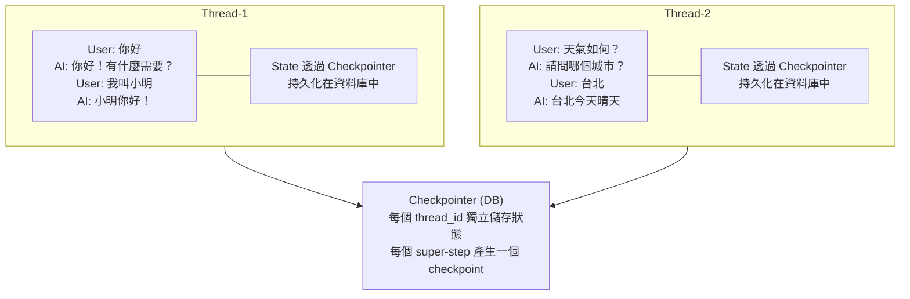
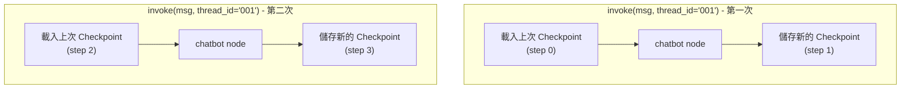
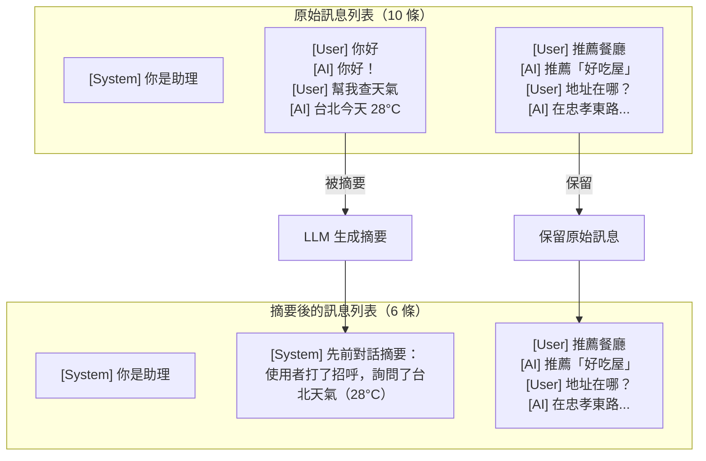
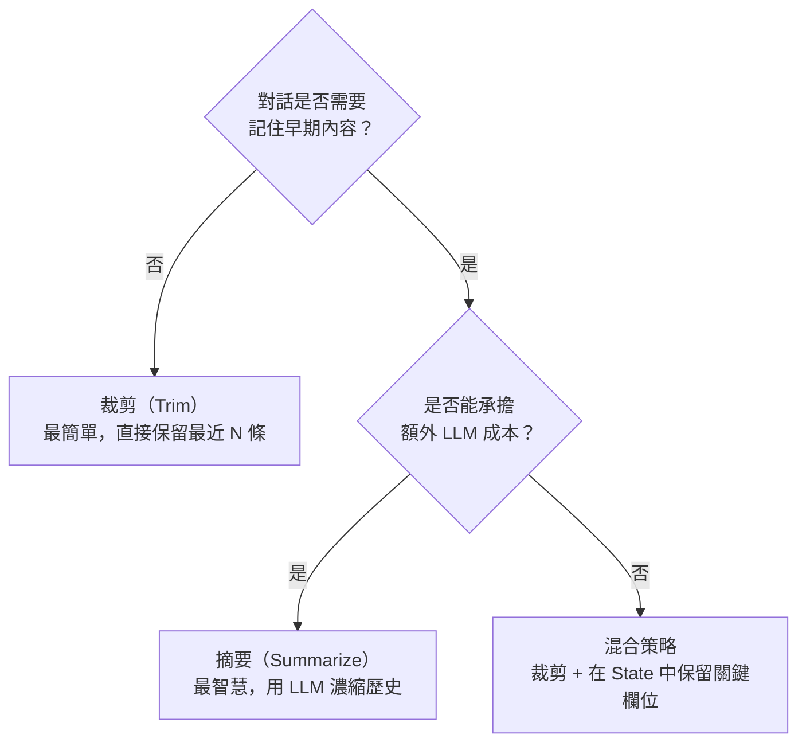

# 7.1 短期記憶（Short-term Memory）

## 目錄

1. [短期記憶概述](#1-短期記憶概述)
2. [透過 Checkpointer 實現工作記憶](#2-透過-checkpointer-實現工作記憶)
3. [訊息裁剪（Trimming）](#3-訊息裁剪trimming)
4. [訊息刪除（Delete Messages）](#4-訊息刪除delete-messages)
5. [訊息摘要（Summarizing）](#5-訊息摘要summarizing)
6. [三種策略的比較與選擇](#6-三種策略的比較與選擇)

---

## 1. 短期記憶概述

短期記憶（Short-term Memory）是**線程範圍（Thread-scoped）**的記憶，只在同一個對話線程內有效。LangGraph 透過 Checkpointer 將 State 持久化，實現對話上下文的保留。



**核心挑戰：** 隨著對話越來越長，訊息列表會持續增長，導致：
- 超出 LLM 的上下文視窗（context window）限制
- LLM 在長上下文中表現下降（容易「分心」）
- 回應速度變慢、成本增加

因此我們需要**管理短期記憶的策略**：裁剪、刪除、摘要。

---

## 2. 透過 Checkpointer 實現工作記憶

### 基本原理

Checkpointer 會在每個 super-step 邊界自動儲存 State 快照。只需在 `compile()` 時指定 checkpointer，並在 `invoke()` 時傳入 `thread_id`。

### 完整範例：基本對話記憶

```python
"""
透過 Checkpointer 實現基本對話記憶
每次呼叫 graph.invoke 都能保留先前的對話歷史
"""
from typing import Annotated
from typing_extensions import TypedDict
from langgraph.graph import StateGraph, MessagesState, START, END
from langgraph.checkpoint.memory import InMemorySaver

# ============================================================
# 1. 定義 State（使用內建 MessagesState）
# ============================================================
# MessagesState 等同：
# class MessagesState(TypedDict):
#     messages: Annotated[list[AnyMessage], add_messages]

# ============================================================
# 2. 定義 Node
# ============================================================
def chatbot(state: MessagesState) -> dict:
    """簡單的回聲機器人，示範記憶效果"""
    messages = state["messages"]
    last_msg = messages[-1]

    # 檢查歷史訊息中是否有自我介紹
    user_name = None
    for msg in messages:
        if hasattr(msg, "content") and "我叫" in str(msg.content):
            # 簡單提取名字
            content = str(msg.content)
            idx = content.index("我叫") + 2
            user_name = content[idx:].strip().rstrip("。！!.")

    greeting = f"，{user_name}" if user_name else ""
    response_text = f"你好{greeting}！你說的是：「{last_msg.content}」"

    return {"messages": [{"role": "assistant", "content": response_text}]}

# ============================================================
# 3. 建構 Graph + Checkpointer
# ============================================================
builder = StateGraph(MessagesState)
builder.add_node("chatbot", chatbot)
builder.add_edge(START, "chatbot")
builder.add_edge("chatbot", END)

# 關鍵：指定 checkpointer
checkpointer = InMemorySaver()
graph = builder.compile(checkpointer=checkpointer)

# ============================================================
# 4. 模擬多輪對話
# ============================================================
config = {"configurable": {"thread_id": "user-001"}}

# 第一輪
result1 = graph.invoke(
    {"messages": [{"role": "user", "content": "我叫小明"}]},
    config,
)
print("第一輪回覆:", result1["messages"][-1].content)
# 第一輪回覆: 你好，小明！你說的是：「我叫小明」

# 第二輪（同一 thread_id，保留記憶）
result2 = graph.invoke(
    {"messages": [{"role": "user", "content": "你還記得我嗎？"}]},
    config,
)
print("第二輪回覆:", result2["messages"][-1].content)
# 第二輪回覆: 你好，小明！你說的是：「你還記得我嗎？」

# 不同的 thread_id → 沒有記憶
config2 = {"configurable": {"thread_id": "user-002"}}
result3 = graph.invoke(
    {"messages": [{"role": "user", "content": "你還記得我嗎？"}]},
    config2,
)
print("新線程回覆:", result3["messages"][-1].content)
# 新線程回覆: 你好！你說的是：「你還記得我嗎？」

# ============================================================
# 5. 查看 Checkpoint 歷史
# ============================================================
history = list(graph.get_state_history(config))
print(f"\n線程 user-001 共有 {len(history)} 個 checkpoints")
for i, snapshot in enumerate(history):
    print(f"  [{i}] step={snapshot.metadata.get('step', '?')}, "
          f"next={snapshot.next}, "
          f"messages_count={len(snapshot.values.get('messages', []))}")
```

> 📄 完整範例程式碼：[7.1-example-basic-memory.py](./7.1-example-basic-memory.py)

### 架構圖



---

## 3. 訊息裁剪（Trimming）

### 概念

裁剪是最直接的策略：只保留最近的 N 條訊息（或 N 個 token），丟棄較早的訊息。在 LangGraph 中，可以使用 `RemoveMessage` 來從 State 中移除訊息。

| | 裁剪前 | | 裁剪後（保留最近 4 條） |
|---|--------|---|-------------------------|
| [0] | System: 你是助理 | 保留 | [0] System: 你是助理 |
| [1] | User: 你好 | X 刪除 | [1] User: 寫詩 |
| [2] | AI: 你好！ | X 刪除 | [2] AI: 好的，這首... |
| [3] | User: 寫故事 | X 刪除 | [3] User: 改成五言 |
| [4] | AI: 從前從前... | X 刪除 | [4] AI: 春風送暖... |
| [5] | User: 寫詩 | 保留 | |
| [6] | AI: 好的，這首... | 保留 | |
| [7] | User: 改成五言 | 保留 | |
| [8] | AI: 春風送暖... | 保留 | |

### 完整範例：在 Graph 節點中裁剪訊息

```python
"""
訊息裁剪策略：保留系統訊息 + 最近 N 條對話訊息
使用 RemoveMessage 從 LangGraph State 中永久刪除舊訊息
"""
from typing import Annotated
from typing_extensions import TypedDict
from langchain_core.messages import (
    HumanMessage, AIMessage, SystemMessage, RemoveMessage
)
from langgraph.graph import StateGraph, START, END, MessagesState
from langgraph.checkpoint.memory import InMemorySaver

# ============================================================
# 1. 定義 State
# ============================================================
class ChatState(MessagesState):
    summary: str  # 可選的摘要欄位（此範例未使用，留做擴展）

# ============================================================
# 2. 定義裁剪節點
# ============================================================
MAX_MESSAGES = 6  # 最多保留的訊息數量（不含系統訊息）

def trim_messages(state: ChatState) -> dict:
    """裁剪訊息：保留系統訊息 + 最近 MAX_MESSAGES 條"""
    messages = state["messages"]

    # 分離系統訊息和對話訊息
    system_msgs = [m for m in messages if isinstance(m, SystemMessage)]
    non_system_msgs = [m for m in messages if not isinstance(m, SystemMessage)]

    if len(non_system_msgs) <= MAX_MESSAGES:
        return {}  # 不需要裁剪

    # 標記要刪除的舊訊息
    msgs_to_remove = non_system_msgs[:-MAX_MESSAGES]
    return {
        "messages": [RemoveMessage(id=m.id) for m in msgs_to_remove]
    }

def chatbot(state: ChatState) -> dict:
    """模擬聊天機器人回覆"""
    messages = state["messages"]
    last_msg = messages[-1]
    reply = f"收到！你說的是「{last_msg.content}」（目前共 {len(messages)} 條訊息）"
    return {"messages": [AIMessage(content=reply)]}

# ============================================================
# 3. 建構 Graph
# ============================================================
builder = StateGraph(ChatState)
builder.add_node("trim", trim_messages)
builder.add_node("chatbot", chatbot)

builder.add_edge(START, "trim")       # 先裁剪
builder.add_edge("trim", "chatbot")   # 再回覆
builder.add_edge("chatbot", END)

checkpointer = InMemorySaver()
graph = builder.compile(checkpointer=checkpointer)

# ============================================================
# 4. 模擬長對話
# ============================================================
config = {"configurable": {"thread_id": "trim-demo"}}

# 先加一條系統訊息
graph.invoke(
    {"messages": [
        SystemMessage(content="你是一個友善的助理。"),
        HumanMessage(content="第1條訊息"),
    ]},
    config,
)

# 繼續發送多條訊息
for i in range(2, 8):
    result = graph.invoke(
        {"messages": [HumanMessage(content=f"第{i}條訊息")]},
        config,
    )

# 檢查最終狀態
final_state = graph.get_state(config)
final_messages = final_state.values["messages"]

print(f"最終訊息數量: {len(final_messages)}")
print("--- 剩餘訊息 ---")
for msg in final_messages:
    print(f"  [{msg.type}] {msg.content[:50]}")

# 系統訊息始終保留，非系統訊息最多 MAX_MESSAGES 條
```

> 📄 完整範例程式碼：[7.1-example-message-trimming.py](./7.1-example-message-trimming.py)

### 使用 langchain_core 的 trim_messages 工具

```python
"""
使用 langchain_core 的 trim_messages 工具
按 token 數量自動裁剪（適合精確控制 token 使用量）
"""
from langchain_core.messages import (
    HumanMessage, AIMessage, SystemMessage, trim_messages
)

# 模擬一段長對話
messages = [
    SystemMessage(content="你是一個 Python 專家。"),
    HumanMessage(content="什麼是 list comprehension？"),
    AIMessage(content="List comprehension 是 Python 的一種簡潔語法..."),
    HumanMessage(content="給我一個範例"),
    AIMessage(content="例如 [x**2 for x in range(10)]..."),
    HumanMessage(content="怎麼加條件過濾？"),
    AIMessage(content="在後面加 if 條件即可..."),
    HumanMessage(content="巢狀的呢？"),
]

# 策略一：保留最後 N 條訊息
trimmed = trim_messages(
    messages,
    max_tokens=100,            # 最多 100 token
    strategy="last",           # 從尾端保留
    token_counter=len,         # 簡化：用字元數代替 token 計數
    include_system=True,       # 始終保留系統訊息
    allow_partial=False,       # 不拆分單一訊息
)

print("裁剪後的訊息:")
for msg in trimmed:
    print(f"  [{msg.type}] {msg.content[:40]}...")
```

> 📄 完整範例程式碼：[7.1-example-trim-messages-tool.py](./7.1-example-trim-messages-tool.py)

---

## 4. 訊息刪除（Delete Messages）

### 使用 RemoveMessage 精準刪除

```python
"""
使用 RemoveMessage 從 State 中刪除特定訊息
RemoveMessage 需要搭配 add_messages reducer 使用
"""
from langchain_core.messages import HumanMessage, AIMessage, RemoveMessage
from langgraph.graph import StateGraph, MessagesState, START, END
from langgraph.graph.message import REMOVE_ALL_MESSAGES
from langgraph.checkpoint.memory import InMemorySaver

# ============================================================
# 1. 定義刪除策略節點
# ============================================================

def delete_old_messages(state: MessagesState) -> dict:
    """刪除最舊的 2 條訊息"""
    messages = state["messages"]
    if len(messages) > 4:
        # 只刪除前 2 條
        to_remove = messages[:2]
        return {"messages": [RemoveMessage(id=m.id) for m in to_remove]}
    return {}

def delete_all_messages(state: MessagesState) -> dict:
    """清空所有訊息歷史"""
    return {"messages": [RemoveMessage(id=REMOVE_ALL_MESSAGES)]}

def echo(state: MessagesState) -> dict:
    """回聲節點"""
    last = state["messages"][-1]
    return {"messages": [AIMessage(content=f"Echo: {last.content}")]}

# ============================================================
# 2. 建構帶有刪除功能的 Graph
# ============================================================
builder = StateGraph(MessagesState)
builder.add_node("cleanup", delete_old_messages)
builder.add_node("echo", echo)
builder.add_edge(START, "cleanup")
builder.add_edge("cleanup", "echo")
builder.add_edge("echo", END)

graph = builder.compile(checkpointer=InMemorySaver())
config = {"configurable": {"thread_id": "delete-demo"}}

# ============================================================
# 3. 模擬對話
# ============================================================
for i in range(1, 7):
    result = graph.invoke(
        {"messages": [HumanMessage(content=f"訊息 #{i}")]},
        config,
    )
    msg_count = len(result["messages"])
    print(f"發送第 {i} 條後，剩餘 {msg_count} 條訊息")

# 驗證最終訊息
final = graph.get_state(config)
print("\n--- 最終訊息 ---")
for m in final.values["messages"]:
    print(f"  [{m.type}] {m.content}")
```

> 📄 完整範例程式碼：[7.1-example-delete-messages.py](./7.1-example-delete-messages.py)

### 刪除訊息的注意事項

> **Warning**: 刪除訊息時必須確保剩餘的訊息歷史仍然有效！
>
> **常見陷阱：**
>
> 1. 某些 LLM Provider 要求訊息歷史以 user 訊息開頭。如果開頭是 AI 訊息，可能報錯。
> 2. 帶有 `tool_calls` 的 AI 訊息必須有對應的 Tool 結果，否則會造成錯誤。
> 3. 建議始終保留系統訊息（system message）。

---

## 5. 訊息摘要（Summarizing）

### 概念

摘要策略比裁剪更智慧：用 LLM 將舊訊息濃縮成一段摘要，然後替換掉原始訊息。這樣既能控制訊息長度，又不會丟失重要資訊。



### 完整範例：帶摘要功能的聊天機器人

```python
"""
訊息摘要策略：
當訊息超過門檻時，用 LLM（此範例用模擬函式）生成摘要並替換舊訊息
"""
from typing import Annotated
from typing_extensions import TypedDict
from langchain_core.messages import (
    HumanMessage, AIMessage, SystemMessage, RemoveMessage
)
from langgraph.graph import StateGraph, MessagesState, START, END
from langgraph.checkpoint.memory import InMemorySaver

# ============================================================
# 1. 定義 State（擴展 MessagesState 加入 summary 欄位）
# ============================================================
class SummarizableState(MessagesState):
    summary: str  # 累積的對話摘要

# ============================================================
# 2. 定義節點
# ============================================================
SUMMARY_THRESHOLD = 6  # 超過此數量觸發摘要

def should_summarize(state: SummarizableState) -> str:
    """條件路由：決定是否需要摘要"""
    messages = state["messages"]
    non_system = [m for m in messages if not isinstance(m, SystemMessage)]
    if len(non_system) > SUMMARY_THRESHOLD:
        return "summarize"
    return "respond"

def summarize_conversation(state: SummarizableState) -> dict:
    """
    摘要節點：將舊訊息濃縮為摘要
    實際應用中應使用 LLM 來生成摘要
    """
    messages = state["messages"]
    existing_summary = state.get("summary", "")

    # 分離系統訊息和對話訊息
    non_system = [m for m in messages if not isinstance(m, SystemMessage)]

    # 保留最近 4 條，其餘做摘要
    to_summarize = non_system[:-4]
    to_keep = non_system[-4:]

    # === 模擬 LLM 生成摘要 ===
    # 實際應用中替換為：
    # summary = llm.invoke(f"請摘要以下對話：\n{to_summarize}\n\n先前摘要：{existing_summary}")
    summary_parts = []
    if existing_summary:
        summary_parts.append(existing_summary)
    for msg in to_summarize:
        role = "使用者" if isinstance(msg, HumanMessage) else "助理"
        summary_parts.append(f"{role}：{msg.content[:30]}")

    new_summary = "；".join(summary_parts)

    # 刪除舊訊息
    remove_msgs = [RemoveMessage(id=m.id) for m in to_summarize]

    return {
        "messages": remove_msgs,
        "summary": new_summary,
    }

def respond(state: SummarizableState) -> dict:
    """回覆節點：帶入摘要上下文"""
    messages = state["messages"]
    summary = state.get("summary", "")
    last_msg = messages[-1]

    # 組合摘要上下文
    context = f"[摘要: {summary}] " if summary else ""
    reply = f"{context}你說：「{last_msg.content}」"

    return {"messages": [AIMessage(content=reply)]}

# ============================================================
# 3. 建構 Graph
# ============================================================
builder = StateGraph(SummarizableState)
builder.add_node("summarize", summarize_conversation)
builder.add_node("respond", respond)

# 從 START 根據條件決定路徑
builder.add_conditional_edges(
    START,
    should_summarize,
    {"summarize": "summarize", "respond": "respond"},
)
builder.add_edge("summarize", "respond")
builder.add_edge("respond", END)

checkpointer = InMemorySaver()
graph = builder.compile(checkpointer=checkpointer)

# ============================================================
# 4. 模擬長對話
# ============================================================
config = {"configurable": {"thread_id": "summary-demo"}}

conversations = [
    "你好，我是小明",
    "台北天氣如何？",
    "推薦一家餐廳",
    "地址在哪裡？",
    "營業時間呢？",
    "有停車場嗎？",
    "價位大概多少？",
    "需要預約嗎？",
]

for i, msg in enumerate(conversations):
    result = graph.invoke(
        {"messages": [HumanMessage(content=msg)]},
        config,
    )
    state = graph.get_state(config)
    msg_count = len(state.values["messages"])
    summary = state.values.get("summary", "（無）")
    print(f"[{i+1}] 訊息數: {msg_count}, 摘要: {summary[:60]}")

print("\n--- 最終訊息 ---")
final = graph.get_state(config)
for m in final.values["messages"]:
    print(f"  [{m.type}] {m.content[:80]}")
```

> 📄 完整範例程式碼：[7.1-example-summarize-conversation.py](./7.1-example-summarize-conversation.py)

### 搭配真實 LLM 的摘要節點

```python
"""
使用真實 LLM 生成對話摘要的摘要節點（需安裝 langchain-openai）
此範例展示實際應用中的摘要邏輯
"""
from langchain_core.messages import HumanMessage, AIMessage, SystemMessage
# from langchain_openai import ChatOpenAI  # 需安裝 langchain-openai
# from langchain_anthropic import ChatAnthropic  # 需安裝 langchain-anthropic

def summarize_with_llm(state: dict) -> dict:
    """
    使用 LLM 生成對話摘要
    """
    messages = state["messages"]
    existing_summary = state.get("summary", "")

    non_system = [m for m in messages if not isinstance(m, SystemMessage)]
    to_summarize = non_system[:-4]

    if not to_summarize:
        return {}

    # 組合摘要 prompt
    summary_prompt = "請將以下對話內容濃縮為簡短摘要（保留關鍵資訊）：\n\n"

    if existing_summary:
        summary_prompt += f"先前的摘要：{existing_summary}\n\n"

    summary_prompt += "新的對話內容：\n"
    for msg in to_summarize:
        role = "User" if isinstance(msg, HumanMessage) else "AI"
        summary_prompt += f"{role}: {msg.content}\n"

    # === 呼叫 LLM ===
    # llm = ChatOpenAI(model="gpt-4o-mini", temperature=0)  # Set OPENAI_API_KEY in environment variables, you could create API key at https://platform.openai.com/settings/organization/api-keys
    # llm = ChatAnthropic(model="claude-sonnet-4-5", temperature=0)  # Set ANTHROPIC_API_KEY in environment variables, you could create API key at https://platform.claude.com/settings/keys
    # response = llm.invoke([HumanMessage(content=summary_prompt)])
    # new_summary = response.content

    # 模擬 LLM 回覆
    new_summary = f"（模擬摘要）對話包含 {len(to_summarize)} 條舊訊息"

    from langchain_core.messages import RemoveMessage
    remove_msgs = [RemoveMessage(id=m.id) for m in to_summarize]

    return {
        "messages": remove_msgs,
        "summary": new_summary,
    }
```

---

## 6. 三種策略的比較與選擇

### 對比表

| 特性 | 裁剪（Trim） | 刪除（Delete） | 摘要（Summarize） |
|------|-------------|----------------|-------------------|
| **複雜度** | 低 | 低 | 高（需要 LLM） |
| **資訊保留** | 差（直接丟棄） | 差（直接丟棄） | 好（濃縮保留） |
| **延遲影響** | 無 | 無 | 有（需要額外 LLM 呼叫） |
| **成本** | 無額外成本 | 無額外成本 | 有（摘要 LLM 費用） |
| **適用場景** | 簡單對話、原型 | 精準控制、清除敏感資訊 | 長對話、需要上下文 |
| **實作方式** | `trim_messages` / 節點 | `RemoveMessage` | 自訂摘要節點 |

### 選擇指南



### 混合策略範例

```python
"""
混合策略：裁剪訊息 + 在獨立欄位中保留關鍵資訊
不需要額外 LLM 呼叫，但能保留重要上下文
"""
from typing import Annotated
from typing_extensions import TypedDict
from operator import add
from langchain_core.messages import HumanMessage, AIMessage, RemoveMessage
from langgraph.graph import StateGraph, MessagesState, START, END
from langgraph.checkpoint.memory import InMemorySaver

# ============================================================
# 1. State 包含結構化的關鍵資訊欄位
# ============================================================
class HybridState(MessagesState):
    user_facts: Annotated[list[str], add]  # 累積的使用者資訊
    topic_history: Annotated[list[str], add]  # 話題歷史

MAX_MESSAGES = 6

# ============================================================
# 2. 節點
# ============================================================
def extract_and_trim(state: HybridState) -> dict:
    """提取關鍵資訊 + 裁剪舊訊息"""
    messages = state["messages"]
    updates: dict = {}

    # 提取關鍵資訊（實際應用中可用 LLM）
    last_msg = messages[-1] if messages else None
    if last_msg and isinstance(last_msg, HumanMessage):
        content = last_msg.content
        if "我叫" in content or "我是" in content:
            updates["user_facts"] = [f"名字相關: {content[:30]}"]
        if "喜歡" in content or "偏好" in content:
            updates["user_facts"] = [f"偏好: {content[:30]}"]

    # 裁剪
    if len(messages) > MAX_MESSAGES:
        to_remove = messages[:len(messages) - MAX_MESSAGES]
        updates["messages"] = [RemoveMessage(id=m.id) for m in to_remove]
        updates["topic_history"] = [f"（裁剪了 {len(to_remove)} 條舊訊息）"]

    return updates

def respond(state: HybridState) -> dict:
    """回覆時利用結構化資訊"""
    messages = state["messages"]
    facts = state.get("user_facts", [])
    topics = state.get("topic_history", [])

    context_parts = []
    if facts:
        context_parts.append(f"已知: {'; '.join(facts[-3:])}")
    if topics:
        context_parts.append(f"話題: {'; '.join(topics[-3:])}")

    context = " | ".join(context_parts) if context_parts else "無額外上下文"
    last_msg = messages[-1]

    return {
        "messages": [
            AIMessage(content=f"[{context}] 回覆：{last_msg.content}")
        ]
    }

# ============================================================
# 3. 建構 Graph
# ============================================================
builder = StateGraph(HybridState)
builder.add_node("extract_and_trim", extract_and_trim)
builder.add_node("respond", respond)
builder.add_edge(START, "extract_and_trim")
builder.add_edge("extract_and_trim", "respond")
builder.add_edge("respond", END)

graph = builder.compile(checkpointer=InMemorySaver())

# ============================================================
# 4. 執行
# ============================================================
config = {"configurable": {"thread_id": "hybrid-demo"}}

test_messages = [
    "你好，我叫小明",
    "我喜歡吃日本料理",
    "推薦台北的餐廳",
    "價位呢？",
    "營業時間？",
    "有外送嗎？",
    "我還喜歡甜點",
    "推薦甜點店",
]

for msg in test_messages:
    result = graph.invoke(
        {"messages": [HumanMessage(content=msg)]},
        config,
    )
    state = graph.get_state(config)
    print(f"訊息數: {len(state.values['messages'])}, "
          f"已知事實: {state.values.get('user_facts', [])}")
```

> 📄 完整範例程式碼：[7.1-example-hybrid-strategy.py](./7.1-example-hybrid-strategy.py)

---

## 重點摘要

| 問題 | 答案 |
|------|------|
| 短期記憶的範圍是？ | Thread-scoped，同一個 `thread_id` 內有效 |
| 如何啟用短期記憶？ | `compile(checkpointer=InMemorySaver())` + `invoke(input, {"configurable": {"thread_id": "..."}})` |
| 訊息裁剪用什麼？ | `trim_messages` 工具或自訂節點搭配 `RemoveMessage` |
| 如何刪除全部訊息？ | `RemoveMessage(id=REMOVE_ALL_MESSAGES)` |
| 摘要策略的核心流程？ | 用 LLM 將舊訊息生成摘要 → 刪除舊訊息 → 保留摘要在 State 中 |
| 生產環境用什麼 Checkpointer？ | `PostgresSaver`（需安裝 `langgraph-checkpoint-postgres`） |
| 最推薦的策略是？ | 取決於場景：簡單對話用裁剪，長對話用摘要，敏感資料用刪除 |

---

## 參考資源

- [LangGraph Concepts — Memory](https://langchain-ai.github.io/langgraph/concepts/memory/)
- [LangGraph How-to — Add Memory](https://langchain-ai.github.io/langgraph/how-tos/add-memory/)
- [LangGraph Persistence](https://langchain-ai.github.io/langgraph/concepts/persistence/)
- [LangChain — Short-term Memory](https://python.langchain.com/docs/concepts/short-term-memory/)
- [LangChain — trim_messages](https://python.langchain.com/api_reference/core/messages/langchain_core.messages.utils.trim_messages.html)
