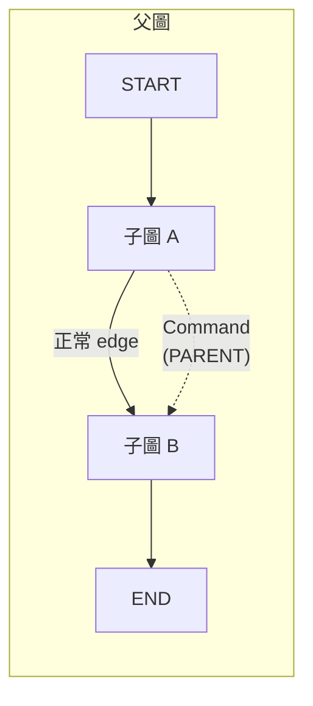
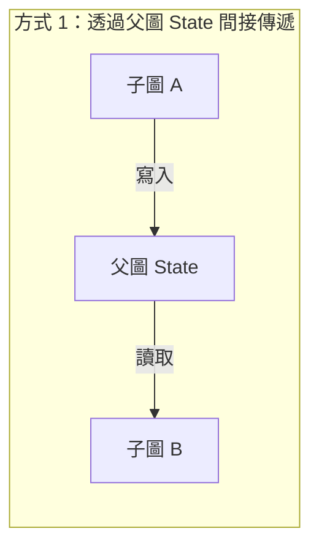
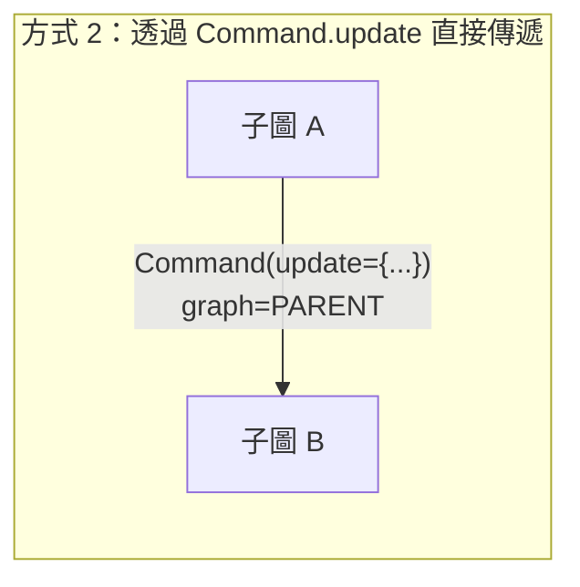
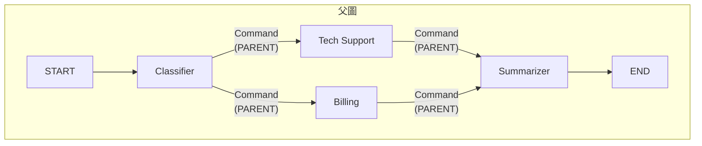

# 9.2 子圖導航

## 目錄

1. [透過 Command 導航到父圖節點](#1-透過-command-導航到父圖節點)
2. [子圖間的資料傳遞](#2-子圖間的資料傳遞)
3. [完整範例：多子圖協作系統](#3-完整範例多子圖協作系統)
4. [重點摘要](#4-重點摘要)
5. [參考資源](#5-參考資源)

---

## 1. 透過 Command 導航到父圖節點

在 LangGraph 中，子圖的節點可以使用 `Command` 搭配 `graph=Command.PARENT` 來**跳出子圖**，導航到父圖中的其他節點。這是 Multi-Agent 系統中 Agent 之間切換（Handoff）的核心機制。



> 子圖 A 內部的某個節點發出 Command，直接導航到父圖的「子圖 B」節點。

### Command 導航核心語法

```python
from langgraph.types import Command

# 在子圖的節點函式中返回 Command
def some_subgraph_node(state):
    return Command(
        goto="target_node_in_parent",   # 父圖中的目標節點
        update={"key": "value"},        # 要更新到父圖 State 的資料
        graph=Command.PARENT            # 指定導航到父圖
    )
```

### 完整範例

```python
"""
透過 Command 從子圖導航到父圖節點的完整範例。

架構：
    父圖
    ├── agent_a (子圖) —— 分析 Agent
    ├── agent_b (子圖) —— 執行 Agent
    └── reporter (普通節點) —— 報告生成

Agent A 分析完後，依結果決定導航到 Agent B 或 Reporter。
"""
from typing import Annotated, Literal
from typing_extensions import TypedDict
from langgraph.graph import StateGraph, START, END
from langgraph.types import Command

# ============================================================
# 1. 定義共享 State
# ============================================================
class TeamState(TypedDict):
    task: str
    analysis: str
    execution_result: str
    logs: Annotated[list[str], lambda x, y: x + y]
    next_action: str  # "execute" 或 "report"


# ============================================================
# 2. 子圖 A：分析 Agent
# ============================================================
def analyze_task(state: TeamState) -> dict:
    """分析任務"""
    task = state.get("task", "")
    needs_execution = "執行" in task or "建立" in task
    return {
        "analysis": f"分析結果：任務 '{task}' {'需要' if needs_execution else '不需要'}執行操作",
        "next_action": "execute" if needs_execution else "report",
        "logs": [f"[Agent A] 完成分析，下一步: {'execute' if needs_execution else 'report'}"]
    }

def decide_and_navigate(state: TeamState) -> Command:
    """
    根據分析結果，使用 Command 導航到父圖中的不同節點。
    這是子圖跳出到父圖的關鍵步驟。
    """
    next_action = state.get("next_action", "report")

    if next_action == "execute":
        # 導航到父圖的 "agent_b" 節點
        return Command(
            goto="agent_b",
            update={
                "logs": ["[Agent A -> Agent B] 移交執行任務"]
            },
            graph=Command.PARENT    # <-- 關鍵：指向父圖
        )
    else:
        # 導航到父圖的 "reporter" 節點
        return Command(
            goto="reporter",
            update={
                "logs": ["[Agent A -> Reporter] 直接生成報告"]
            },
            graph=Command.PARENT    # <-- 關鍵：指向父圖
        )

agent_a_builder = StateGraph(TeamState)
agent_a_builder.add_node("analyze", analyze_task)
agent_a_builder.add_node("decide", decide_and_navigate)
agent_a_builder.add_edge(START, "analyze")
agent_a_builder.add_edge("analyze", "decide")
# 注意：decide 節點不需要加 edge 到 END，因為它透過 Command 離開子圖
agent_a_subgraph = agent_a_builder.compile()


# ============================================================
# 3. 子圖 B：執行 Agent
# ============================================================
def execute_task(state: TeamState) -> dict:
    """執行任務"""
    return {
        "execution_result": f"已執行: {state.get('task', '')}",
        "logs": ["[Agent B] 執行完成"]
    }

def navigate_to_reporter(state: TeamState) -> Command:
    """執行完成後，導航回父圖的 reporter"""
    return Command(
        goto="reporter",
        update={
            "logs": ["[Agent B -> Reporter] 執行完畢，移交報告生成"]
        },
        graph=Command.PARENT
    )

agent_b_builder = StateGraph(TeamState)
agent_b_builder.add_node("execute", execute_task)
agent_b_builder.add_node("nav_report", navigate_to_reporter)
agent_b_builder.add_edge(START, "execute")
agent_b_builder.add_edge("execute", "nav_report")
agent_b_subgraph = agent_b_builder.compile()


# ============================================================
# 4. 父圖的普通節點
# ============================================================
def generate_report(state: TeamState) -> dict:
    """生成最終報告"""
    analysis = state.get("analysis", "無")
    execution = state.get("execution_result", "無")
    return {
        "logs": [f"[Reporter] 報告生成完成 | 分析: {analysis} | 執行: {execution}"]
    }


# ============================================================
# 5. 建立父圖
# ============================================================
parent_builder = StateGraph(TeamState)
parent_builder.add_node("agent_a", agent_a_subgraph)
parent_builder.add_node("agent_b", agent_b_subgraph)
parent_builder.add_node("reporter", generate_report)

parent_builder.add_edge(START, "agent_a")
# agent_a 和 agent_b 的導航由 Command 處理，不需要靜態 edge
parent_builder.add_edge("reporter", END)

parent_graph = parent_builder.compile()


# ============================================================
# 6. 執行測試
# ============================================================
# 測試案例 1：需要執行的任務
print("=== 案例 1：需要執行 ===")
result1 = parent_graph.invoke({
    "task": "建立新的資料庫索引",
    "analysis": "",
    "execution_result": "",
    "logs": [],
    "next_action": ""
})
for log in result1["logs"]:
    print(f"  {log}")

print("\n=== 案例 2：只需報告 ===")
result2 = parent_graph.invoke({
    "task": "查詢系統狀態",
    "analysis": "",
    "execution_result": "",
    "logs": [],
    "next_action": ""
})
for log in result2["logs"]:
    print(f"  {log}")
```

> 📄 完整範例程式碼：[9.2-example-command-navigation.py](./9.2-example-command-navigation.py)

### 執行結果

```
=== 案例 1：需要執行 ===
  [Agent A] 完成分析，下一步: execute
  [Agent A -> Agent B] 移交執行任務
  [Agent B] 執行完成
  [Agent B -> Reporter] 執行完畢，移交報告生成
  [Reporter] 報告生成完成 | 分析: 分析結果：任務 '建立新的資料庫索引' 需要執行操作 | 執行: 已執行: 建立新的資料庫索引

=== 案例 2：只需報告 ===
  [Agent A] 完成分析，下一步: report
  [Agent A -> Reporter] 直接生成報告
  [Reporter] 報告生成完成 | 分析: 分析結果：任務 '查詢系統狀態' 不需要執行操作 | 執行: 無
```

### Command 導航注意事項

| 項目 | 說明 |
|------|------|
| `graph=Command.PARENT` | 必須指定才能跳出子圖到父圖 |
| `goto` 目標 | 必須是父圖中已定義的節點名稱 |
| `update` | 更新的是**父圖**的 State，不是子圖的 |
| 不需要 END edge | 使用 Command 導航的節點不需要接到子圖的 END |
| 跨層導航 | 目前只能導航到直接父圖，不能跨越多層 |

---

## 2. 子圖間的資料傳遞

在 Multi-Agent 系統中，子圖之間需要交換資料。LangGraph 提供兩種主要方式：





### 方式 1：透過父圖 State 間接傳遞

```python
"""
子圖間透過父圖 State 間接傳遞資料的完整範例。

流程：子圖 A（資料收集）-> 子圖 B（資料分析）
兩個子圖透過父圖 State 的 shared_data 欄位交換資料。
"""
from typing import Annotated
from typing_extensions import TypedDict
from langgraph.graph import StateGraph, START, END

# ============================================================
# 1. 共享 State
# ============================================================
class PipelineState(TypedDict):
    input_query: str
    collected_data: list[str]          # 子圖 A 寫入，子圖 B 讀取
    analysis_result: str               # 子圖 B 寫入
    logs: Annotated[list[str], lambda x, y: x + y]


# ============================================================
# 2. 子圖 A：資料收集
# ============================================================
def collect_from_source_1(state: PipelineState) -> dict:
    query = state.get("input_query", "")
    return {
        "collected_data": [f"來源1的資料: {query}相關結果"],
        "logs": ["[收集器] 從來源 1 取得資料"]
    }

def collect_from_source_2(state: PipelineState) -> dict:
    existing = state.get("collected_data", [])
    return {
        "collected_data": existing + ["來源2的資料: 補充資訊"],
        "logs": ["[收集器] 從來源 2 取得資料"]
    }

collector_builder = StateGraph(PipelineState)
collector_builder.add_node("source1", collect_from_source_1)
collector_builder.add_node("source2", collect_from_source_2)
collector_builder.add_edge(START, "source1")
collector_builder.add_edge("source1", "source2")
collector_builder.add_edge("source2", END)
collector_subgraph = collector_builder.compile()


# ============================================================
# 3. 子圖 B：資料分析
# ============================================================
def analyze_data(state: PipelineState) -> dict:
    data = state.get("collected_data", [])
    # 子圖 B 讀取子圖 A 寫入的 collected_data
    analysis = f"分析了 {len(data)} 筆資料，發現關鍵模式"
    return {
        "analysis_result": analysis,
        "logs": [f"[分析器] {analysis}"]
    }

def generate_insights(state: PipelineState) -> dict:
    return {
        "analysis_result": f"{state['analysis_result']} -> 產生 3 個洞察",
        "logs": ["[分析器] 洞察生成完成"]
    }

analyzer_builder = StateGraph(PipelineState)
analyzer_builder.add_node("analyze", analyze_data)
analyzer_builder.add_node("insights", generate_insights)
analyzer_builder.add_edge(START, "analyze")
analyzer_builder.add_edge("analyze", "insights")
analyzer_builder.add_edge("insights", END)
analyzer_subgraph = analyzer_builder.compile()


# ============================================================
# 4. 父圖：管線
# ============================================================
parent_builder = StateGraph(PipelineState)
parent_builder.add_node("collect", collector_subgraph)    # 子圖 A
parent_builder.add_node("analyze", analyzer_subgraph)     # 子圖 B
parent_builder.add_edge(START, "collect")
parent_builder.add_edge("collect", "analyze")             # A 完成後自動到 B
parent_builder.add_edge("analyze", END)

pipeline = parent_builder.compile()


# ============================================================
# 5. 執行
# ============================================================
result = pipeline.invoke({
    "input_query": "LangGraph 最佳實踐",
    "collected_data": [],
    "analysis_result": "",
    "logs": []
})

print("=== 處理日誌 ===")
for log in result["logs"]:
    print(f"  {log}")
print(f"\n收集的資料: {result['collected_data']}")
print(f"分析結果: {result['analysis_result']}")
```

> 📄 完整範例程式碼：[9.2-example-data-passing-state.py](./9.2-example-data-passing-state.py)

### 執行結果

```
=== 處理日誌 ===
  [收集器] 從來源 1 取得資料
  [收集器] 從來源 2 取得資料
  [分析器] 分析了 2 筆資料，發現關鍵模式
  [分析器] 洞察生成完成

收集的資料: ['來源1的資料: LangGraph 最佳實踐相關結果', '來源2的資料: 補充資訊']
分析結果: 分析了 2 筆資料，發現關鍵模式 -> 產生 3 個洞察
```

### 方式 2：透過 Command 直接傳遞

```python
"""
子圖間透過 Command 直接傳遞資料的完整範例。

子圖 A 的節點直接透過 Command 導航到子圖 B，
並在 update 中攜帶要傳遞的資料。
"""
from typing import Annotated
from typing_extensions import TypedDict
from langgraph.graph import StateGraph, START, END
from langgraph.types import Command

# ============================================================
# 1. 共享 State
# ============================================================
class HandoffState(TypedDict):
    message: str
    context: dict           # 傳遞的上下文資料
    response: str
    logs: Annotated[list[str], lambda x, y: x + y]


# ============================================================
# 2. 子圖 A：前端 Agent
# ============================================================
def receive_request(state: HandoffState) -> dict:
    return {"logs": [f"[前端] 收到請求: {state['message']}"]}

def handoff_to_backend(state: HandoffState) -> Command:
    """透過 Command 直接導航到子圖 B，攜帶上下文"""
    return Command(
        goto="backend_agent",
        update={
            "context": {
                "original_message": state["message"],
                "priority": "high",
                "processed_by": "frontend_agent"
            },
            "logs": ["[前端 -> 後端] Handoff，附帶上下文資料"]
        },
        graph=Command.PARENT
    )

frontend_builder = StateGraph(HandoffState)
frontend_builder.add_node("receive", receive_request)
frontend_builder.add_node("handoff", handoff_to_backend)
frontend_builder.add_edge(START, "receive")
frontend_builder.add_edge("receive", "handoff")
frontend_subgraph = frontend_builder.compile()


# ============================================================
# 3. 子圖 B：後端 Agent
# ============================================================
def process_request(state: HandoffState) -> dict:
    """讀取從子圖 A 傳遞過來的 context"""
    ctx = state.get("context", {})
    original = ctx.get("original_message", "unknown")
    priority = ctx.get("priority", "normal")
    return {
        "response": f"已處理（優先級: {priority}）: {original}",
        "logs": [f"[後端] 處理完成，優先級: {priority}"]
    }

backend_builder = StateGraph(HandoffState)
backend_builder.add_node("process", process_request)
backend_builder.add_edge(START, "process")
backend_builder.add_edge("process", END)
backend_subgraph = backend_builder.compile()


# ============================================================
# 4. 父圖
# ============================================================
parent_builder = StateGraph(HandoffState)
parent_builder.add_node("frontend_agent", frontend_subgraph)
parent_builder.add_node("backend_agent", backend_subgraph)
parent_builder.add_edge(START, "frontend_agent")
# frontend 透過 Command 導航到 backend，不需要靜態 edge
parent_builder.add_edge("backend_agent", END)

parent_graph = parent_builder.compile()


# ============================================================
# 5. 執行
# ============================================================
result = parent_graph.invoke({
    "message": "請幫我建立一個新的專案",
    "context": {},
    "response": "",
    "logs": []
})

print("=== 日誌 ===")
for log in result["logs"]:
    print(f"  {log}")
print(f"\n最終回應: {result['response']}")
print(f"上下文: {result['context']}")
```

> 📄 完整範例程式碼：[9.2-example-data-passing-command.py](./9.2-example-data-passing-command.py)

### 執行結果

```
=== 日誌 ===
  [前端] 收到請求: 請幫我建立一個新的專案
  [前端 -> 後端] Handoff，附帶上下文資料
  [後端] 處理完成，優先級: high

最終回應: 已處理（優先級: high）: 請幫我建立一個新的專案
上下文: {'original_message': '請幫我建立一個新的專案', 'priority': 'high', 'processed_by': 'frontend_agent'}
```

### 兩種傳遞方式比較

| 特性 | 透過父圖 State 間接傳遞 | 透過 Command 直接傳遞 |
|------|--------------------------|------------------------|
| 資料流向 | 子圖 A -> 父圖 State -> 子圖 B | 子圖 A -> Command -> 子圖 B |
| 導航控制 | 由父圖的靜態 edge 決定 | 由子圖的 Command 動態決定 |
| 耦合程度 | 低（透過 State Schema 解耦） | 中（子圖需知道父圖節點名稱） |
| 適用場景 | 固定的資料管線 | 動態的 Agent Handoff |
| 靈活性 | 低（固定流程） | 高（可條件式導航） |

---

## 3. 完整範例：多子圖協作系統

```python
"""
多子圖協作系統：客服工單處理管線。

架構：
    父圖 (工單處理)
    ├── classifier (子圖) —— 工單分類 Agent
    ├── tech_support (子圖) —— 技術支援 Agent
    ├── billing (子圖) —— 帳務 Agent
    └── summarizer (普通節點) —— 摘要生成

Classifier 分析工單後，透過 Command 導航到對應的 Agent。
各 Agent 處理完後，透過 Command 導航到 Summarizer。
"""
from typing import Annotated, Literal
from typing_extensions import TypedDict
from langgraph.graph import StateGraph, START, END
from langgraph.types import Command

# ============================================================
# 1. 定義 State
# ============================================================
class TicketState(TypedDict):
    ticket_content: str                     # 工單內容
    category: str                           # 分類結果
    resolution: str                         # 處理結果
    summary: str                            # 最終摘要
    logs: Annotated[list[str], lambda x, y: x + y]


# ============================================================
# 2. 子圖：分類 Agent
# ============================================================
def classify_ticket(state: TicketState) -> dict:
    content = state.get("ticket_content", "").lower()
    if any(kw in content for kw in ["密碼", "登入", "錯誤", "bug", "當機"]):
        category = "technical"
    elif any(kw in content for kw in ["帳單", "付款", "退款", "費用", "訂閱"]):
        category = "billing"
    else:
        category = "technical"  # 預設歸類為技術支援
    return {
        "category": category,
        "logs": [f"[分類] 工單分類為: {category}"]
    }

def route_to_agent(state: TicketState) -> Command:
    """根據分類結果導航到對應的 Agent"""
    category = state.get("category", "technical")
    target = "tech_support" if category == "technical" else "billing"
    return Command(
        goto=target,
        update={
            "logs": [f"[分類 -> {target}] 轉派工單"]
        },
        graph=Command.PARENT
    )

classifier_builder = StateGraph(TicketState)
classifier_builder.add_node("classify", classify_ticket)
classifier_builder.add_node("route", route_to_agent)
classifier_builder.add_edge(START, "classify")
classifier_builder.add_edge("classify", "route")
classifier_subgraph = classifier_builder.compile()


# ============================================================
# 3. 子圖：技術支援 Agent
# ============================================================
def diagnose_issue(state: TicketState) -> dict:
    return {
        "resolution": f"技術診斷: 針對 '{state['ticket_content']}' 的問題已找到解決方案",
        "logs": ["[技術支援] 問題診斷完成"]
    }

def nav_to_summary_tech(state: TicketState) -> Command:
    return Command(
        goto="summarizer",
        update={"logs": ["[技術支援 -> 摘要] 處理完成"]},
        graph=Command.PARENT
    )

tech_builder = StateGraph(TicketState)
tech_builder.add_node("diagnose", diagnose_issue)
tech_builder.add_node("nav", nav_to_summary_tech)
tech_builder.add_edge(START, "diagnose")
tech_builder.add_edge("diagnose", "nav")
tech_subgraph = tech_builder.compile()


# ============================================================
# 4. 子圖：帳務 Agent
# ============================================================
def process_billing(state: TicketState) -> dict:
    return {
        "resolution": f"帳務處理: 針對 '{state['ticket_content']}' 已完成帳務審核",
        "logs": ["[帳務] 帳務審核完成"]
    }

def nav_to_summary_billing(state: TicketState) -> Command:
    return Command(
        goto="summarizer",
        update={"logs": ["[帳務 -> 摘要] 處理完成"]},
        graph=Command.PARENT
    )

billing_builder = StateGraph(TicketState)
billing_builder.add_node("process", process_billing)
billing_builder.add_node("nav", nav_to_summary_billing)
billing_builder.add_edge(START, "process")
billing_builder.add_edge("process", "nav")
billing_subgraph = billing_builder.compile()


# ============================================================
# 5. 父圖的摘要節點
# ============================================================
def create_summary(state: TicketState) -> dict:
    return {
        "summary": (
            f"工單摘要\n"
            f"  內容: {state['ticket_content']}\n"
            f"  分類: {state['category']}\n"
            f"  結果: {state['resolution']}"
        ),
        "logs": ["[摘要] 工單摘要已生成"]
    }


# ============================================================
# 6. 建立父圖
# ============================================================
parent_builder = StateGraph(TicketState)
parent_builder.add_node("classifier", classifier_subgraph)
parent_builder.add_node("tech_support", tech_subgraph)
parent_builder.add_node("billing", billing_subgraph)
parent_builder.add_node("summarizer", create_summary)

parent_builder.add_edge(START, "classifier")
# classifier, tech_support, billing 的路由由 Command 處理
parent_builder.add_edge("summarizer", END)

parent_graph = parent_builder.compile()


# ============================================================
# 7. 測試
# ============================================================
print("=== 測試 1：技術問題 ===")
result1 = parent_graph.invoke({
    "ticket_content": "我的帳號登入時出現錯誤代碼 500",
    "category": "",
    "resolution": "",
    "summary": "",
    "logs": []
})
for log in result1["logs"]:
    print(f"  {log}")
print(f"\n{result1['summary']}")

print("\n" + "=" * 50)

print("\n=== 測試 2：帳務問題 ===")
result2 = parent_graph.invoke({
    "ticket_content": "我要申請上個月的退款",
    "category": "",
    "resolution": "",
    "summary": "",
    "logs": []
})
for log in result2["logs"]:
    print(f"  {log}")
print(f"\n{result2['summary']}")
```

> 📄 完整範例程式碼：[9.2-example-ticket-system.py](./9.2-example-ticket-system.py)

### 執行結果

```
=== 測試 1：技術問題 ===
  [分類] 工單分類為: technical
  [分類 -> tech_support] 轉派工單
  [技術支援] 問題診斷完成
  [技術支援 -> 摘要] 處理完成
  [摘要] 工單摘要已生成

工單摘要
  內容: 我的帳號登入時出現錯誤代碼 500
  分類: technical
  結果: 技術診斷: 針對 '我的帳號登入時出現錯誤代碼 500' 的問題已找到解決方案

==================================================

=== 測試 2：帳務問題 ===
  [分類] 工單分類為: billing
  [分類 -> billing] 轉派工單
  [帳務] 帳務審核完成
  [帳務 -> 摘要] 處理完成
  [摘要] 工單摘要已生成

工單摘要
  內容: 我要申請上個月的退款
  分類: billing
  結果: 帳務處理: 針對 '我要申請上個月的退款' 已完成帳務審核
```

### 系統架構圖



---

## 4. 重點摘要

| 概念 | 關鍵知識 |
|------|----------|
| **Command.PARENT** | 子圖節點跳出到父圖的唯一方式 |
| **goto 目標** | 必須是父圖中已定義的節點名稱 |
| **update 欄位** | Command 的 update 會寫入父圖的 State |
| **間接傳遞** | 子圖 A 寫入 State -> 子圖 B 讀取 State，適合固定管線 |
| **直接傳遞** | 透過 Command(update=...) 攜帶資料，適合動態 Handoff |
| **不需要靜態 edge** | 使用 Command 導航的節點不需要在子圖中加 edge 到 END |

**設計原則：**

1. **明確的導航目標** —— Command 的 goto 必須精確指向父圖中的節點
2. **State 更新語義清晰** —— Command.update 的內容代表 Handoff 時要傳遞的上下文
3. **解耦優先** —— 盡量透過 State Schema 解耦，僅在需要動態路由時使用 Command
4. **單層跳轉** —— Command.PARENT 只能跳到直接父圖，多層嵌套需要逐層跳轉

---

## 5. 參考資源

- [LangGraph Subgraphs 官方文件](https://langchain-ai.github.io/langgraph/how-tos/subgraph/)
- [LangGraph Command API](https://langchain-ai.github.io/langgraph/reference/types/#langgraph.types.Command)
- [Navigate to parent graph node](https://langchain-ai.github.io/langgraph/how-tos/command/#navigate-to-a-node-in-a-parent-graph)
- [Multi-Agent Handoffs](https://python.langchain.com/docs/concepts/multi_agent/#handoffs)
