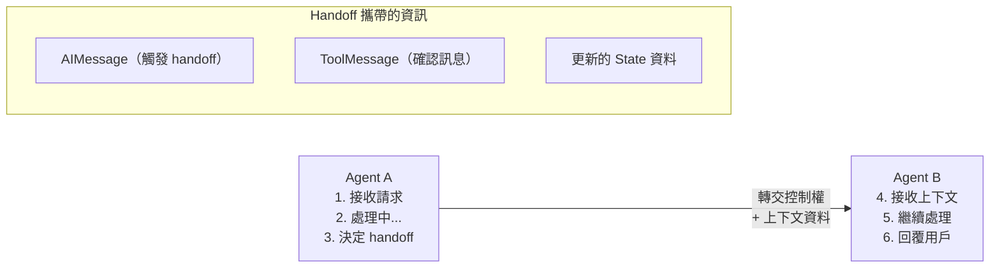

# 10.2 Agent 協作

## 目錄

1. [Agent Handoff（切換）](#1-agent-handoff切換)
2. [分治法 (Divide-and-Conquer)](#2-分治法-divide-and-conquer)
3. [langgraph-supervisor 函式庫](#3-langgraph-supervisor-函式庫)
4. [langgraph-swarm 函式庫](#4-langgraph-swarm-函式庫)
5. [重點摘要](#5-重點摘要)
6. [參考資源](#6-參考資源)

---

## 1. Agent Handoff（切換）

Handoff 是 Multi-Agent 系統中最核心的協作機制——一個 Agent 將控制權和上下文轉交給另一個 Agent。這個概念最初由 OpenAI 提出，LangGraph 透過 `Command` 和 tool 返回 `Command` 兩種方式來實作。

### Handoff 的核心流程

```
    Agent A                                Agent B
    ┌──────────────┐                       ┌──────────────┐
    │ 1. 接收請求   │                       │              │
    │ 2. 處理中...  │                       │              │
    │ 3. 決定 handoff│──── 轉交控制權 ─────>│ 4. 接收上下文 │
    │              │    + 上下文資料        │ 5. 繼續處理   │
    │              │                       │ 6. 回覆用戶   │
    └──────────────┘                       └──────────────┘
    
    Handoff 攜帶的資訊：
    ┌────────────────────────────┐
    │ - AIMessage (觸發 handoff)  │
    │ - ToolMessage (確認訊息)    │
    │ - 更新的 State 資料         │
    └────────────────────────────┘
```

> Mermaid 語法版本：



### Handoff 時的上下文工程

在 Handoff 時，LLM 期望 tool call 都有對應的 response。因此必須同時傳遞：
1. **AIMessage**：觸發 handoff 的 AI 訊息（包含 tool_call）
2. **ToolMessage**：人造的 tool response，確認 handoff 完成

### 完整範例：Handoff 協作系統

```python
"""
Agent Handoff 協作系統的完整範例。

兩個 Agent（銷售顧問和技術顧問）透過 Handoff 機制互相轉交控制權。
使用 Command + graph=Command.PARENT 實現子圖間的 Handoff。
"""
from typing import Annotated, Literal
from typing_extensions import TypedDict
from langgraph.graph import StateGraph, START, END
from langgraph.types import Command

# ============================================================
# 1. 定義 State
# ============================================================
class ConsultState(TypedDict):
    user_query: str
    active_agent: str
    conversation: Annotated[list[str], lambda x, y: x + y]
    final_answer: str
    handoff_count: int


# ============================================================
# 2. 銷售顧問子圖
# ============================================================
def sales_process(state: ConsultState) -> dict | Command:
    """銷售顧問處理邏輯"""
    query = state["user_query"].lower()

    # 判斷是否需要技術支援
    needs_tech = any(kw in query for kw in ["安裝", "設定", "整合", "api", "技術"])

    if needs_tech and state.get("handoff_count", 0) < 2:
        # Handoff 到技術顧問
        return Command(
            goto="tech_consultant",
            update={
                "active_agent": "tech",
                "handoff_count": state.get("handoff_count", 0) + 1,
                "conversation": [
                    "[銷售顧問] 這個問題涉及技術細節，讓我為您轉接技術顧問。",
                    "[系統] Handoff: 銷售顧問 -> 技術顧問"
                ]
            },
            graph=Command.PARENT
        )
    else:
        return {
            "final_answer": f"[銷售顧問回覆] 關於您的問題「{state['user_query']}」，"
                           f"我們提供三個方案：基礎版、專業版、企業版。",
            "conversation": ["[銷售顧問] 提供產品方案建議"]
        }

sales_builder = StateGraph(ConsultState)
sales_builder.add_node("process", sales_process)
sales_builder.add_edge(START, "process")
sales_builder.add_edge("process", END)
sales_subgraph = sales_builder.compile()


# ============================================================
# 3. 技術顧問子圖
# ============================================================
def tech_process(state: ConsultState) -> dict | Command:
    """技術顧問處理邏輯"""
    query = state["user_query"].lower()

    # 判斷是否需要銷售支援
    needs_sales = any(kw in query for kw in ["價格", "費用", "購買", "方案"])

    if needs_sales and state.get("handoff_count", 0) < 2:
        return Command(
            goto="sales_consultant",
            update={
                "active_agent": "sales",
                "handoff_count": state.get("handoff_count", 0) + 1,
                "conversation": [
                    "[技術顧問] 關於定價問題，讓我為您轉接銷售顧問。",
                    "[系統] Handoff: 技術顧問 -> 銷售顧問"
                ]
            },
            graph=Command.PARENT
        )
    else:
        return {
            "final_answer": f"[技術顧問回覆] 關於「{state['user_query']}」，"
                           f"建議使用 REST API 整合，以下是技術文件連結...",
            "conversation": ["[技術顧問] 提供技術解決方案"]
        }

tech_builder = StateGraph(ConsultState)
tech_builder.add_node("process", tech_process)
tech_builder.add_edge(START, "process")
tech_builder.add_edge("process", END)
tech_subgraph = tech_builder.compile()


# ============================================================
# 4. 父圖
# ============================================================
def route_initial(state: ConsultState) -> Literal["sales_consultant", "tech_consultant"]:
    active = state.get("active_agent", "sales")
    return "tech_consultant" if active == "tech" else "sales_consultant"

def route_after(
    state: ConsultState,
) -> Literal["sales_consultant", "tech_consultant", "__end__"]:
    if state.get("final_answer"):
        return "__end__"
    active = state.get("active_agent", "sales")
    return "tech_consultant" if active == "tech" else "sales_consultant"

parent_builder = StateGraph(ConsultState)
parent_builder.add_node("sales_consultant", sales_subgraph)
parent_builder.add_node("tech_consultant", tech_subgraph)

parent_builder.add_conditional_edges(
    START, route_initial,
    ["sales_consultant", "tech_consultant"]
)
parent_builder.add_conditional_edges(
    "sales_consultant", route_after,
    ["sales_consultant", "tech_consultant", END]
)
parent_builder.add_conditional_edges(
    "tech_consultant", route_after,
    ["sales_consultant", "tech_consultant", END]
)

consult_graph = parent_builder.compile()


# ============================================================
# 5. 測試
# ============================================================
test_queries = [
    {"user_query": "我想了解你們的產品方案", "active_agent": "sales"},
    {"user_query": "如何透過 API 整合你們的系統？", "active_agent": "sales"},
]

for tq in test_queries:
    print(f"--- 問題: {tq['user_query']} ---")
    result = consult_graph.invoke({
        **tq,
        "conversation": [],
        "final_answer": "",
        "handoff_count": 0
    })
    for msg in result["conversation"]:
        print(f"  {msg}")
    print(f"  {result['final_answer']}\n")
```

> 📄 完整範例程式碼：[10.2-example-handoff.py](./10.2-example-handoff.py)

### 執行結果

```
--- 問題: 我想了解你們的產品方案 ---
  [銷售顧問] 提供產品方案建議
  [銷售顧問回覆] 關於您的問題「我想了解你們的產品方案」，我們提供三個方案：基礎版、專業版、企業版。

--- 問題: 如何透過 API 整合你們的系統？ ---
  [銷售顧問] 這個問題涉及技術細節，讓我為您轉接技術顧問。
  [系統] Handoff: 銷售顧問 -> 技術顧問
  [技術顧問] 提供技術解決方案
  [技術顧問回覆] 關於「如何透過 API 整合你們的系統？」，建議使用 REST API 整合，以下是技術文件連結...
```

---

## 2. 分治法 (Divide-and-Conquer)

分治法將複雜任務拆分為多個子任務，分發給不同 Agent 平行處理，再合併結果。這是 Map-Reduce 模式在 Multi-Agent 系統中的應用。

```
                    ┌──────────────┐
                    │  Planner     │
                    │  (拆分任務)   │
                    └──┬───┬───┬──┘
                       │   │   │     (Map: 平行分發)
                       v   v   v
                    ┌───┐┌───┐┌───┐
                    │ A ││ B ││ C │
                    └─┬─┘└─┬─┘└─┬─┘
                      │    │    │     (Reduce: 收集合併)
                      v    v    v
                    ┌──────────────┐
                    │  Aggregator  │
                    │  (合併結果)   │
                    └──────────────┘
```

### 完整範例

```python
"""
分治法 (Divide-and-Conquer) 的完整範例。

Planner 將一個複雜問題拆分為多個子任務，
每個子任務由專門的 Agent 處理（使用 Send 平行分發），
最後由 Aggregator 合併所有結果。
"""
from typing import Annotated
from typing_extensions import TypedDict
from langgraph.graph import StateGraph, START, END
from langgraph.types import Send

# ============================================================
# 1. 定義 State
# ============================================================
class DnCState(TypedDict):
    complex_task: str                       # 複雜任務描述
    subtasks: list[str]                     # 拆分後的子任務
    subtask_results: Annotated[list[str], lambda x, y: x + y]
    final_result: str
    logs: Annotated[list[str], lambda x, y: x + y]


class SubtaskState(TypedDict):
    """單一子任務的 State"""
    subtask: str
    subtask_results: Annotated[list[str], lambda x, y: x + y]
    logs: Annotated[list[str], lambda x, y: x + y]


# ============================================================
# 2. Planner：拆分任務
# ============================================================
def planner(state: DnCState) -> dict:
    """將複雜任務拆分為多個子任務"""
    task = state["complex_task"]

    # 模擬任務拆分邏輯
    subtasks = [
        f"子任務1: 針對「{task}」進行背景研究",
        f"子任務2: 針對「{task}」收集數據",
        f"子任務3: 針對「{task}」撰寫分析報告",
    ]

    return {
        "subtasks": subtasks,
        "logs": [f"[Planner] 已將任務拆分為 {len(subtasks)} 個子任務"]
    }


# ============================================================
# 3. Worker：處理子任務
# ============================================================
def worker(state: SubtaskState) -> dict:
    """處理單一子任務"""
    subtask = state["subtask"]
    result = f"[完成] {subtask} -> 發現 2 個關鍵洞察"
    return {
        "subtask_results": [result],
        "logs": [f"[Worker] 完成: {subtask[:30]}..."]
    }


# ============================================================
# 4. Fan-out 邏輯：平行分發子任務
# ============================================================
def distribute_subtasks(state: DnCState) -> list[Send]:
    """將子任務 fan-out 到多個 Worker"""
    sends = []
    for subtask in state.get("subtasks", []):
        sends.append(Send("worker", {
            "subtask": subtask,
            "subtask_results": [],
            "logs": []
        }))
    return sends


# ============================================================
# 5. Aggregator：合併結果
# ============================================================
def aggregator(state: DnCState) -> dict:
    """合併所有子任務的結果"""
    results = state.get("subtask_results", [])
    merged = f"=== 分治法結果 ===\n"
    merged += f"原始任務: {state['complex_task']}\n"
    merged += f"子任務數: {len(results)}\n\n"
    for i, result in enumerate(results, 1):
        merged += f"  {i}. {result}\n"
    merged += f"\n綜合結論: 基於 {len(results)} 個子任務的分析，任務已完成。"

    return {
        "final_result": merged,
        "logs": [f"[Aggregator] 已合併 {len(results)} 個子任務結果"]
    }


# ============================================================
# 6. 建立圖
# ============================================================
builder = StateGraph(DnCState)

builder.add_node("planner", planner)
builder.add_node("worker", worker)
builder.add_node("aggregator", aggregator)

builder.add_edge(START, "planner")
builder.add_conditional_edges("planner", distribute_subtasks, ["worker"])
builder.add_edge("worker", "aggregator")
builder.add_edge("aggregator", END)

dnc_graph = builder.compile()


# ============================================================
# 7. 執行
# ============================================================
result = dnc_graph.invoke({
    "complex_task": "評估 AI Agent 在企業中的應用前景",
    "subtasks": [],
    "subtask_results": [],
    "final_result": "",
    "logs": []
})

print("=== 執行日誌 ===")
for log in result["logs"]:
    print(f"  {log}")
print(f"\n{result['final_result']}")
```

> 📄 完整範例程式碼：[10.2-example-divide-and-conquer.py](./10.2-example-divide-and-conquer.py)

### 執行結果

```
=== 執行日誌 ===
  [Planner] 已將任務拆分為 3 個子任務
  [Worker] 完成: 子任務1: 針對「評估 AI Agent...
  [Worker] 完成: 子任務2: 針對「評估 AI Agent...
  [Worker] 完成: 子任務3: 針對「評估 AI Agent...
  [Aggregator] 已合併 3 個子任務結果

=== 分治法結果 ===
原始任務: 評估 AI Agent 在企業中的應用前景
子任務數: 3

  1. [完成] 子任務1: 針對「評估 AI Agent 在企業中的應用前景」進行背景研究 -> 發現 2 個關鍵洞察
  2. [完成] 子任務2: 針對「評估 AI Agent 在企業中的應用前景」收集數據 -> 發現 2 個關鍵洞察
  3. [完成] 子任務3: 針對「評估 AI Agent 在企業中的應用前景」撰寫分析報告 -> 發現 2 個關鍵洞察

綜合結論: 基於 3 個子任務的分析，任務已完成。
```

---

## 3. langgraph-supervisor 函式庫

`langgraph-supervisor` 是 LangGraph 官方提供的高階函式庫，簡化了 Supervisor 模式的建構。在 LangChain v1 中，推薦使用 `create_agent` 搭配 tool 包裝的方式來實現 Supervisor 模式（即 Subagents 模式）。

```
    使用 create_agent 建構 Supervisor
    ┌─────────────────────────────────────┐
    │  supervisor = create_agent(          │
    │    model,                            │
    │    tools=[schedule_event, send_mail],│  <-- 子 Agent 包裝為 tool
    │    system_prompt="...",              │
    │  )                                   │
    └─────────────────────────────────────┘
```

### 完整範例

```python
"""
使用 create_agent 實現 Supervisor 模式的完整範例。

這是 LangChain v1 推薦的 Subagents 模式：
- 建立專門的子 Agent
- 將子 Agent 包裝為 Tool
- Supervisor Agent 透過 Tool 呼叫子 Agent

注意：此範例需要 langchain>=1.0 和有效的 LLM API Key。
"""
from langchain.tools import tool
from langchain.agents import create_agent
from langchain.chat_models import init_chat_model

# ============================================================
# 1. 定義底層工具（子 Agent 使用的）
# ============================================================
@tool
def search_database(query: str) -> str:
    """搜尋資料庫中的資料。"""
    # 模擬資料庫搜尋
    return f"搜尋結果: 找到 3 筆關於「{query}」的記錄"

@tool
def generate_chart(data_description: str) -> str:
    """根據資料描述生成圖表。"""
    return f"圖表已生成: {data_description} 的視覺化圖表"

@tool
def send_notification(recipient: str, message: str) -> str:
    """發送通知訊息。"""
    return f"通知已發送給 {recipient}: {message}"


# ============================================================
# 2. 建立子 Agent
# ============================================================
model = init_chat_model("anthropic:claude-sonnet-4-20250514")

# 資料分析 Agent
data_agent = create_agent(
    model,
    tools=[search_database, generate_chart],
    system_prompt=(
        "你是資料分析專家。負責搜尋資料庫、分析資料、生成圖表。"
        "完成分析後，在最後回覆中包含所有分析結果。"
    ),
)

# 通知 Agent
notification_agent = create_agent(
    model,
    tools=[send_notification],
    system_prompt=(
        "你是通知管理專家。負責根據需求發送適當的通知。"
        "確認通知發送後，在最後回覆中確認發送狀態。"
    ),
)


# ============================================================
# 3. 包裝子 Agent 為 Tool（Supervisor 使用的）
# ============================================================
@tool
def analyze_data(request: str) -> str:
    """進行資料分析。包含搜尋資料庫、統計分析、圖表生成。
    
    輸入: 自然語言的分析需求描述。
    """
    result = data_agent.invoke({
        "messages": [{"role": "user", "content": request}]
    })
    return result["messages"][-1].text

@tool
def send_alerts(request: str) -> str:
    """發送通知和警報。包含訊息撰寫和發送。
    
    輸入: 自然語言的通知需求描述。
    """
    result = notification_agent.invoke({
        "messages": [{"role": "user", "content": request}]
    })
    return result["messages"][-1].text


# ============================================================
# 4. 建立 Supervisor Agent
# ============================================================
supervisor = create_agent(
    model,
    tools=[analyze_data, send_alerts],
    system_prompt=(
        "你是專案管理助理。你可以進行資料分析和發送通知。"
        "根據用戶需求，選擇適當的工具來完成任務。"
        "如果任務涉及多個步驟，按順序呼叫多個工具。"
    ),
)


# ============================================================
# 5. 使用 Supervisor
# ============================================================
if __name__ == "__main__":
    # 複合任務：先分析再通知
    query = "分析上個月的銷售數據，然後通知銷售團隊本月目標"

    for step in supervisor.stream(
        {"messages": [{"role": "user", "content": query}]}
    ):
        for update in step.values():
            for message in update.get("messages", []):
                message.pretty_print()
```

> 📄 完整範例程式碼：[10.2-example-supervisor-subagents.py](./10.2-example-supervisor-subagents.py)

### 架構分層圖

```
    ┌─────────────────────────────────────────────┐
    │  Supervisor (create_agent)                  │
    │  tools: [analyze_data, send_alerts]         │
    │                                             │
    │  ┌──────────────┐  ┌──────────────────┐    │
    │  │ analyze_data │  │ send_alerts      │    │
    │  │ (tool 包裝)  │  │ (tool 包裝)      │    │
    │  └──────┬───────┘  └───────┬──────────┘    │
    │         │                  │                │
    │  ┌──────v───────┐  ┌──────v──────────┐    │
    │  │ Data Agent   │  │ Notification    │    │
    │  │ (create_agent)│ │ Agent           │    │
    │  │ tools:       │  │ (create_agent)  │    │
    │  │  search_db   │  │ tools:          │    │
    │  │  gen_chart   │  │  send_notif     │    │
    │  └──────────────┘  └─────────────────┘    │
    └─────────────────────────────────────────────┘
```

---

## 4. langgraph-swarm 函式庫

`langgraph-swarm` 是 LangGraph 官方提供的高階函式庫，簡化了 Swarm/Handoff 模式的建構。在 LangChain v1 中，推薦使用 `Command` + `graph=Command.PARENT` 在多個 Agent 子圖間實現 Handoff。

### Handoff 工具的標準模式

```python
"""
使用 Command + ToolMessage 實現標準 Handoff 的完整範例。

這是 LangChain v1 推薦的 Handoff 實作模式：
- 定義 Handoff 工具，返回 Command
- 包含 AIMessage + ToolMessage 確保對話歷史完整
- 使用 Command.PARENT 導航到父圖中的其他 Agent 節點

注意：此範例需要 langchain>=1.0 和有效的 LLM API Key。
"""
from typing import Literal

from langchain.agents import create_agent
from langchain.agents import AgentState
from langchain.chat_models import init_chat_model
from langchain.messages import AIMessage, ToolMessage
from langchain.tools import tool, ToolRuntime
from langgraph.graph import StateGraph, START, END
from langgraph.types import Command
from typing_extensions import NotRequired

# ============================================================
# 1. 定義 State
# ============================================================
class MultiAgentState(AgentState):
    active_agent: NotRequired[str]


# ============================================================
# 2. 定義 Handoff 工具
# ============================================================
@tool
def transfer_to_sales(
    runtime: ToolRuntime,
) -> Command:
    """轉接到銷售 Agent。當用戶詢問價格、購買、方案時使用。"""
    # 取得觸發 handoff 的 AI 訊息
    last_ai_message = next(
        msg for msg in reversed(runtime.state["messages"])
        if isinstance(msg, AIMessage)
    )
    # 建立 ToolMessage 完成 tool call 的 request-response 循環
    transfer_message = ToolMessage(
        content="已轉接到銷售 Agent",
        tool_call_id=runtime.tool_call_id,
    )
    return Command(
        goto="sales_agent",
        update={
            "active_agent": "sales_agent",
            "messages": [last_ai_message, transfer_message],
        },
        graph=Command.PARENT,
    )


@tool
def transfer_to_support(
    runtime: ToolRuntime,
) -> Command:
    """轉接到客服 Agent。當用戶遇到問題、需要幫助時使用。"""
    last_ai_message = next(
        msg for msg in reversed(runtime.state["messages"])
        if isinstance(msg, AIMessage)
    )
    transfer_message = ToolMessage(
        content="已轉接到客服 Agent",
        tool_call_id=runtime.tool_call_id,
    )
    return Command(
        goto="support_agent",
        update={
            "active_agent": "support_agent",
            "messages": [last_ai_message, transfer_message],
        },
        graph=Command.PARENT,
    )


# ============================================================
# 3. 建立 Agent
# ============================================================
model = init_chat_model("anthropic:claude-sonnet-4-20250514")

sales_agent = create_agent(
    model,
    tools=[transfer_to_support],
    system_prompt="你是銷售顧問。幫助用戶了解產品方案和價格。"
                  "如果用戶有技術問題或需要客服支援，使用 transfer_to_support 轉接。",
)

support_agent = create_agent(
    model,
    tools=[transfer_to_sales],
    system_prompt="你是客服顧問。幫助用戶解決問題。"
                  "如果用戶詢問價格或想購買，使用 transfer_to_sales 轉接。",
)


# ============================================================
# 4. 建立 Agent 節點
# ============================================================
def call_sales(state: MultiAgentState) -> Command:
    response = sales_agent.invoke(state)
    return response

def call_support(state: MultiAgentState) -> Command:
    response = support_agent.invoke(state)
    return response


# ============================================================
# 5. 路由邏輯
# ============================================================
def route_after_agent(
    state: MultiAgentState,
) -> Literal["sales_agent", "support_agent", "__end__"]:
    messages = state.get("messages", [])
    if messages:
        last_msg = messages[-1]
        # AI 回覆且沒有 tool call = Agent 已完成
        if isinstance(last_msg, AIMessage) and not last_msg.tool_calls:
            return "__end__"
    active = state.get("active_agent", "sales_agent")
    return active if active else "sales_agent"

def route_initial(
    state: MultiAgentState,
) -> Literal["sales_agent", "support_agent"]:
    return state.get("active_agent") or "sales_agent"


# ============================================================
# 6. 建立父圖
# ============================================================
builder = StateGraph(MultiAgentState)
builder.add_node("sales_agent", call_sales)
builder.add_node("support_agent", call_support)

builder.add_conditional_edges(
    START, route_initial,
    ["sales_agent", "support_agent"]
)
builder.add_conditional_edges(
    "sales_agent", route_after_agent,
    ["sales_agent", "support_agent", END]
)
builder.add_conditional_edges(
    "support_agent", route_after_agent,
    ["sales_agent", "support_agent", END]
)

graph = builder.compile()

# ============================================================
# 7. 使用
# ============================================================
if __name__ == "__main__":
    result = graph.invoke({
        "messages": [
            {"role": "user", "content": "我的帳號登入有問題，可以幫忙嗎？"}
        ]
    })
    for msg in result["messages"]:
        msg.pretty_print()
```

> 📄 完整範例程式碼：[10.2-example-swarm-handoff.py](./10.2-example-swarm-handoff.py)

### Handoff 上下文工程

```
    為什麼要傳遞 AIMessage + ToolMessage？
    
    正確的對話歷史:
    ┌──────────────────────────────────────────────┐
    │ HumanMessage: "我要退款"                      │
    │ AIMessage: tool_calls=[transfer_to_support]  │  <-- 必須包含
    │ ToolMessage: "已轉接到客服 Agent"              │  <-- 必須包含
    │ AIMessage: "好的，我來幫您處理退款..."          │
    └──────────────────────────────────────────────┘
    
    錯誤的對話歷史（缺少 ToolMessage）:
    ┌──────────────────────────────────────────────┐
    │ HumanMessage: "我要退款"                      │
    │ AIMessage: tool_calls=[transfer_to_support]  │
    │ ← 缺少 ToolMessage，LLM 會困惑！              │
    │ AIMessage: ???                                │
    └──────────────────────────────────────────────┘
```

### Subagents vs Handoffs 比較

| 特性 | Subagents (Supervisor) | Handoffs (Swarm) |
|------|------------------------|-------------------|
| **控制流** | 中央 Supervisor 路由 | Agent 自主 Handoff |
| **子 Agent 狀態** | 無狀態（每次重新開始） | 有狀態（保持對話） |
| **用戶互動** | 用戶只和 Supervisor 互動 | 用戶直接和活躍 Agent 互動 |
| **Token 效率** | 重複請求成本高 | 重複請求成本低（保持狀態） |
| **實作方式** | `create_agent` + Tool 包裝 | `Command` + `graph=Command.PARENT` |
| **適用場景** | 需要中央控制的任務委派 | 對話式、多步驟的客服場景 |

---

## 5. 重點摘要

| 概念 | 關鍵知識 |
|------|----------|
| **Handoff** | Agent 間轉交控制權的核心機制 |
| **ToolMessage** | Handoff 時必須包含，維持對話歷史完整性 |
| **Command.PARENT** | 從子圖導航到父圖的指令 |
| **分治法** | Planner 拆分 -> Worker 平行處理 -> Aggregator 合併 |
| **Send** | LangGraph 的 fan-out 機制，平行觸發多個節點 |
| **Subagents 模式** | `create_agent` + Tool 包裝，中央 Supervisor 路由 |
| **Handoffs 模式** | `Command` + `Command.PARENT`，Agent 自主切換 |

**設計原則：**

1. **上下文工程是關鍵** —— Handoff 時要精確控制傳遞哪些訊息
2. **避免全量傳遞** —— 不要把子 Agent 的完整對話歷史傳給下一個 Agent
3. **防止無限迴圈** —— Handoff 必須有次數上限或終止條件
4. **先簡單後複雜** —— 先用 Subagents（簡單），需要對話保持時再用 Handoffs
5. **分治法適合平行化** —— 子任務獨立時用 `Send` 平行處理

---

## 6. 參考資源

- [LangChain Multi-Agent 概述](https://python.langchain.com/docs/concepts/multi_agent/)
- [LangChain Subagents Tutorial](https://python.langchain.com/docs/tutorials/multi_agent/subagents-personal-assistant/)
- [LangChain Handoffs 指南](https://python.langchain.com/docs/concepts/multi_agent/handoffs/)
- [LangGraph Command API](https://langchain-ai.github.io/langgraph/reference/types/#langgraph.types.Command)
- [LangGraph Send API (Map-Reduce)](https://langchain-ai.github.io/langgraph/how-tos/map-reduce/)
