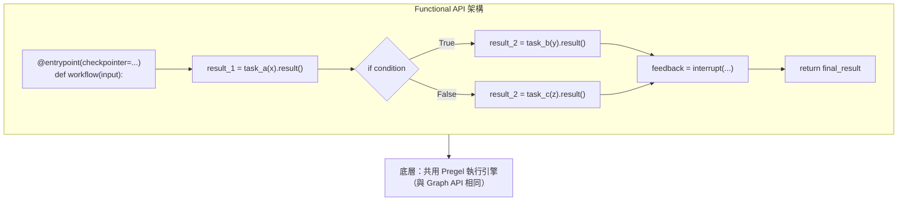
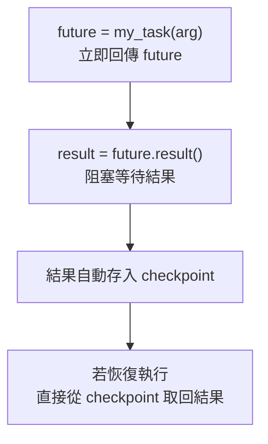
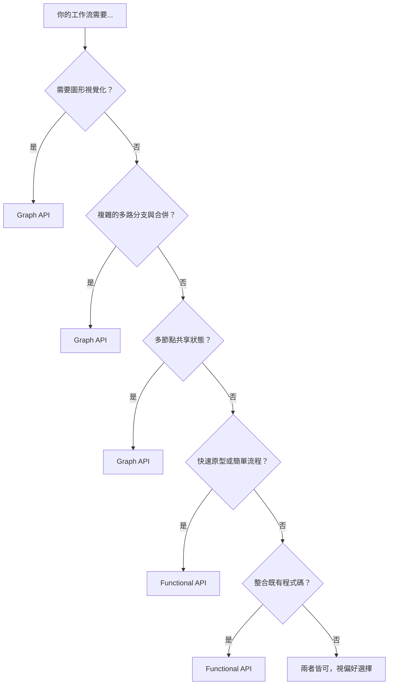

# 11.1 函數式 API（Functional API）

## 目錄

1. [Functional API 概述](#1-functional-api-概述)
2. [@entrypoint 裝飾器](#2-entrypoint-裝飾器)
3. [@task 裝飾器](#3-task-裝飾器)
4. [Retry 與 Caching](#4-retry-與-caching)
5. [Human-in-the-Loop（函數式版本）](#5-human-in-the-loop函數式版本)
6. [與 Graph API 的比較與選用時機](#6-與-graph-api-的比較與選用時機)
7. [重點摘要](#7-重點摘要)
8. [參考資源](#8-參考資源)

---

## 1. Functional API 概述

Functional API 是 LangGraph 提供的另一種工作流建構方式。與 Graph API 的宣告式圖結構不同，Functional API 讓你用**標準 Python 控制流**（if/else、for、函式呼叫）來編排工作流，同時保有 LangGraph 的核心能力：持久化、記憶、Human-in-the-Loop 和串流。



**兩大核心建構塊：**

| 元件 | 用途 |
|------|------|
| `@entrypoint` | 標記工作流入口，管理執行流程、中斷與 checkpointing |
| `@task` | 標記離散工作單元（如 API 呼叫），支援非同步執行與結果快取 |

---

## 2. @entrypoint 裝飾器

### 基本定義

`@entrypoint` 將普通函式轉換為 LangGraph 工作流。函式必須接受**單一位置引數**作為輸入；若需多參數，請使用 dict。

```python
"""
@entrypoint 基本用法：建立簡單的數字分類工作流
"""
import uuid
from langgraph.func import entrypoint, task
from langgraph.checkpoint.memory import InMemorySaver

# ============================================================
# 1. 定義 Task
# ============================================================
@task
def is_even(number: int) -> bool:
    """檢查數字是否為偶數"""
    return number % 2 == 0

@task
def format_message(even: bool) -> str:
    """根據結果格式化訊息"""
    return "這是偶數" if even else "這是奇數"

# ============================================================
# 2. 定義 Entrypoint
# ============================================================
checkpointer = InMemorySaver()

@entrypoint(checkpointer=checkpointer)
def classify_number(inputs: dict) -> str:
    """數字分類工作流"""
    even = is_even(inputs["number"]).result()
    return format_message(even).result()

# ============================================================
# 3. 執行工作流
# ============================================================
config = {"configurable": {"thread_id": str(uuid.uuid4())}}
result = classify_number.invoke({"number": 7}, config=config)
print(result)
# 輸出: 這是奇數

result2 = classify_number.invoke({"number": 42}, config=config)
print(result2)
# 輸出: 這是偶數
```

> 📄 完整範例程式碼：[11.1-example-entrypoint-basic.py](./11.1-example-entrypoint-basic.py)

### 可注入參數（Injectable Parameters）

`@entrypoint` 函式可以透過型別註記自動注入額外參數：

| 參數 | 型別 | 說明 |
|------|------|------|
| `previous` | `Any` | 同一 thread 上一次呼叫的 checkpoint 狀態 |
| `store` | `BaseStore` | 長期記憶存儲 |
| `writer` | `StreamWriter` | 自訂串流資料寫入 |
| `config` | `RunnableConfig` | 執行時期設定 |

```python
"""
可注入參數：使用 previous 實現跨呼叫短期記憶
"""
import uuid
from langgraph.func import entrypoint
from langgraph.checkpoint.memory import InMemorySaver
from typing import Any

checkpointer = InMemorySaver()

@entrypoint(checkpointer=checkpointer)
def accumulator(number: int, *, previous: Any = None) -> int:
    """累加器：每次呼叫把數字加上前一次的結果"""
    previous = previous or 0
    total = number + previous
    return total

config = {"configurable": {"thread_id": "acc-thread"}}

print(accumulator.invoke(1, config))   # 1  (previous=None → 0+1)
print(accumulator.invoke(2, config))   # 3  (previous=1 → 1+2)
print(accumulator.invoke(3, config))   # 6  (previous=3 → 3+3)
```

> 📄 完整範例程式碼：[11.1-example-accumulator.py](./11.1-example-accumulator.py)

### entrypoint.final：分離回傳值與存儲值

```python
"""
entrypoint.final：回傳給呼叫者的值與存入 checkpoint 的值可以不同
"""
import uuid
from langgraph.func import entrypoint
from langgraph.checkpoint.memory import InMemorySaver
from typing import Any

checkpointer = InMemorySaver()

@entrypoint(checkpointer=checkpointer)
def doubling_accumulator(n: int, *, previous: Any = None) -> entrypoint.final[int, int]:
    """
    回傳 previous 給呼叫者，但存儲 2*n 到 checkpoint。
    下次呼叫時 previous 會是 2*n。
    """
    previous = previous or 0
    # value=回傳值, save=存入checkpoint的值
    return entrypoint.final(value=previous, save=2 * n)

config = {"configurable": {"thread_id": "double-thread"}}

print(doubling_accumulator.invoke(3, config))  # 0   (previous=None)
print(doubling_accumulator.invoke(1, config))  # 6   (previous=2*3=6)
print(doubling_accumulator.invoke(5, config))  # 2   (previous=2*1=2)
```

> 📄 完整範例程式碼：[11.1-example-entrypoint-final.py](./11.1-example-entrypoint-final.py)

---

## 3. @task 裝飾器

### 基本概念

`@task` 代表一個離散的工作單元。它有兩個關鍵特性：

1. **非同步執行**：呼叫 task 立即回傳 future，可並行執行多個 task
2. **Checkpointing**：task 結果會自動存入 checkpoint，恢復時不需重新計算



### 並行執行 Tasks

```python
"""
並行執行多個 Task，提升 I/O 密集型任務的效能
"""
import uuid
import time
from langgraph.func import entrypoint, task
from langgraph.checkpoint.memory import InMemorySaver

@task
def fetch_data(source: str) -> dict:
    """模擬從不同來源抓取資料"""
    time.sleep(0.5)  # 模擬 I/O 延遲
    data_map = {
        "news": {"title": "AI 突破", "category": "科技"},
        "weather": {"city": "台北", "temp": 28},
        "stocks": {"index": "TAIEX", "value": 22000},
    }
    return data_map.get(source, {"error": "未知來源"})

@task
def merge_results(results: list[dict]) -> str:
    """合併所有資料來源的結果"""
    return " | ".join(str(r) for r in results)

checkpointer = InMemorySaver()

@entrypoint(checkpointer=checkpointer)
def data_pipeline(sources: list[str]) -> str:
    """平行抓取多個資料來源，然後合併"""
    # 同時啟動所有 task（不等待）
    futures = [fetch_data(src) for src in sources]
    # 一次收集所有結果
    results = [f.result() for f in futures]
    return merge_results(results).result()

config = {"configurable": {"thread_id": str(uuid.uuid4())}}

start = time.time()
result = data_pipeline.invoke(["news", "weather", "stocks"], config=config)
elapsed = time.time() - start

print(f"結果: {result}")
print(f"耗時: {elapsed:.2f}s （三個 0.5s task 並行執行）")
# 結果: {'title': 'AI 突破', 'category': '科技'} | {'city': '台北', 'temp': 28} | {'index': 'TAIEX', 'value': 22000}
# 耗時: ~0.5s（而非 1.5s）
```

> 📄 完整範例程式碼：[11.1-example-parallel-tasks.py](./11.1-example-parallel-tasks.py)

### 何時應該使用 Task

| 情境 | 說明 |
|------|------|
| **Checkpointing** | 長時間操作的結果需要持久化，避免恢復時重算 |
| **Human-in-the-Loop** | 必須把非確定性操作（如 API 呼叫）包在 task 中 |
| **並行執行** | I/O 密集型任務可並行加速 |
| **可觀察性** | 包裝為 task 方便用 LangSmith 追蹤個別操作 |
| **重試邏輯** | 需要自動重試的操作 |

### 確定性與冪等性

```
⚠️ 重要原則：所有隨機性 / 副作用 都應包在 @task 中

❌ 錯誤：直接在 entrypoint 中執行副作用
@entrypoint(checkpointer=...)
def workflow(inputs):
    with open("file.txt", "w") as f:   # 恢復時會重複執行！
        f.write("side effect")
    value = interrupt("question")
    return value

✅ 正確：將副作用包在 task 中
@task
def write_file():
    with open("file.txt", "w") as f:
        f.write("side effect")

@entrypoint(checkpointer=...)
def workflow(inputs):
    write_file().result()               # 恢復時從 checkpoint 取回
    value = interrupt("question")
    return value
```

---

## 4. Retry 與 Caching

### Retry Policy（重試策略）

透過 `RetryPolicy` 設定 task 的自動重試行為：

```python
"""
RetryPolicy：自動重試失敗的 task
"""
import uuid
from langgraph.func import entrypoint, task
from langgraph.types import RetryPolicy
from langgraph.checkpoint.memory import InMemorySaver

# 模擬不穩定的 API
call_count = 0

# 設定重試策略：遇到 ValueError 時重試
retry_policy = RetryPolicy(retry_on=ValueError)

@task(retry_policy=retry_policy)
def unstable_api_call() -> str:
    """模擬一個會失敗一次的 API 呼叫"""
    global call_count
    call_count += 1
    if call_count < 2:
        raise ValueError("暫時性失敗：API 回應超時")
    return "API 回應成功：資料已取得"

checkpointer = InMemorySaver()

@entrypoint(checkpointer=checkpointer)
def workflow(inputs: dict) -> str:
    return unstable_api_call().result()

config = {"configurable": {"thread_id": str(uuid.uuid4())}}
result = workflow.invoke({"query": "test"}, config=config)
print(result)
# 輸出: API 回應成功：資料已取得
# （第一次呼叫失敗，自動重試後成功）
```

> 📄 完整範例程式碼：[11.1-example-retry-policy.py](./11.1-example-retry-policy.py)

### Caching（快取策略）

透過 `CachePolicy` 快取 task 結果，避免重複執行：

```python
"""
CachePolicy：快取 task 結果，設定 TTL
"""
import time
from langgraph.func import entrypoint, task
from langgraph.types import CachePolicy
from langgraph.cache.memory import InMemoryCache

@task(cache_policy=CachePolicy(ttl=120))  # 快取 120 秒
def expensive_computation(x: int) -> int:
    """模擬耗時計算"""
    time.sleep(1)  # 模擬長時間運算
    return x * 2

@entrypoint(cache=InMemoryCache())
def workflow(inputs: dict) -> dict:
    # 第一次呼叫：實際執行（耗時 1 秒）
    result1 = expensive_computation(inputs["x"]).result()
    # 第二次呼叫：從快取取得（幾乎瞬間）
    result2 = expensive_computation(inputs["x"]).result()
    return {"result1": result1, "result2": result2}

start = time.time()
for chunk in workflow.stream({"x": 5}, stream_mode="updates"):
    print(chunk)
elapsed = time.time() - start

print(f"\n耗時: {elapsed:.2f}s （第二次呼叫從快取取得）")
# 輸出:
# {'expensive_computation': 10}
# {'expensive_computation': 10, '__metadata__': {'cached': True}}
# {'workflow': {'result1': 10, 'result2': 10}}
# 耗時: ~1.0s（而非 2.0s）
```

> 📄 完整範例程式碼：[11.1-example-cache-policy.py](./11.1-example-cache-policy.py)

### 錯誤恢復（Resume after Error）

```python
"""
錯誤恢復：task 結果已存入 checkpoint，恢復時不需重新執行
"""
import time
import uuid
from langgraph.func import entrypoint, task
from langgraph.checkpoint.memory import InMemorySaver

attempt_count = 0

@task
def slow_task() -> str:
    """耗時任務"""
    time.sleep(1)
    return "慢速任務完成"

@task
def flaky_task() -> str:
    """不穩定任務：第一次會失敗"""
    global attempt_count
    attempt_count += 1
    if attempt_count < 2:
        raise ValueError("模擬失敗")
    return "不穩定任務成功"

checkpointer = InMemorySaver()

@entrypoint(checkpointer=checkpointer)
def pipeline(inputs: dict) -> str:
    slow_result = slow_task().result()    # 結果會存入 checkpoint
    flaky_result = flaky_task().result()  # 第一次執行時這裡會拋錯
    return f"{slow_result} + {flaky_result}"

config = {"configurable": {"thread_id": "error-recovery"}}

# 第一次呼叫：slow_task 成功，flaky_task 失敗
try:
    pipeline.invoke({"run": 1}, config=config)
except ValueError:
    print("第一次執行失敗（預期中）")

# 恢復執行：slow_task 從 checkpoint 取回（不重新執行），flaky_task 重試成功
result = pipeline.invoke(None, config=config)
print(f"恢復後結果: {result}")
# 輸出:
# 第一次執行失敗（預期中）
# 恢復後結果: 慢速任務完成 + 不穩定任務成功
```

> 📄 完整範例程式碼：[11.1-example-error-recovery.py](./11.1-example-error-recovery.py)

---

## 5. Human-in-the-Loop（函數式版本）

### 基本 HIL 工作流

使用 `interrupt()` 暫停工作流，等待人類輸入後以 `Command(resume=...)` 恢復：

```python
"""
函數式 API 的 Human-in-the-Loop 工作流
"""
import uuid
from langgraph.func import entrypoint, task
from langgraph.types import Command, interrupt
from langgraph.checkpoint.memory import InMemorySaver

@task
def draft_email(topic: str) -> str:
    """草擬一封電子郵件"""
    return f"親愛的客戶，\n\n關於{topic}，我們想通知您最新進展...\n\n此致敬禮"

@task
def send_email(content: str, approved: bool) -> str:
    """根據審核結果發送或取消"""
    if approved:
        return f"✅ 郵件已發送:\n{content}"
    else:
        return "❌ 郵件已取消"

checkpointer = InMemorySaver()

@entrypoint(checkpointer=checkpointer)
def email_workflow(topic: str) -> dict:
    """郵件草擬 → 人工審核 → 發送/取消"""
    # Step 1: 自動草擬
    draft = draft_email(topic).result()

    # Step 2: 暫停等待人工審核
    review = interrupt({
        "draft": draft,
        "action": "請審核此郵件內容，回覆 true（核准）或 false（拒絕）"
    })

    # Step 3: 根據審核結果處理
    result = send_email(draft, review).result()

    return {"draft": draft, "review_result": review, "outcome": result}

# ============================================================
# 執行工作流
# ============================================================
thread_id = str(uuid.uuid4())
config = {"configurable": {"thread_id": thread_id}}

# 第一階段：啟動工作流 → 自動草擬後暫停
print("=== 啟動工作流 ===")
for item in email_workflow.stream("產品更新", config):
    print(item)
# 輸出:
# {'draft_email': '親愛的客戶，\n\n關於產品更新，...'}
# {'__interrupt__': (Interrupt(value={'draft': '...', 'action': '...'}),)}

print("\n=== 人工審核後恢復 ===")
# 第二階段：人工核准後恢復
for item in email_workflow.stream(Command(resume=True), config):
    print(item)
# 輸出:
# {'send_email': '✅ 郵件已發送:\n親愛的客戶，...'}
# {'email_workflow': {'draft': '...', 'review_result': True, 'outcome': '✅ 郵件已發送:...'}}
```

> 📄 完整範例程式碼：[11.1-example-hil-email.py](./11.1-example-hil-email.py)

### 串流（Streaming）

```python
"""
Functional API 的串流支援
"""
import uuid
from langgraph.func import entrypoint, task
from langgraph.checkpoint.memory import InMemorySaver
from langgraph.config import get_stream_writer

@task
def step_a(x: int) -> int:
    return x + 1

@task
def step_b(x: int) -> int:
    return x + 2

checkpointer = InMemorySaver()

@entrypoint(checkpointer=checkpointer)
def streaming_workflow(inputs: dict) -> int:
    writer = get_stream_writer()
    writer("開始處理...")

    a = step_a(inputs["x"]).result()
    writer(f"步驟 A 完成，結果: {a}")

    b = step_b(a).result()
    writer(f"步驟 B 完成，結果: {b}")

    return b

config = {"configurable": {"thread_id": str(uuid.uuid4())}}

for mode, chunk in streaming_workflow.stream(
    {"x": 5},
    stream_mode=["custom", "updates"],
    config=config
):
    print(f"[{mode}] {chunk}")
# 輸出:
# [custom] 開始處理...
# [updates] {'step_a': 6}
# [custom] 步驟 A 完成，結果: 6
# [updates] {'step_b': 8}
# [custom] 步驟 B 完成，結果: 8
# [updates] {'streaming_workflow': 8}
```

> 📄 完整範例程式碼：[11.1-example-streaming.py](./11.1-example-streaming.py)

---

## 6. 與 Graph API 的比較與選用時機

### 核心差異對照表

| 面向 | Graph API | Functional API |
|------|-----------|----------------|
| **控制流** | 宣告式（nodes + edges） | 命令式（if/else, for, 函式呼叫） |
| **狀態管理** | 需定義 State Schema 與 Reducer | 函式作用域，不需顯式 State |
| **Checkpointing** | 每個 superstep 產生新 checkpoint | Task 結果存入現有 checkpoint |
| **視覺化** | 支援圖形視覺化 | 不支援（圖在執行時動態產生） |
| **程式碼量** | 較多（定義 nodes, edges, state） | 較少（標準 Python 控制流） |
| **適用場景** | 複雜分支、並行合併、團隊協作 | 線性流程、快速原型、既有程式碼整合 |

### 選用決策流程



### 混合使用範例

兩種 API 共用同一個執行引擎，可以在同一個應用中混合使用：

```python
"""
混合使用 Graph API 與 Functional API
"""
import uuid
from typing import TypedDict
from langgraph.func import entrypoint
from langgraph.checkpoint.memory import InMemorySaver
from langgraph.graph import StateGraph

# ============================================================
# 1. 用 Graph API 建立一個子圖
# ============================================================
class MathState(TypedDict):
    value: int

def triple(state: MathState) -> MathState:
    return {"value": state["value"] * 3}

builder = StateGraph(MathState)
builder.add_node("triple", triple)
builder.set_entry_point("triple")
math_graph = builder.compile()

# ============================================================
# 2. 用 Functional API 建立主工作流，內部呼叫子圖
# ============================================================
checkpointer = InMemorySaver()

@entrypoint(checkpointer=checkpointer)
def main_workflow(x: int) -> dict:
    """Functional API 呼叫 Graph API 子圖"""
    graph_result = math_graph.invoke({"value": x})
    doubled = graph_result["value"] * 2
    return {
        "original": x,
        "tripled": graph_result["value"],
        "then_doubled": doubled
    }

config = {"configurable": {"thread_id": str(uuid.uuid4())}}
result = main_workflow.invoke(5, config=config)
print(result)
# 輸出: {'original': 5, 'tripled': 15, 'then_doubled': 30}
```

> 📄 完整範例程式碼：[11.1-example-mixed-api.py](./11.1-example-mixed-api.py)

---

## 7. 重點摘要

| 主題 | 關鍵要點 |
|------|---------|
| **@entrypoint** | 工作流入口，接受單一引數，裝飾後產生 Pregel 實例，支援 invoke/stream |
| **@task** | 離散工作單元，回傳 future，結果自動 checkpoint，支援並行執行 |
| **可注入參數** | previous（短期記憶）、store（長期記憶）、writer（串流）、config（設定） |
| **entrypoint.final** | 分離回傳值與 checkpoint 存儲值 |
| **RetryPolicy** | 設定 task 的自動重試策略（retry_on 指定可重試的例外類型） |
| **CachePolicy** | 設定 task 結果快取（ttl 指定快取存活秒數） |
| **錯誤恢復** | 以 None 和同一 thread_id 恢復執行，已完成的 task 不會重跑 |
| **HIL** | 用 interrupt() 暫停，用 Command(resume=...) 恢復 |
| **確定性** | 所有隨機性與副作用必須包在 @task 中，確保恢復時行為一致 |
| **混合使用** | Graph API 與 Functional API 可在同一應用中混用 |

---

## 8. 參考資源

- [Functional API 概念文件](https://langchain-ai.github.io/langgraph/concepts/functional_api/)
- [使用 Functional API](https://langchain-ai.github.io/langgraph/how-tos/use-functional-api/)
- [選擇 Graph API 或 Functional API](https://langchain-ai.github.io/langgraph/concepts/choosing-apis/)
- [LangGraph Checkpoint 機制](https://langchain-ai.github.io/langgraph/concepts/persistence/)
- [Human-in-the-Loop 指南](https://langchain-ai.github.io/langgraph/concepts/human_in_the_loop/)
