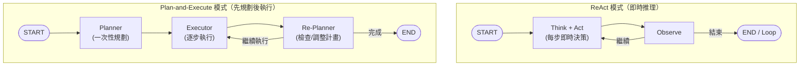
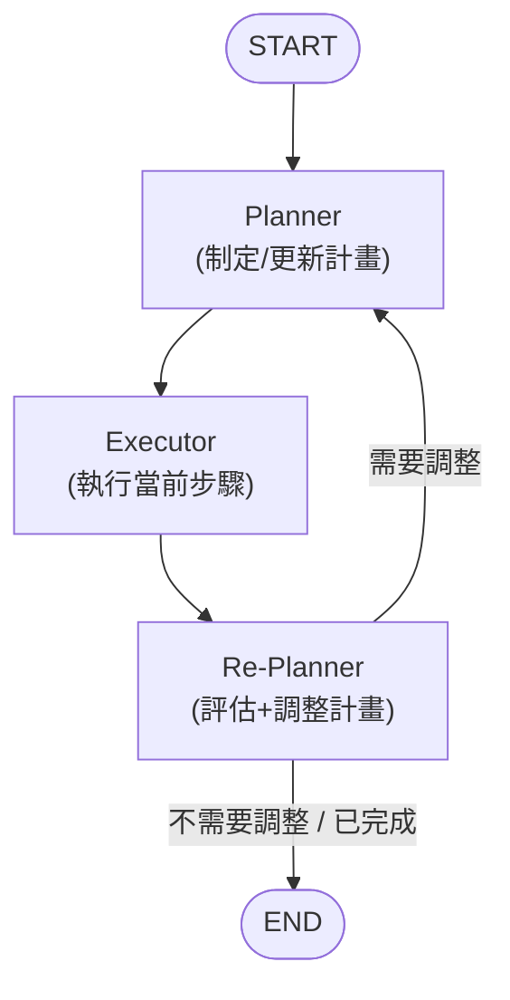
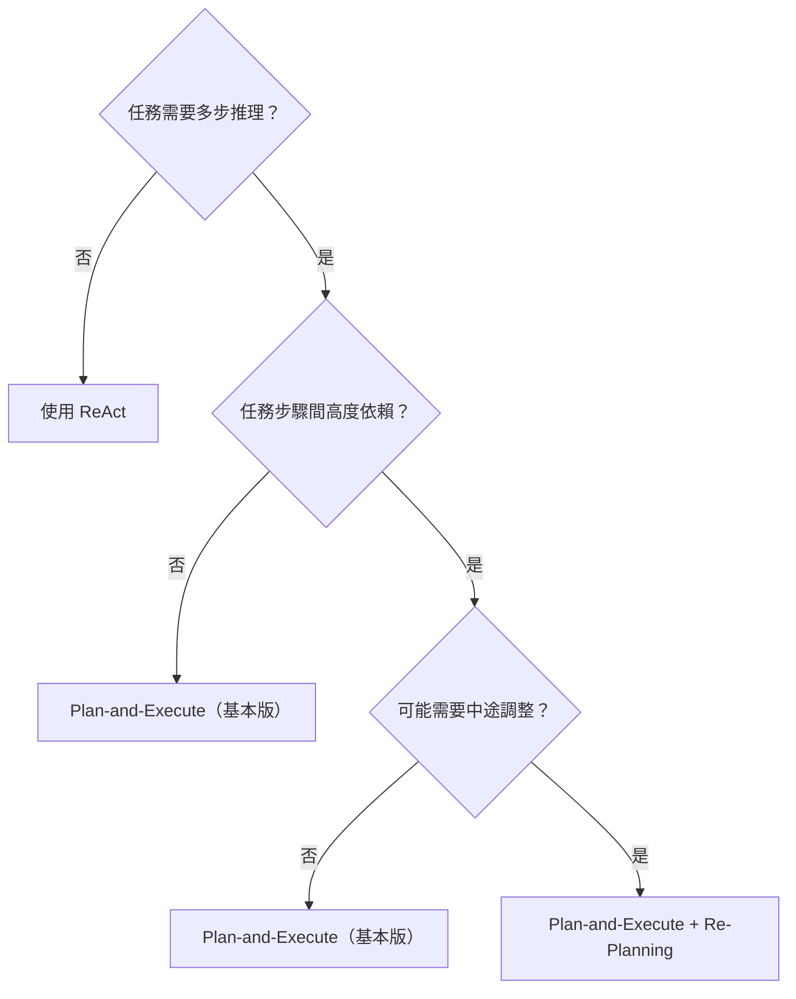

# 13.2 Plan-and-Execute Agent

## 目錄

1. [Plan-and-Execute 模式概覽](#1-plan-and-execute-模式概覽)
2. [基本 Plan-and-Execute Agent](#2-基本-plan-and-execute-agent)
3. [動態重新規劃（Re-Planning）](#3-動態重新規劃re-planning)
4. [Plan-and-Execute vs ReAct 比較](#4-plan-and-execute-vs-react-比較)
5. [重點摘要](#5-重點摘要)
6. [參考資源](#6-參考資源)

---

## 1. Plan-and-Execute 模式概覽

Plan-and-Execute 模式將 Agent 的推理分為兩個明確階段：

1. **規劃（Plan）**：LLM 先將複雜任務分解為一系列步驟
2. **執行（Execute）**：逐步執行每個步驟，必要時可動態調整計畫

這與 ReAct 模式（思考-行動-觀察的即時迴圈）形成對比。Plan-and-Execute 更適合需要多步推理的複雜任務。

### 架構對比



**Plan-and-Execute 的優勢：**
- 較大的 LLM 負責規劃（需要較強推理能力）
- 較小的 LLM 負責執行（成本較低）
- 計畫可視化、可追蹤
- 適合多步驟複雜任務

---

## 2. 基本 Plan-and-Execute Agent

### 完整範例

```python
"""
基本 Plan-and-Execute Agent
將任務分解為步驟，然後逐步執行

需要安裝：pip install langgraph langchain-openai
"""
import os
from typing import TypedDict, Annotated
import operator
from pydantic import BaseModel, Field
from langchain.chat_models import init_chat_model
from langchain.tools import tool
from langgraph.graph import StateGraph, START, END

os.environ["OPENAI_API_KEY"] = "your-api-key"


# ---- State 定義 ----
class PlanStep(BaseModel):
    """單一計畫步驟"""
    step_number: int = Field(description="步驟編號")
    description: str = Field(description="步驟描述")
    tool_needed: str = Field(description="需要的工具名稱，若不需要工具則為 'none'")


class Plan(BaseModel):
    """完整執行計畫"""
    steps: list[PlanStep] = Field(description="按順序排列的步驟列表")


class PlanExecuteState(TypedDict):
    """Agent 的完整狀態"""
    task: str                                          # 原始任務
    plan: list[dict]                                   # 計畫步驟列表
    current_step_index: int                            # 當前執行到第幾步
    step_results: Annotated[list[str], operator.add]   # 每步的執行結果
    final_answer: str                                  # 最終回答


# ---- 工具定義 ----
@tool
def calculator(expression: str) -> str:
    """計算數學表達式。輸入一個合法的 Python 數學表達式字串。"""
    try:
        result = eval(expression, {"__builtins__": {}})
        return f"計算結果：{expression} = {result}"
    except Exception as e:
        return f"計算錯誤：{e}"


@tool
def search_knowledge(query: str) -> str:
    """搜尋知識庫（模擬）。輸入搜尋關鍵字。"""
    # 模擬搜尋結果
    knowledge_base = {
        "台灣人口": "台灣人口約為 2,340 萬人（2024 年）",
        "日本人口": "日本人口約為 1.25 億人（2024 年）",
        "GDP": "台灣 2024 年 GDP 約為 7,900 億美元",
        "面積": "台灣面積約 36,193 平方公里",
    }
    for key, value in knowledge_base.items():
        if key in query:
            return value
    return f"找到關於「{query}」的資訊：[模擬搜尋結果]"


TOOLS = [calculator, search_knowledge]
TOOL_MAP = {t.name: t for t in TOOLS}

# ---- LLM ----
planner_llm = init_chat_model("gpt-4o-mini", temperature=0)
executor_llm = init_chat_model("gpt-4o-mini", temperature=0)


# ---- 規劃節點 ----
def planner(state: PlanExecuteState):
    """將任務分解為可執行的步驟"""
    task = state["task"]
    tool_descriptions = "\n".join(
        [f"- {t.name}: {t.description}" for t in TOOLS]
    )

    prompt = (
        "你是一個任務規劃器。將以下任務分解為明確的執行步驟。\n"
        "每個步驟應該是具體、可執行的。\n\n"
        f"可用的工具：\n{tool_descriptions}\n\n"
        f"任務：{task}\n\n"
        "請制定執行計畫。最後一個步驟應該是「彙整結果並回答」。"
    )

    plan = planner_llm.with_structured_output(Plan).invoke(
        [{"role": "user", "content": prompt}]
    )

    plan_dicts = [step.model_dump() for step in plan.steps]
    print("  [規劃器] 制定的計畫：")
    for step in plan.steps:
        print(f"    步驟 {step.step_number}: {step.description} (工具: {step.tool_needed})")

    return {
        "plan": plan_dicts,
        "current_step_index": 0,
    }


# ---- 執行節點 ----
def executor(state: PlanExecuteState):
    """執行當前步驟"""
    idx = state["current_step_index"]
    plan = state["plan"]

    if idx >= len(plan):
        return {"step_results": ["所有步驟已完成"]}

    current_step = plan[idx]
    step_desc = current_step["description"]
    tool_name = current_step["tool_needed"]

    print(f"\n  [執行器] 執行步驟 {idx + 1}: {step_desc}")

    if tool_name != "none" and tool_name in TOOL_MAP:
        # 讓 LLM 決定工具的輸入參數
        prompt = (
            f"你需要使用工具 '{tool_name}' 來完成這個步驟：{step_desc}\n"
            f"已知的上下文資訊：\n"
            + "\n".join(state.get("step_results", []))
            + f"\n\n請提供工具的輸入參數（純文字）。"
        )
        tool_input = executor_llm.invoke(
            [{"role": "user", "content": prompt}]
        ).content

        # 執行工具
        tool_fn = TOOL_MAP[tool_name]
        result = tool_fn.invoke(tool_input)
        print(f"    工具輸出：{result}")
    else:
        # 不需要工具，用 LLM 處理
        context = "\n".join(state.get("step_results", []))
        prompt = (
            f"完成以下步驟：{step_desc}\n"
            f"已有的資訊：\n{context}\n"
            f"原始任務：{state['task']}"
        )
        result = executor_llm.invoke(
            [{"role": "user", "content": prompt}]
        ).content

    return {
        "step_results": [f"步驟 {idx + 1} 結果：{result}"],
        "current_step_index": idx + 1,
    }


# ---- 判斷是否繼續 ----
def should_continue(state: PlanExecuteState) -> str:
    """檢查是否還有步驟需要執行"""
    if state["current_step_index"] >= len(state["plan"]):
        return "summarize"
    return "executor"


# ---- 彙整節點 ----
def summarize(state: PlanExecuteState):
    """彙整所有步驟結果，生成最終回答"""
    context = "\n".join(state["step_results"])
    prompt = (
        f"根據以下執行結果，回答原始任務。用繁體中文回答。\n\n"
        f"原始任務：{state['task']}\n\n"
        f"執行結果：\n{context}"
    )
    response = executor_llm.invoke([{"role": "user", "content": prompt}])
    return {"final_answer": response.content}


# ---- 組裝圖 ----
workflow = StateGraph(PlanExecuteState)

workflow.add_node("planner", planner)
workflow.add_node("executor", executor)
workflow.add_node("summarize", summarize)

workflow.add_edge(START, "planner")
workflow.add_edge("planner", "executor")
workflow.add_conditional_edges(
    "executor",
    should_continue,
    {
        "executor": "executor",      # 繼續下一步
        "summarize": "summarize",    # 所有步驟完成
    },
)
workflow.add_edge("summarize", END)

graph = workflow.compile()


# ---- 測試 ----
if __name__ == "__main__":
    print("=== Plan-and-Execute Agent ===\n")

    task = "台灣和日本的人口分別是多少？兩者的差距是多少倍？"
    print(f"任務：{task}\n")

    result = graph.invoke({"task": task, "step_results": []})
    print(f"\n{'='*50}")
    print(f"最終回答：{result['final_answer']}")
```

> 📄 完整範例程式碼：[13.2-example-plan-execute-basic.py](./13.2-example-plan-execute-basic.py)

---

## 3. 動態重新規劃（Re-Planning）

在基本版本中，計畫一旦制定就不會改變。但在實際場景中，某個步驟可能失敗或產生意外結果，需要動態調整計畫。

### 架構圖



### 完整範例

```python
"""
動態重新規劃（Re-Planning）的 Plan-and-Execute Agent
可在執行過程中根據結果調整後續計畫

需要安裝：pip install langgraph langchain-openai
"""
import os
from typing import TypedDict, Annotated, Literal
import operator
from pydantic import BaseModel, Field
from langchain.chat_models import init_chat_model
from langchain.tools import tool
from langgraph.graph import StateGraph, START, END

os.environ["OPENAI_API_KEY"] = "your-api-key"


# ---- State 定義 ----
class ReplanState(TypedDict):
    task: str
    plan: list[str]                                     # 步驟描述列表
    completed_steps: Annotated[list[str], operator.add]  # 已完成步驟及結果
    current_step: str                                    # 當前步驟
    final_answer: str


# ---- 工具 ----
@tool
def web_search(query: str) -> str:
    """在網路上搜尋資訊（模擬）"""
    simulated_results = {
        "python 3.13": "Python 3.13 新增 free-threaded 模式和改進的錯誤訊息。",
        "langgraph": "LangGraph 是 LangChain 生態的 Agent 框架，用於建構有狀態工作流。",
        "react": "React 是 Meta 開發的前端 JavaScript 框架。",
    }
    for key, val in simulated_results.items():
        if key.lower() in query.lower():
            return val
    return f"搜尋 '{query}' 的結果：[未找到精確結果]"


@tool
def code_executor(code: str) -> str:
    """執行 Python 程式碼片段（模擬，僅支援安全表達式）"""
    try:
        result = eval(code, {"__builtins__": {}})
        return f"執行結果：{result}"
    except Exception as e:
        return f"執行錯誤：{str(e)}"


TOOLS = [web_search, code_executor]
TOOL_MAP = {t.name: t for t in TOOLS}

# ---- LLM ----
planner_llm = init_chat_model("gpt-4o-mini", temperature=0)
executor_llm = init_chat_model("gpt-4o-mini", temperature=0)


# ---- 規劃器 ----
class PlanOutput(BaseModel):
    steps: list[str] = Field(description="按順序的步驟描述列表")


def planner(state: ReplanState):
    """制定初始計畫"""
    task = state["task"]
    tool_info = "\n".join([f"- {t.name}: {t.description}" for t in TOOLS])

    prompt = (
        "你是任務規劃專家。制定一個簡潔的執行計畫。\n"
        "每個步驟應該清楚、具體、可執行。\n"
        f"可用工具：\n{tool_info}\n\n"
        f"任務：{task}\n\n"
        "輸出 3-5 個步驟的計畫。"
    )

    plan = planner_llm.with_structured_output(PlanOutput).invoke(
        [{"role": "user", "content": prompt}]
    )
    print("  [規劃器] 初始計畫：")
    for i, step in enumerate(plan.steps, 1):
        print(f"    {i}. {step}")

    return {
        "plan": plan.steps,
        "current_step": plan.steps[0] if plan.steps else "",
    }


# ---- 執行器 ----
def executor(state: ReplanState):
    """執行當前步驟"""
    step = state["current_step"]
    completed = state.get("completed_steps", [])

    print(f"\n  [執行器] 執行：{step}")

    context = "\n".join(completed) if completed else "（尚無前置結果）"
    tool_info = "\n".join([f"- {t.name}: {t.description}" for t in TOOLS])

    prompt = (
        f"完成以下步驟：{step}\n\n"
        f"可用工具：\n{tool_info}\n\n"
        f"先前結果：\n{context}\n\n"
        f"如果需要使用工具，請指明工具名稱和輸入。"
        f"如果不需要工具，直接給出結果。"
    )

    response = executor_llm.invoke([{"role": "user", "content": prompt}])
    result_text = response.content

    # 檢查是否需要呼叫工具（簡單的文字解析）
    for tool_name, tool_fn in TOOL_MAP.items():
        if tool_name in result_text.lower():
            # 嘗試提取工具輸入並執行
            tool_response = tool_fn.invoke(step)
            result_text += f"\n工具回應：{tool_response}"
            break

    print(f"    結果：{result_text[:150]}")

    return {
        "completed_steps": [f"[{step}] -> {result_text}"],
    }


# ---- 重新規劃器 ----
class ReplanDecision(BaseModel):
    action: Literal["continue", "replan", "finish"] = Field(
        description="continue=按原計畫繼續, replan=調整計畫, finish=任務完成"
    )
    updated_steps: list[str] = Field(
        default=[],
        description="若 action=replan，提供新的剩餘步驟"
    )
    reasoning: str = Field(description="決策理由")


def replanner(state: ReplanState):
    """評估進度，決定是否需要調整計畫"""
    task = state["task"]
    plan = state["plan"]
    completed = state.get("completed_steps", [])

    # 找到下一個待執行步驟的索引
    completed_count = len(completed)

    prompt = (
        "你是任務進度評估者。根據已完成的步驟和原計畫，決定下一步行動。\n\n"
        f"原始任務：{task}\n\n"
        f"原計畫：\n" + "\n".join([f"  {i+1}. {s}" for i, s in enumerate(plan)]) + "\n\n"
        f"已完成的步驟及結果：\n" + "\n".join(completed) + "\n\n"
        "選擇行動：\n"
        "- continue：按原計畫執行下一步\n"
        "- replan：根據目前結果調整後續步驟\n"
        "- finish：已有足夠資訊，可以給出最終回答\n"
    )

    decision = planner_llm.with_structured_output(ReplanDecision).invoke(
        [{"role": "user", "content": prompt}]
    )

    print(f"\n  [重規劃器] 決策：{decision.action} — {decision.reasoning}")

    if decision.action == "finish":
        # 生成最終回答
        answer_prompt = (
            f"根據以下資訊回答任務。用繁體中文回答。\n\n"
            f"任務：{task}\n\n"
            f"收集到的資訊：\n" + "\n".join(completed)
        )
        response = executor_llm.invoke([{"role": "user", "content": answer_prompt}])
        return {"final_answer": response.content}

    elif decision.action == "replan":
        # 更新計畫
        new_plan = decision.updated_steps
        print("  [重規劃器] 新計畫：")
        for i, step in enumerate(new_plan, 1):
            print(f"    {i}. {step}")
        return {
            "plan": new_plan,
            "current_step": new_plan[0] if new_plan else "",
        }

    else:  # continue
        # 按原計畫繼續
        remaining = plan[completed_count:]
        if remaining:
            return {"current_step": remaining[0]}
        else:
            # 所有步驟已完成
            answer_prompt = (
                f"根據以下資訊回答任務。用繁體中文回答。\n\n"
                f"任務：{task}\n\n"
                f"收集到的資訊：\n" + "\n".join(completed)
            )
            response = executor_llm.invoke(
                [{"role": "user", "content": answer_prompt}]
            )
            return {"final_answer": response.content}


def should_end(state: ReplanState) -> Literal["executor", "__end__"]:
    """根據是否有最終回答決定是否結束"""
    if state.get("final_answer"):
        return "__end__"
    return "executor"


# ---- 組裝圖 ----
workflow = StateGraph(ReplanState)

workflow.add_node("planner", planner)
workflow.add_node("executor", executor)
workflow.add_node("replanner", replanner)

workflow.add_edge(START, "planner")
workflow.add_edge("planner", "executor")
workflow.add_edge("executor", "replanner")
workflow.add_conditional_edges(
    "replanner",
    should_end,
    {
        "executor": "executor",
        "__end__": END,
    },
)

graph = workflow.compile()


# ---- 測試 ----
if __name__ == "__main__":
    print("=== 動態重新規劃 Agent ===\n")

    task = "請比較 Python 3.13 和 LangGraph 各自的主要特色，並總結它們之間有什麼關聯。"
    print(f"任務：{task}\n")

    result = graph.invoke({
        "task": task,
        "plan": [],
        "completed_steps": [],
        "current_step": "",
        "final_answer": "",
    })

    print(f"\n{'='*60}")
    print(f"最終回答：\n{result['final_answer']}")
```

> 📄 完整範例程式碼：[13.2-example-replan.py](./13.2-example-replan.py)

### 帶有最大迭代次數保護的版本

在生產環境中，需要防止無限迴圈：

```python
"""
帶有迭代次數限制的 Plan-and-Execute Agent
需要安裝：pip install langgraph langchain-openai
"""
import os
from typing import TypedDict, Annotated, Literal
import operator
from pydantic import BaseModel, Field
from langchain.chat_models import init_chat_model
from langgraph.graph import StateGraph, START, END

os.environ["OPENAI_API_KEY"] = "your-api-key"

MAX_ITERATIONS = 10  # 最大迭代次數


class SafePlanState(TypedDict):
    task: str
    plan: list[str]
    completed_steps: Annotated[list[str], operator.add]
    current_step: str
    iteration_count: int
    final_answer: str


llm = init_chat_model("gpt-4o-mini", temperature=0)


class PlanOutput(BaseModel):
    steps: list[str]


def planner(state: SafePlanState):
    prompt = f"為以下任務制定 3-5 步簡潔計畫：\n{state['task']}"
    plan = llm.with_structured_output(PlanOutput).invoke(
        [{"role": "user", "content": prompt}]
    )
    return {
        "plan": plan.steps,
        "current_step": plan.steps[0] if plan.steps else "",
        "iteration_count": 0,
    }


def executor(state: SafePlanState):
    step = state["current_step"]
    context = "\n".join(state.get("completed_steps", []))
    prompt = f"執行步驟：{step}\n已有資訊：\n{context}"
    response = llm.invoke([{"role": "user", "content": prompt}])
    return {
        "completed_steps": [f"[{step}] -> {response.content}"],
        "iteration_count": state["iteration_count"] + 1,
    }


def check_progress(state: SafePlanState) -> Literal["executor", "finish"]:
    """檢查是否繼續，包含安全保護"""
    # 安全閥：超過最大迭代次數強制結束
    if state["iteration_count"] >= MAX_ITERATIONS:
        print(f"  [安全] 達到最大迭代次數 {MAX_ITERATIONS}，強制結束")
        return "finish"

    completed_count = len(state.get("completed_steps", []))
    if completed_count >= len(state["plan"]):
        return "finish"

    # 設定下一步
    return "executor"


def update_next_step(state: SafePlanState):
    """更新 current_step 為下一個待執行步驟"""
    completed_count = len(state.get("completed_steps", []))
    plan = state["plan"]
    if completed_count < len(plan):
        return {"current_step": plan[completed_count]}
    return {}


def finish(state: SafePlanState):
    context = "\n".join(state.get("completed_steps", []))
    prompt = f"根據以下結果回答任務（繁體中文）：\n任務：{state['task']}\n結果：\n{context}"
    response = llm.invoke([{"role": "user", "content": prompt}])
    return {"final_answer": response.content}


# ---- 組裝 ----
workflow = StateGraph(SafePlanState)

workflow.add_node("planner", planner)
workflow.add_node("executor", executor)
workflow.add_node("update_next_step", update_next_step)
workflow.add_node("finish", finish)

workflow.add_edge(START, "planner")
workflow.add_edge("planner", "executor")
workflow.add_edge("executor", "update_next_step")
workflow.add_conditional_edges(
    "update_next_step",
    check_progress,
    {"executor": "executor", "finish": "finish"},
)
workflow.add_edge("finish", END)

graph = workflow.compile()


if __name__ == "__main__":
    result = graph.invoke({
        "task": "列出 LangGraph 的三個核心概念並簡單解釋",
        "plan": [],
        "completed_steps": [],
        "current_step": "",
        "iteration_count": 0,
        "final_answer": "",
    })
    print(f"回答：{result['final_answer']}")
```

> 📄 完整範例程式碼：[13.2-example-safe-plan.py](./13.2-example-safe-plan.py)

---

## 4. Plan-and-Execute vs ReAct 比較

| 特性 | Plan-and-Execute | ReAct |
|------|-----------------|-------|
| **決策時機** | 先全域規劃，再逐步執行 | 每一步即時決策 |
| **計畫可見性** | 高（計畫明確列出） | 低（隱式推理） |
| **適合任務** | 多步複雜任務 | 簡單互動式任務 |
| **LLM 呼叫** | 規劃 1 次 + 每步 1 次 | 每步 1 次（思考+行動） |
| **錯誤恢復** | 可重新規劃 | 依賴 LLM 即時調整 |
| **成本優化** | 可用不同大小的模型 | 通常用同一個模型 |
| **上下文窗口** | 壓力較小（分步處理） | 壓力較大（累積歷史） |
| **可追蹤性** | 強（步驟清晰） | 弱（推理過程模糊） |
| **實作複雜度** | 較高 | 較低 |

### 何時使用哪種模式？



---

## 5. 重點摘要

| 主題 | 重點 |
|------|------|
| Plan-and-Execute | 將任務分為「規劃」和「執行」兩個階段，適合多步複雜任務 |
| Planner | 負責將任務分解為步驟列表，通常使用 `with_structured_output` 輸出結構化計畫 |
| Executor | 逐步執行計畫中的步驟，可呼叫工具完成具體任務 |
| Re-Planner | 在每步執行後評估進度，決定是繼續、調整計畫或結束 |
| 條件邊 | 用 `add_conditional_edges` 控制執行流：繼續執行或進入結束 |
| 安全保護 | 生產環境必須設定 `MAX_ITERATIONS` 防止無限迴圈 |
| 模型分離 | 規劃用強模型（如 GPT-4o），執行用輕量模型（如 GPT-4o-mini），降低成本 |
| State 設計 | 需要追蹤 plan、current_step_index、step_results 等欄位 |
| Reducer | `step_results` 使用 `operator.add` 做累加，保留所有步驟結果 |
| vs ReAct | Plan-and-Execute 更適合長期規劃，ReAct 更適合即時互動 |

---

## 6. 參考資源

- [LangGraph Plan-and-Execute](https://langchain-ai.github.io/langgraph/tutorials/plan-and-execute/plan-and-execute/) — 官方 Plan-and-Execute 教學
- [Plan-and-Solve Paper](https://arxiv.org/abs/2305.04091) — Plan-and-Solve Prompting 論文
- [BabyAGI](https://github.com/yoheinakajima/babyagi) — 早期的 Plan-and-Execute 實作
- [LangGraph ReAct Agent](https://langchain-ai.github.io/langgraph/how-tos/create-react-agent/) — ReAct Agent 教學（對比參考）
- [LangGraph Workflows and Agents](https://langchain-ai.github.io/langgraph/concepts/agentic_concepts/) — Agent 概念文件
