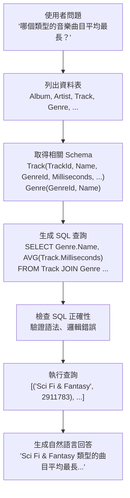
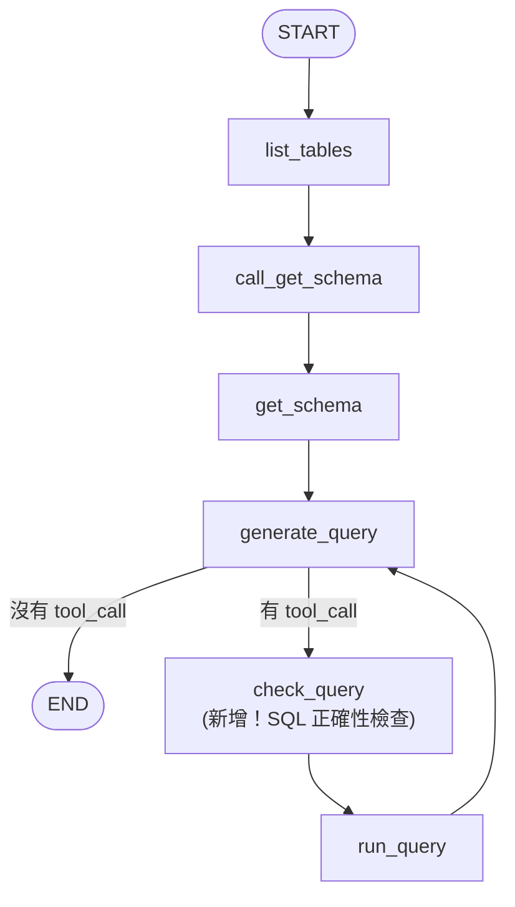
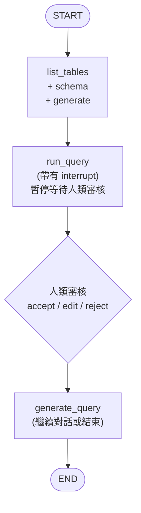

# 13.3 SQL Agent

## 目錄

1. [SQL Agent 概覽](#1-sql-agent-概覽)
2. [基本 SQL Agent：自然語言轉 SQL](#2-基本-sql-agent自然語言轉-sql)
3. [進階 SQL Agent：帶查詢驗證](#3-進階-sql-agent帶查詢驗證)
4. [Human-in-the-Loop SQL Agent](#4-human-in-the-loop-sql-agent)
5. [SQL Agent 安全性考量](#5-sql-agent-安全性考量)
6. [重點摘要](#6-重點摘要)
7. [參考資源](#7-參考資源)

---

## 1. SQL Agent 概覽

SQL Agent 讓使用者以自然語言提問，由 LLM 自動生成 SQL 查詢、執行查詢、並將結果轉化為人類可讀的回答。

### 典型工作流程



### LangChain SQL 工具集

LangChain 的 `SQLDatabaseToolkit` 提供四個核心工具：

| 工具名稱 | 功能 |
|----------|------|
| `sql_db_list_tables` | 列出資料庫中所有資料表 |
| `sql_db_schema` | 取得指定資料表的 Schema 和範例資料 |
| `sql_db_query` | 執行 SQL 查詢並回傳結果 |
| `sql_db_query_checker` | 用 LLM 檢查 SQL 查詢的正確性 |

---

## 2. 基本 SQL Agent：自然語言轉 SQL

### 完整範例

```python
"""
基本 SQL Agent：自然語言轉 SQL 查詢
使用 SQLite 範例資料庫（Chinook — 數位音樂商店）

需要安裝：pip install langgraph langchain-openai langchain-community
"""
import os
import sqlite3
import pathlib
import requests
from langchain.chat_models import init_chat_model
from langchain_community.utilities import SQLDatabase
from langchain_community.agent_toolkits import SQLDatabaseToolkit
from langchain.messages import AIMessage
from langgraph.graph import StateGraph, MessagesState, START, END
from langgraph.prebuilt import ToolNode

os.environ["OPENAI_API_KEY"] = "your-api-key"


# ---- 第一步：準備資料庫 ----
# 下載 Chinook 範例資料庫
db_path = pathlib.Path("Chinook.db")
if not db_path.exists():
    url = "https://storage.googleapis.com/benchmarks-artifacts/chinook/Chinook.db"
    response = requests.get(url)
    if response.status_code == 200:
        db_path.write_bytes(response.content)
        print(f"已下載 {db_path}")

# 如果無法下載，建立一個簡單的範例資料庫
if not db_path.exists():
    conn = sqlite3.connect("Chinook.db")
    cursor = conn.cursor()
    cursor.executescript("""
        CREATE TABLE IF NOT EXISTS Artist (
            ArtistId INTEGER PRIMARY KEY,
            Name TEXT NOT NULL
        );
        CREATE TABLE IF NOT EXISTS Album (
            AlbumId INTEGER PRIMARY KEY,
            Title TEXT NOT NULL,
            ArtistId INTEGER REFERENCES Artist(ArtistId)
        );
        CREATE TABLE IF NOT EXISTS Genre (
            GenreId INTEGER PRIMARY KEY,
            Name TEXT NOT NULL
        );
        CREATE TABLE IF NOT EXISTS Track (
            TrackId INTEGER PRIMARY KEY,
            Name TEXT NOT NULL,
            AlbumId INTEGER REFERENCES Album(AlbumId),
            GenreId INTEGER REFERENCES Genre(GenreId),
            Milliseconds INTEGER NOT NULL,
            UnitPrice REAL NOT NULL
        );
        INSERT OR IGNORE INTO Artist VALUES (1, 'AC/DC'), (2, 'Accept'), (3, 'Aerosmith');
        INSERT OR IGNORE INTO Genre VALUES (1, 'Rock'), (2, 'Jazz'), (3, 'Metal');
        INSERT OR IGNORE INTO Album VALUES (1, 'Highway to Hell', 1), (2, 'Back in Black', 1);
        INSERT OR IGNORE INTO Track VALUES
            (1, 'Highway to Hell', 1, 1, 215000, 0.99),
            (2, 'Back in Black', 2, 1, 255000, 0.99),
            (3, 'Hells Bells', 2, 3, 312000, 0.99);
    """)
    conn.commit()
    conn.close()
    print("已建立範例資料庫")

# 連接資料庫
db = SQLDatabase.from_uri("sqlite:///Chinook.db")
print(f"方言：{db.dialect}")
print(f"可用資料表：{db.get_usable_table_names()}")


# ---- 第二步：取得 SQL 工具 ----
model = init_chat_model("gpt-4o-mini", temperature=0)
toolkit = SQLDatabaseToolkit(db=db, llm=model)
tools = toolkit.get_tools()

print("\n可用工具：")
for tool in tools:
    print(f"  - {tool.name}: {tool.description[:80]}...")


# ---- 第三步：定義節點 ----
def list_tables(state: MessagesState):
    """第一步：列出所有資料表"""
    list_tables_tool = next(t for t in tools if t.name == "sql_db_list_tables")

    # 建立預定的 tool call
    tool_call = {
        "name": "sql_db_list_tables",
        "args": {},
        "id": "list_tables_call",
        "type": "tool_call",
    }
    tool_call_msg = AIMessage(content="", tool_calls=[tool_call])
    tool_response = list_tables_tool.invoke(tool_call)
    summary = AIMessage(content=f"可用的資料表：{tool_response.content}")

    print(f"  [列出資料表] {tool_response.content}")
    return {"messages": [tool_call_msg, tool_response, summary]}


# 取得 Schema 工具節點
get_schema_tool = next(t for t in tools if t.name == "sql_db_schema")
get_schema_node = ToolNode([get_schema_tool], name="get_schema")


def call_get_schema(state: MessagesState):
    """讓 LLM 選擇需要查看的資料表 Schema"""
    llm_with_tools = model.bind_tools([get_schema_tool], tool_choice="any")
    response = llm_with_tools.invoke(state["messages"])
    return {"messages": [response]}


# 執行查詢工具
run_query_tool = next(t for t in tools if t.name == "sql_db_query")
run_query_node = ToolNode([run_query_tool], name="run_query")


# 生成查詢
GENERATE_QUERY_PROMPT = """你是一個 SQL 查詢專家。
根據使用者問題和資料庫 Schema 生成正確的 {dialect} 查詢。

規則：
- 除非使用者指定數量，否則限制查詢結果最多 5 筆
- 按相關欄位排序以回傳最有意義的結果
- 只查詢需要的欄位，不要 SELECT *
- 絕對不要執行 INSERT、UPDATE、DELETE、DROP 等修改語句
""".format(dialect=db.dialect)


def generate_query(state: MessagesState):
    """生成 SQL 查詢"""
    system_msg = {"role": "system", "content": GENERATE_QUERY_PROMPT}
    llm_with_tools = model.bind_tools([run_query_tool])
    response = llm_with_tools.invoke([system_msg] + state["messages"])
    return {"messages": [response]}


def should_continue(state: MessagesState):
    """判斷是否有查詢需要執行"""
    last = state["messages"][-1]
    if hasattr(last, "tool_calls") and last.tool_calls:
        return "run_query"
    return "__end__"


# ---- 第四步：組裝圖 ----
workflow = StateGraph(MessagesState)

workflow.add_node("list_tables", list_tables)
workflow.add_node("call_get_schema", call_get_schema)
workflow.add_node("get_schema", get_schema_node)
workflow.add_node("generate_query", generate_query)
workflow.add_node("run_query", run_query_node)

# 固定流程：列表 -> 取 Schema -> 生成查詢
workflow.add_edge(START, "list_tables")
workflow.add_edge("list_tables", "call_get_schema")
workflow.add_edge("call_get_schema", "get_schema")
workflow.add_edge("get_schema", "generate_query")

# 條件邊：生成查詢後可能執行或結束
workflow.add_conditional_edges(
    "generate_query",
    should_continue,
    {"run_query": "run_query", "__end__": END},
)
# 查詢結果回到生成節點（可以繼續問或結束）
workflow.add_edge("run_query", "generate_query")

graph = workflow.compile()


# ---- 第五步：測試 ----
if __name__ == "__main__":
    print("\n=== SQL Agent 測試 ===\n")

    question = "哪個音樂類型的曲目平均最長？"
    print(f"問題：{question}\n")

    for step in graph.stream(
        {"messages": [{"role": "user", "content": question}]},
        stream_mode="values",
    ):
        last_msg = step["messages"][-1]
        if hasattr(last_msg, "content") and last_msg.content:
            print(f"  {last_msg.content[:200]}")
        if hasattr(last_msg, "tool_calls") and last_msg.tool_calls:
            for tc in last_msg.tool_calls:
                print(f"  [工具呼叫] {tc['name']}: {tc['args']}")
```

> 📄 完整範例程式碼：[13.3-example-sql-basic.py](./13.3-example-sql-basic.py)

---

## 3. 進階 SQL Agent：帶查詢驗證

在基本版本中，LLM 生成的 SQL 可能有錯誤。進階版加入**查詢檢查**節點，在執行前先驗證 SQL 的正確性。

### 架構圖



### 完整範例

```python
"""
進階 SQL Agent：帶有查詢驗證的版本
在執行 SQL 之前，先用 LLM 檢查查詢的正確性

需要安裝：pip install langgraph langchain-openai langchain-community
"""
import os
import pathlib
import requests
from typing import Literal
from langchain.chat_models import init_chat_model
from langchain.messages import AIMessage
from langchain_community.utilities import SQLDatabase
from langchain_community.agent_toolkits import SQLDatabaseToolkit
from langgraph.graph import StateGraph, MessagesState, START, END
from langgraph.prebuilt import ToolNode

os.environ["OPENAI_API_KEY"] = "your-api-key"

# ---- 資料庫設定 ----
db_path = pathlib.Path("Chinook.db")
if not db_path.exists():
    url = "https://storage.googleapis.com/benchmarks-artifacts/chinook/Chinook.db"
    resp = requests.get(url)
    if resp.status_code == 200:
        db_path.write_bytes(resp.content)

db = SQLDatabase.from_uri("sqlite:///Chinook.db")
model = init_chat_model("gpt-4o-mini", temperature=0)
toolkit = SQLDatabaseToolkit(db=db, llm=model)
tools = toolkit.get_tools()

# 取出各工具
get_schema_tool = next(t for t in tools if t.name == "sql_db_schema")
run_query_tool = next(t for t in tools if t.name == "sql_db_query")
list_tables_tool = next(t for t in tools if t.name == "sql_db_list_tables")

get_schema_node = ToolNode([get_schema_tool], name="get_schema")
run_query_node = ToolNode([run_query_tool], name="run_query")


# ---- 節點定義 ----
def list_tables(state: MessagesState):
    tool_call = {
        "name": "sql_db_list_tables",
        "args": {},
        "id": "list_call",
        "type": "tool_call",
    }
    tool_call_msg = AIMessage(content="", tool_calls=[tool_call])
    tool_response = list_tables_tool.invoke(tool_call)
    summary = AIMessage(content=f"可用資料表：{tool_response.content}")
    return {"messages": [tool_call_msg, tool_response, summary]}


def call_get_schema(state: MessagesState):
    llm_with_tools = model.bind_tools([get_schema_tool], tool_choice="any")
    response = llm_with_tools.invoke(state["messages"])
    return {"messages": [response]}


GENERATE_PROMPT = """你是 SQL 專家。根據問題和 Schema 生成 {dialect} 查詢。
規則：
- 限制結果最多 5 筆（除非使用者指定）
- 不要用 SELECT *
- 不要執行 DML 語句（INSERT/UPDATE/DELETE/DROP）
""".format(dialect=db.dialect)


def generate_query(state: MessagesState):
    system_msg = {"role": "system", "content": GENERATE_PROMPT}
    llm_with_tools = model.bind_tools([run_query_tool])
    response = llm_with_tools.invoke([system_msg] + state["messages"])
    return {"messages": [response]}


# ---- 查詢檢查節點（核心新增）----
CHECK_QUERY_PROMPT = """你是 SQL 專家，仔細檢查以下 {dialect} 查詢是否有常見錯誤：
- NOT IN 搭配 NULL 值
- 該用 UNION ALL 卻用了 UNION
- BETWEEN 的邊界問題
- 資料型別不匹配
- 欄位名稱是否正確引用
- 函數參數數量是否正確
- JOIN 條件是否正確

如果有錯誤，請修正查詢。如果沒有錯誤，請原樣輸出查詢。
執行修正後的查詢。""".format(dialect=db.dialect)


def check_query(state: MessagesState):
    """在執行前檢查 SQL 查詢的正確性"""
    # 取出 generate_query 產生的 tool_call
    last_msg = state["messages"][-1]
    if not last_msg.tool_calls:
        return {"messages": []}

    tool_call = last_msg.tool_calls[0]
    original_query = tool_call["args"].get("query", "")

    print(f"  [查詢檢查] 原始查詢：{original_query}")

    system_msg = {"role": "system", "content": CHECK_QUERY_PROMPT}
    user_msg = {"role": "user", "content": original_query}

    # 強制 LLM 輸出一個 run_query 的 tool call
    llm_with_tools = model.bind_tools([run_query_tool], tool_choice="any")
    response = llm_with_tools.invoke([system_msg, user_msg])

    # 保持原始消息 ID 以維持 tool call 鏈
    response.id = last_msg.id

    if response.tool_calls:
        checked_query = response.tool_calls[0]["args"].get("query", "")
        if checked_query != original_query:
            print(f"  [查詢檢查] 修正後：{checked_query}")
        else:
            print(f"  [查詢檢查] 查詢正確，無需修改")

    return {"messages": [response]}


def should_continue(state: MessagesState) -> Literal["__end__", "check_query"]:
    last = state["messages"][-1]
    if hasattr(last, "tool_calls") and last.tool_calls:
        return "check_query"
    return "__end__"


# ---- 組裝圖 ----
workflow = StateGraph(MessagesState)

workflow.add_node("list_tables", list_tables)
workflow.add_node("call_get_schema", call_get_schema)
workflow.add_node("get_schema", get_schema_node)
workflow.add_node("generate_query", generate_query)
workflow.add_node("check_query", check_query)
workflow.add_node("run_query", run_query_node)

workflow.add_edge(START, "list_tables")
workflow.add_edge("list_tables", "call_get_schema")
workflow.add_edge("call_get_schema", "get_schema")
workflow.add_edge("get_schema", "generate_query")
workflow.add_conditional_edges(
    "generate_query",
    should_continue,
    {"check_query": "check_query", "__end__": END},
)
workflow.add_edge("check_query", "run_query")
workflow.add_edge("run_query", "generate_query")

graph = workflow.compile()


# ---- 測試 ----
if __name__ == "__main__":
    print("=== 進階 SQL Agent（帶查詢驗證）===\n")

    questions = [
        "哪位藝術家的專輯最多？",
        "列出價格最高的前 5 首曲目",
        "每個音樂類型有多少首曲目？",
    ]

    for q in questions:
        print(f"\n{'='*50}")
        print(f"問題：{q}\n")
        for step in graph.stream(
            {"messages": [{"role": "user", "content": q}]},
            stream_mode="values",
        ):
            last = step["messages"][-1]
            if hasattr(last, "content") and last.content:
                content = last.content[:200]
                if content.strip():
                    print(f"  {content}")
```

---

## 4. Human-in-the-Loop SQL Agent

在執行 SQL 查詢前讓人類審核是生產環境的最佳實踐，可以防止意外的破壞性查詢。

### 架構圖



### 完整範例

```python
"""
Human-in-the-Loop SQL Agent
在執行 SQL 查詢前暫停，等待人類審核

需要安裝：pip install langgraph langchain-openai langchain-community
"""
import os
import json
import pathlib
import requests
from typing import Literal
from langchain.chat_models import init_chat_model
from langchain.messages import AIMessage
from langchain.tools import tool as tool_decorator
from langchain_community.utilities import SQLDatabase
from langchain_community.agent_toolkits import SQLDatabaseToolkit
from langchain_core.runnables import RunnableConfig
from langgraph.graph import StateGraph, MessagesState, START, END
from langgraph.prebuilt import ToolNode
from langgraph.checkpoint.memory import InMemorySaver
from langgraph.types import interrupt, Command

os.environ["OPENAI_API_KEY"] = "your-api-key"

# ---- 資料庫設定 ----
db_path = pathlib.Path("Chinook.db")
if not db_path.exists():
    url = "https://storage.googleapis.com/benchmarks-artifacts/chinook/Chinook.db"
    resp = requests.get(url)
    if resp.status_code == 200:
        db_path.write_bytes(resp.content)

db = SQLDatabase.from_uri("sqlite:///Chinook.db")
model = init_chat_model("gpt-4o-mini", temperature=0)
toolkit = SQLDatabaseToolkit(db=db, llm=model)
tools = toolkit.get_tools()

get_schema_tool = next(t for t in tools if t.name == "sql_db_schema")
run_query_tool_original = next(t for t in tools if t.name == "sql_db_query")
list_tables_tool = next(t for t in tools if t.name == "sql_db_list_tables")


# ---- 帶有人類審核的查詢工具 ----
@tool_decorator(
    run_query_tool_original.name,
    description=run_query_tool_original.description,
    args_schema=run_query_tool_original.args_schema,
)
def run_query_with_review(config: RunnableConfig, **tool_input):
    """執行 SQL 查詢，但先暫停等待人類審核"""
    request = {
        "action": "sql_db_query",
        "args": tool_input,
        "description": "請審核以下 SQL 查詢是否安全且正確",
    }

    # 暫停執行，等待人類輸入
    response = interrupt([request])

    if response["type"] == "accept":
        # 人類核准，執行原始查詢
        return run_query_tool_original.invoke(tool_input, config)

    elif response["type"] == "edit":
        # 人類修改了查詢
        edited_input = response["args"]["args"]
        return run_query_tool_original.invoke(edited_input, config)

    elif response["type"] == "reject":
        # 人類拒絕執行
        return "查詢被拒絕：" + response.get("reason", "未提供原因")

    else:
        raise ValueError(f"不支援的回應類型：{response['type']}")


# ---- 節點定義 ----
def list_tables(state: MessagesState):
    tool_call = {
        "name": "sql_db_list_tables",
        "args": {},
        "id": "list_call",
        "type": "tool_call",
    }
    tool_call_msg = AIMessage(content="", tool_calls=[tool_call])
    tool_response = list_tables_tool.invoke(tool_call)
    summary = AIMessage(content=f"可用資料表：{tool_response.content}")
    return {"messages": [tool_call_msg, tool_response, summary]}


def call_get_schema(state: MessagesState):
    llm_with_tools = model.bind_tools([get_schema_tool], tool_choice="any")
    response = llm_with_tools.invoke(state["messages"])
    return {"messages": [response]}


get_schema_node = ToolNode([get_schema_tool], name="get_schema")


def generate_query(state: MessagesState):
    system_prompt = (
        f"你是 {db.dialect} SQL 專家。根據問題生成查詢。"
        "限制結果 5 筆，不要 SELECT *，不要 DML。"
    )
    system_msg = {"role": "system", "content": system_prompt}
    llm_with_tools = model.bind_tools([run_query_with_review])
    response = llm_with_tools.invoke([system_msg] + state["messages"])
    return {"messages": [response]}


run_query_node = ToolNode([run_query_with_review], name="run_query")


def should_continue(state: MessagesState) -> Literal["__end__", "run_query"]:
    last = state["messages"][-1]
    if hasattr(last, "tool_calls") and last.tool_calls:
        return "run_query"
    return "__end__"


# ---- 組裝圖（帶 checkpointer）----
workflow = StateGraph(MessagesState)

workflow.add_node("list_tables", list_tables)
workflow.add_node("call_get_schema", call_get_schema)
workflow.add_node("get_schema", get_schema_node)
workflow.add_node("generate_query", generate_query)
workflow.add_node("run_query", run_query_node)

workflow.add_edge(START, "list_tables")
workflow.add_edge("list_tables", "call_get_schema")
workflow.add_edge("call_get_schema", "get_schema")
workflow.add_edge("get_schema", "generate_query")
workflow.add_conditional_edges(
    "generate_query",
    should_continue,
    {"run_query": "run_query", "__end__": END},
)
workflow.add_edge("run_query", "generate_query")

# 使用 checkpointer 來支援 interrupt/resume
checkpointer = InMemorySaver()
graph = workflow.compile(checkpointer=checkpointer)


# ---- 測試 ----
if __name__ == "__main__":
    print("=== Human-in-the-Loop SQL Agent ===\n")

    config = {"configurable": {"thread_id": "sql-hitl-1"}}
    question = "哪位藝術家的專輯數量最多？列出前 3 名。"
    print(f"問題：{question}\n")

    # 第一階段：執行到 interrupt
    print("[階段 1] 執行到人類審核點...\n")
    for step in graph.stream(
        {"messages": [{"role": "user", "content": question}]},
        config,
        stream_mode="values",
    ):
        last = step["messages"][-1]
        if hasattr(last, "content") and last.content:
            print(f"  {last.content[:200]}")
        if hasattr(last, "tool_calls") and last.tool_calls:
            for tc in last.tool_calls:
                print(f"  [待審核查詢] {tc['args']}")

    # 第二階段：人類核准查詢
    print("\n[階段 2] 人類核准查詢...\n")
    for step in graph.stream(
        Command(resume={"type": "accept"}),
        config,
        stream_mode="values",
    ):
        last = step["messages"][-1]
        if hasattr(last, "content") and last.content:
            print(f"  {last.content[:200]}")
```

---

## 5. SQL Agent 安全性考量

### 安全性最佳實踐

| # | SQL Agent 安全層 | 說明 |
|---|-----------------|------|
| 1 | 唯讀資料庫連線 | 只允許 SELECT |
| 2 | SQL 注入防護 | 參數化查詢 |
| 3 | 查詢白名單/黑名單 | 禁止 DROP/DELETE 等 |
| 4 | 結果集限制 | 最多回傳 N 筆 |
| 5 | Human-in-the-Loop | 人類審核關鍵查詢 |
| 6 | 審計日誌 | 記錄所有查詢 |

### 安全查詢驗證範例

```python
"""
SQL 查詢安全驗證工具
在執行查詢前進行多重安全檢查

需要安裝：pip install langgraph langchain-openai langchain-community
"""
import re
from typing import TypedDict
from langchain.tools import tool


# 危險關鍵字黑名單
DANGEROUS_KEYWORDS = [
    "DROP", "DELETE", "INSERT", "UPDATE", "ALTER",
    "CREATE", "TRUNCATE", "EXEC", "EXECUTE",
    "GRANT", "REVOKE", "--", ";--", "/*",
]


class QueryValidationResult(TypedDict):
    is_safe: bool
    query: str
    warnings: list[str]


def validate_sql_query(query: str) -> QueryValidationResult:
    """
    驗證 SQL 查詢的安全性

    檢查項目：
    1. 是否包含危險關鍵字（DML/DDL）
    2. 是否包含多條語句（SQL 注入）
    3. 是否有合理的 LIMIT
    """
    warnings = []
    query_upper = query.upper().strip()

    # 檢查 1：危險關鍵字
    for keyword in DANGEROUS_KEYWORDS:
        # 使用 word boundary 避免誤判
        pattern = r'\b' + re.escape(keyword) + r'\b'
        if re.search(pattern, query_upper):
            warnings.append(f"包含危險關鍵字：{keyword}")

    # 檢查 2：多條語句（排除字串中的分號）
    # 簡易檢查：去掉字串後看是否有多個分號
    cleaned = re.sub(r"'[^']*'", "", query)
    if cleaned.count(";") > 1:
        warnings.append("包含多條 SQL 語句，可能是 SQL 注入")

    # 檢查 3：是否以 SELECT 開頭
    if not query_upper.startswith("SELECT"):
        warnings.append("查詢不是以 SELECT 開頭")

    # 檢查 4：是否有 LIMIT
    if "LIMIT" not in query_upper:
        warnings.append("查詢沒有 LIMIT 限制，建議加上")

    is_safe = len([w for w in warnings if "危險" in w or "注入" in w]) == 0

    return {
        "is_safe": is_safe,
        "query": query,
        "warnings": warnings,
    }


# ---- 測試驗證 ----
if __name__ == "__main__":
    test_queries = [
        "SELECT Name FROM Artist LIMIT 5",
        "SELECT * FROM Artist; DROP TABLE Artist;",
        "DELETE FROM Artist WHERE ArtistId = 1",
        "SELECT Name, COUNT(*) FROM Album GROUP BY ArtistId",
    ]

    for q in test_queries:
        result = validate_sql_query(q)
        status = "SAFE" if result["is_safe"] else "DANGEROUS"
        print(f"[{status}] {q}")
        for w in result["warnings"]:
            print(f"  Warning: {w}")
        print()
```

> 📄 完整範例程式碼：[13.3-example-sql-validation.py](./13.3-example-sql-validation.py)

---

## 6. 重點摘要

| 主題 | 重點 |
|------|------|
| SQLDatabaseToolkit | LangChain 提供的 SQL 工具集，包含列表、Schema、查詢、查詢檢查四個工具 |
| 固定節點 | `list_tables` 和 `get_schema` 使用預定的 tool call，不依賴 LLM 決策 |
| 強制 tool call | 用 `bind_tools(tools, tool_choice="any")` 強制 LLM 輸出 tool call |
| 查詢驗證 | 在 `generate_query` 和 `run_query` 之間加入 `check_query` 節點 |
| 條件邊 | 查詢生成後用 `should_continue` 判斷是否有 tool_calls 來決定下一步 |
| Human-in-the-Loop | 用 `interrupt()` 暫停執行等待審核，需搭配 `InMemorySaver` checkpointer |
| Command.resume | 人類審核後用 `Command(resume={"type": "accept"})` 恢復執行 |
| 安全性 | 生產環境必須：唯讀連線、查詢白名單、結果限制、審計日誌 |
| ToolNode | 自動處理 tool call 的執行和 ToolMessage 的回傳 |
| 迴圈設計 | `run_query -> generate_query` 形成迴圈，讓 Agent 可以根據結果繼續查詢或結束 |

---

## 7. 參考資源

- [LangGraph SQL Agent Tutorial](https://langchain-ai.github.io/langgraph/tutorials/sql-agent/) — 官方 SQL Agent 教學
- [LangChain SQL Agent](https://python.langchain.com/docs/tutorials/sql_qa/) — LangChain SQL QA 教學
- [SQLDatabaseToolkit API](https://python.langchain.com/api_reference/community/agent_toolkits/langchain_community.agent_toolkits.sql.toolkit.SQLDatabaseToolkit.html) — API 文件
- [LangGraph Human-in-the-Loop](https://langchain-ai.github.io/langgraph/concepts/human_in_the_loop/) — HITL 概念文件
- [Chinook Database](https://github.com/lerocha/chinook-database) — 範例資料庫
- [OWASP SQL Injection](https://owasp.org/www-community/attacks/SQL_Injection) — SQL 注入安全指南
