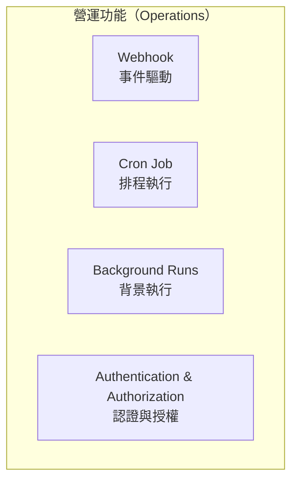
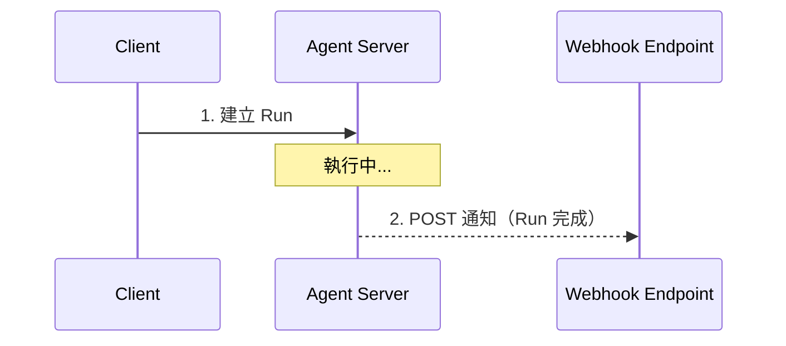
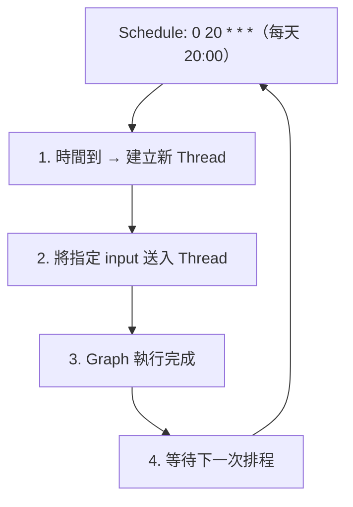
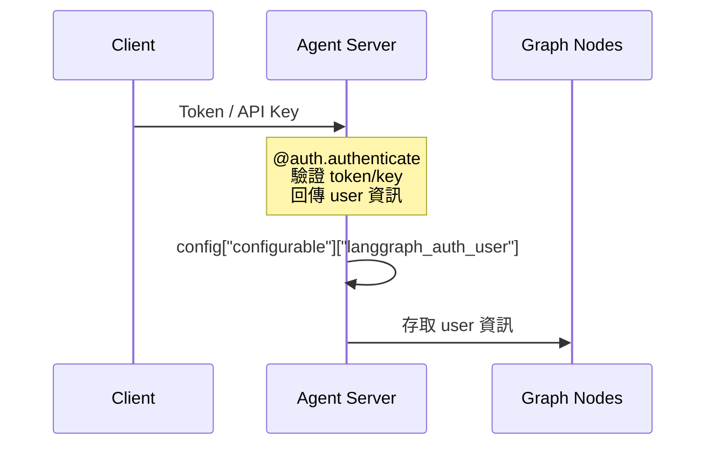
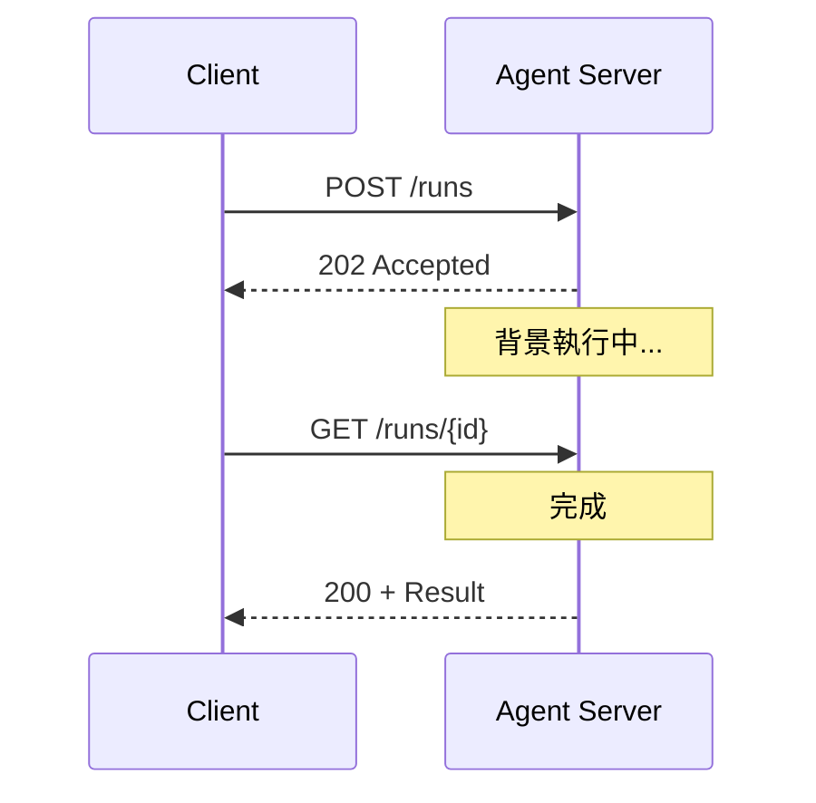
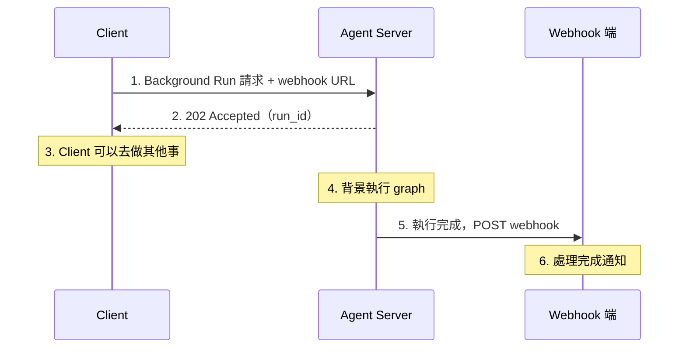

# 14.3 營運功能

## 目錄

1. [營運功能概觀](#1-營運功能概觀)
2. [Webhook（事件驅動整合）](#2-webhook事件驅動整合)
3. [Cron Job（排程執行）](#3-cron-job排程執行)
4. [認證與授權](#4-認證與授權)
5. [Background Runs（背景執行）](#5-background-runs背景執行)

---

## 1. 營運功能概觀

LangGraph Platform 提供完整的營運功能，讓 agent 應用在生產環境中穩定運作：



---

## 2. Webhook（事件驅動整合）

### 概念

Webhook 允許 Agent Server 在 **run 完成後**，主動向你指定的外部 URL 發送 POST 請求。這實現了事件驅動的架構整合。



### 支援的 API 端點

| 操作 | HTTP Method | Endpoint |
|------|-------------|----------|
| Create Run | POST | `/thread/{thread_id}/runs` |
| Stream Run | POST | `/thread/{thread_id}/runs/stream` |
| Wait Run | POST | `/thread/{thread_id}/runs/wait` |
| Create Cron | POST | `/thread/{thread_id}/runs/crons` |
| Stream (Stateless) | POST | `/runs/stream` |
| Wait (Stateless) | POST | `/runs/wait` |
| Create Cron (Stateless) | POST | `/runs/crons` |

### 完整範例

```python
"""
Webhook 完整使用範例
展示如何在 run 完成後觸發 webhook 通知
"""
from langgraph_sdk import get_client

# ============================================================
# 範例 1：基本 Webhook 使用
# ============================================================
async def webhook_basic():
    """在 streaming run 完成後觸發 webhook"""
    client = get_client(url="http://localhost:2024")

    # 建立 thread
    thread = await client.threads.create()

    # 執行 run 並指定 webhook URL
    async for chunk in client.runs.stream(
        thread_id=thread["thread_id"],
        assistant_id="agent",
        input={
            "messages": [{"role": "user", "content": "Hello!"}]
        },
        stream_mode="events",
        # Run 完成後，Agent Server 會 POST 到這個 URL
        webhook="https://my-server.app/my-webhook-endpoint",
    ):
        pass  # 處理 streaming 事件


# ============================================================
# 範例 2：Webhook 接收端（Flask 範例）
# ============================================================
# pip install flask
from flask import Flask, request, jsonify

app = Flask(__name__)

@app.route("/my-webhook-endpoint", methods=["POST"])
def handle_webhook():
    """
    接收 Agent Server 的 webhook 通知
    Payload 包含 run 完整資訊
    """
    payload = request.json

    # 提取關鍵資訊
    run_id = payload.get("run_id")
    status = payload.get("status")          # "success" 或 "error"
    thread_id = payload.get("thread_id")
    values = payload.get("values", {})       # 最終 state values
    error = payload.get("error")             # 失敗時的錯誤資訊

    print(f"Run {run_id} completed with status: {status}")

    if status == "success":
        # 處理成功的 run
        messages = values.get("messages", [])
        print(f"Agent 回覆: {messages[-1] if messages else 'N/A'}")
    elif error:
        # 處理失敗的 run
        print(f"Error: {error['error']} - {error['message']}")

    return jsonify({"received": True}), 200

# if __name__ == "__main__":
#     app.run(host="0.0.0.0", port=5000)
```

> 📄 完整範例程式碼：[14.3-example-webhook.py](./14.3-example-webhook.py)

### Webhook Payload 結構

```json
{
    "run_id": "1ef6a5b8-4457-6db0-8b15-cffd3797fa04",
    "thread_id": "9dde5490-2b67-47c8-aa14-4bfec88af217",
    "assistant_id": "agent",
    "status": "success",
    "created_at": "2024-08-30T23:07:38.242730+00:00",
    "updated_at": "2024-08-30T23:07:40.120000+00:00",
    "run_started_at": "2024-08-30T23:07:38.300000+00:00",
    "run_ended_at": "2024-08-30T23:07:40.100000+00:00",
    "webhook_sent_at": "2024-08-30T23:07:40.150000+00:00",
    "metadata": {},
    "kwargs": {
        "input": {
            "messages": [{"role": "user", "content": "Hello!"}]
        }
    },
    "values": {
        "messages": [
            {"role": "user", "content": "Hello!"},
            {"role": "assistant", "content": "Hi there!"}
        ]
    },
    "error": null
}
```

### Webhook 安全設定

```json
// langgraph.json — 加入 webhook headers 和 URL 限制
{
    "dependencies": ["."],
    "graphs": {"agent": "./agent.py:graph"},
    "webhooks": {
        "headers": {
            "Authorization": "Bearer ${{ env.LG_WEBHOOK_TOKEN }}",
            "X-Environment": "production"
        },
        "url": {
            "allowed_domains": ["*.mycompany.com", "api.trusted-service.com"],
            "require_https": true
        }
    }
}
```

---

## 3. Cron Job（排程執行）

### 概念

Cron Job 讓你**按排程**自動執行 graph，例如每天發送摘要郵件、定期整理資料等。



> **重要**：所有 cron 排程以 **UTC** 時區解釋。請確保換算到 UTC。

### 完整範例

```python
"""
Cron Job 完整使用範例
展示有狀態和無狀態兩種 cron job
"""
from langgraph_sdk import get_client


async def cron_examples():
    client = get_client(url="http://localhost:2024")
    assistant_id = "agent"

    # ========================================================
    # 範例 1：有狀態 Cron（綁定特定 Thread）
    # ========================================================
    # 每次執行都在同一個 thread 上，保持對話歷史
    thread = await client.threads.create()
    print(f"Thread: {thread['thread_id']}")

    # 建立 cron job — 每天 UTC 15:27 執行
    cron_job = await client.crons.create_for_thread(
        thread["thread_id"],
        assistant_id,
        schedule="27 15 * * *",       # Cron 表達式（UTC）
        input={
            "messages": [
                {"role": "user", "content": "請給我今天的新聞摘要"}
            ]
        },
    )
    print(f"Cron Job ID: {cron_job['cron_id']}")

    # ========================================================
    # 範例 2：無狀態 Cron（每次建立新 Thread）
    # ========================================================
    # 適合不需要保持歷史的場景
    cron_job_stateless = await client.crons.create(
        assistant_id,
        schedule="0 8 * * 1",          # 每週一 UTC 08:00
        input={
            "messages": [
                {"role": "user", "content": "整理本週的待辦事項並發送郵件"}
            ]
        },
    )
    print(f"Stateless Cron ID: {cron_job_stateless['cron_id']}")

    # ========================================================
    # 範例 3：保留 Thread 的無狀態 Cron
    # ========================================================
    # 預設 "delete" 會在 run 完成後刪除 thread
    # 使用 "keep" 可保留 thread 供後續查詢
    cron_keep = await client.crons.create(
        assistant_id,
        schedule="27 15 * * *",
        input={
            "messages": [
                {"role": "user", "content": "Daily report"}
            ]
        },
        on_run_completed="keep",  # 保留 thread
    )

    # 查詢該 cron 的歷史 runs
    runs = await client.runs.search(
        metadata={"cron_id": cron_keep["cron_id"]}
    )
    print(f"歷史 runs 數量: {len(runs)}")

    # ========================================================
    # 清理：刪除不再需要的 Cron Job（非常重要！）
    # ========================================================
    await client.crons.delete(cron_job["cron_id"])
    await client.crons.delete(cron_job_stateless["cron_id"])
    await client.crons.delete(cron_keep["cron_id"])
    print("所有 Cron Jobs 已刪除")
```

> 📄 完整範例程式碼：[14.3-example-cron-job.py](./14.3-example-cron-job.py)

### Cron 表達式速查

| 欄位 | 位置 | 範圍 |
|------|------|------|
| 分 | 第 1 欄 | 0-59 |
| 時 | 第 2 欄 | 0-23 |
| 日 | 第 3 欄 | 1-31 |
| 月 | 第 4 欄 | 1-12 |
| 星期幾 | 第 5 欄 | 0-7（0=7=日） |

格式：`* * * * *`（分 時 日 月 星期幾）

| 表達式 | 說明 |
|--------|------|
| `"0 8 * * *"` | 每天 08:00 UTC |
| `"0 20 * * 1-5"` | 週一到週五 20:00 UTC |
| `"*/30 * * * *"` | 每 30 分鐘 |
| `"0 0 1 * *"` | 每月 1 號 00:00 UTC |

---

## 4. 認證與授權

### 認證架構



### 完整範例

#### auth.py — 認證處理器

```python
"""
自訂認證處理器
驗證 API Key 並將使用者資訊傳入 Graph
"""
from langgraph_sdk import Auth

auth = Auth()


def is_valid_key(api_key: str) -> bool:
    """驗證 API Key（實際應用中連接你的認證服務）"""
    valid_keys = {
        "key-user-001": "user_001",
        "key-user-002": "user_002",
    }
    return api_key in valid_keys


async def fetch_user_tokens(api_key: str) -> dict:
    """從 Secret Store 取得使用者的 tokens"""
    # 實際應用中應連接你的 secret manager
    return {
        "github_token": "ghp_xxx",
        "jira_token": "jira_xxx",
    }


@auth.authenticate
async def authenticate(headers: dict) -> Auth.types.MinimalUserDict:
    """
    認證處理器
    - 從 headers 取得 API key
    - 驗證有效性
    - 回傳使用者資訊（會成為 config["configurable"]["langgraph_auth_user"]）
    """
    api_key = headers.get(b"x-api-key")
    if isinstance(api_key, bytes):
        api_key = api_key.decode()

    if not api_key or not is_valid_key(api_key):
        raise Auth.exceptions.HTTPException(
            status_code=401,
            detail="Invalid API key",
        )

    # 取得使用者專屬 tokens
    user_tokens = await fetch_user_tokens(api_key)

    # 回傳的 dict 會成為 langgraph_auth_user
    return {
        "identity": api_key,
        "github_token": user_tokens["github_token"],
        "jira_token": user_tokens["jira_token"],
    }
```

> 📄 完整範例程式碼：[14.3-example-auth.py](./14.3-example-auth.py)

#### agent.py — 在 Graph 中使用認證資訊

```python
"""
在 Graph Node 中存取認證使用者資訊
"""
from typing import Annotated
from typing_extensions import TypedDict
from langchain_core.runnables import RunnableConfig
from langgraph.graph import StateGraph, START, END
from langgraph.graph.message import add_messages
from langchain_core.messages import AnyMessage


class State(TypedDict):
    messages: Annotated[list[AnyMessage], add_messages]


def my_node(state: State, config: RunnableConfig) -> dict:
    """
    Node 可以從 config 中取得認證使用者資訊
    """
    # 取得使用者資訊
    user_config = config["configurable"].get("langgraph_auth_user", {})
    github_token = user_config.get("github_token", "")
    identity = user_config.get("identity", "anonymous")

    # 使用使用者的 token 進行操作
    return {
        "messages": [
            {
                "role": "assistant",
                "content": f"已驗證用戶 {identity}，可以存取 GitHub。",
            }
        ]
    }


# 建構 Graph
builder = StateGraph(State)
builder.add_node("node", my_node)
builder.add_edge(START, "node")
builder.add_edge("node", END)
graph = builder.compile()
```

> 📄 完整範例程式碼：[14.3-example-auth-agent.py](./14.3-example-auth-agent.py)

#### langgraph.json — 設定認證

```json
{
    "dependencies": ["."],
    "graphs": {
        "agent": "./agent.py:graph"
    },
    "auth": {
        "path": "./auth.py:auth"
    },
    "env": ".env"
}
```

#### 客戶端使用認證

```python
"""
客戶端連接需要認證的 Agent Server
"""
from langgraph_sdk import get_client
from langgraph.pregel.remote import RemoteGraph


async def client_with_auth():
    # === 方式 1：SDK Client ===
    client = get_client(
        url="http://localhost:2024",
        headers={"Authorization": "Bearer my-jwt-token"},
    )
    threads = await client.threads.search()

    # === 方式 2：RemoteGraph ===
    remote = RemoteGraph(
        "agent",
        url="http://localhost:2024",
        headers={"Authorization": "Bearer my-jwt-token"},
    )
    result = await remote.ainvoke(
        {"messages": [{"role": "user", "content": "Hello"}]}
    )
```

### Studio 使用者授權

```python
"""
Studio 使用者的特殊處理
Studio 使用者不受一般授權規則限制
"""
from langgraph_sdk.auth import is_studio_user, Auth

auth = Auth()

@auth.on
async def add_owner(
    ctx: Auth.types.AuthContext,
    value: dict,
) -> dict:
    """資源存取控制"""
    # Studio 使用者不受限制
    if is_studio_user(ctx.user):
        return {}

    # 一般使用者只能存取自己的資源
    filters = {"owner": ctx.user.identity}
    metadata = value.setdefault("metadata", {})
    metadata.update(filters)
    return filters
```

---

## 5. Background Runs（背景執行）

### 概念

Background Run 允許你啟動一個 graph 執行後**立即返回**，不需要等待結果。適合長時間運行的任務。



### 完整範例

```python
"""
Background Run 完整使用範例
啟動長時間任務後立即返回，之後查詢結果
"""
from langgraph_sdk import get_client
import asyncio


async def background_run_example():
    client = get_client(url="http://localhost:2024")

    # === 建立 Thread ===
    thread = await client.threads.create()
    thread_id = thread["thread_id"]

    # === 啟動 Background Run ===
    # 立即返回，不等待執行完成
    run = await client.runs.create(
        thread_id=thread_id,
        assistant_id="agent",
        input={
            "messages": [
                {
                    "role": "user",
                    "content": "請分析這份 100 頁的報告並整理重點...",
                }
            ]
        },
    )
    run_id = run["run_id"]
    print(f"Background run started: {run_id}")
    print(f"Status: {run['status']}")  # "pending" 或 "running"

    # === 查詢 Run 狀態 ===
    while True:
        run_status = await client.runs.get(thread_id, run_id)
        status = run_status["status"]
        print(f"Current status: {status}")

        if status in ("success", "error"):
            break

        await asyncio.sleep(2)  # 每 2 秒查詢一次

    # === 取得結果 ===
    if run_status["status"] == "success":
        state = await client.threads.get_state(thread_id)
        print(f"最終結果: {state['values']}")
    else:
        print(f"執行失敗: {run_status}")


    # === 結合 Webhook 使用 ===
    # 更好的做法：不需要 polling，用 webhook 接收通知
    run_with_webhook = await client.runs.create(
        thread_id=thread_id,
        assistant_id="agent",
        input={
            "messages": [
                {"role": "user", "content": "另一個長時間任務"}
            ]
        },
        webhook="https://my-server.app/webhook",
    )
    print(f"Run with webhook: {run_with_webhook['run_id']}")
    # 當 run 完成時，webhook endpoint 會收到 POST 通知


if __name__ == "__main__":
    asyncio.run(background_run_example())
```

> 📄 完整範例程式碼：[14.3-example-background-run.py](./14.3-example-background-run.py)

### Background Run + Webhook 最佳實踐



> **不推薦**：用 polling 查詢 run 狀態（浪費資源）、用同步 wait 等待長時間任務（阻塞連線）

---

## 重點摘要

| 概念 | 重點 |
|------|------|
| **Webhook** | Run 完成後自動 POST 通知外部服務；支援安全 headers 和 URL 限制 |
| **Cron Job** | 按 cron 表達式排程執行 graph；分有狀態和無狀態兩種 |
| **Cron 時區** | 所有排程以 **UTC** 解釋，務必換算 |
| **認證** | `@auth.authenticate` 裝飾器驗證請求，回傳的 user 資訊存入 config |
| **授權** | `@auth.on` 控制資源存取，可為 Studio 使用者設定例外 |
| **Background Run** | 啟動後立即返回，適合長時間任務 |
| **Webhook + Background** | 最佳組合：背景執行 + webhook 通知 = 非阻塞長時間任務處理 |
| **記得刪除 Cron** | 不再使用的 cron job 務必刪除，否則持續呼叫 LLM 產生費用 |

## 參考資源

- [Use Webhooks](https://docs.langchain.com/langsmith/use-webhooks)
- [Use Cron Jobs](https://docs.langchain.com/langsmith/cron-jobs)
- [Custom Authentication](https://docs.langchain.com/langsmith/custom-auth)
- [Authentication & Access Control](https://docs.langchain.com/langsmith/auth)
- [Agent Server API Reference](https://docs.langchain.com/langsmith/agent-server-api)
