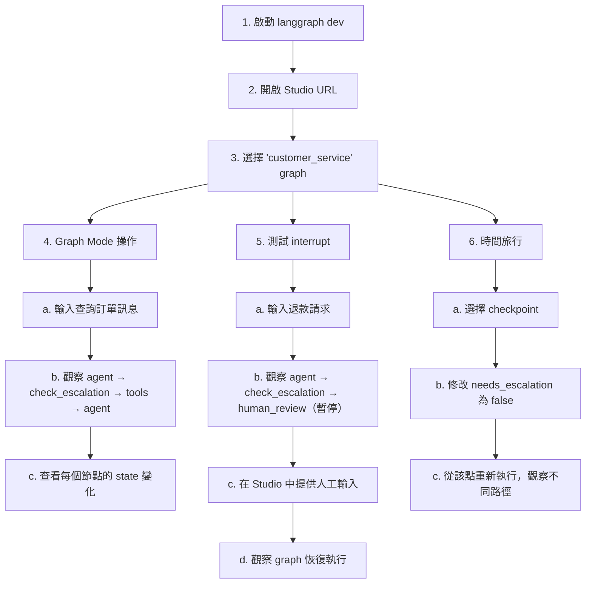

# 15.2 LangGraph Studio

## 目錄

1. [Studio 概觀](#1-studio-概觀)
2. [安裝與連接](#2-安裝與連接)
3. [連接本地 Graph](#3-連接本地-graph)
4. [連接已部署的 Graph](#4-連接已部署的-graph)
5. [Graph Mode：視覺化除錯](#5-graph-mode視覺化除錯)
6. [Chat Mode：互動測試](#6-chat-mode互動測試)
7. [State 轉換觀察](#7-state-轉換觀察)
8. [完整使用流程範例](#8-完整使用流程範例)

---

## 1. Studio 概觀

### 什麼是 LangGraph Studio

LangGraph Studio 是一個**專門為 agent 開發設計的 IDE**，提供視覺化、互動式、除錯功能。它不是一般的 code editor，而是讓你能「看見」agent 內部運作的專用工具。

```
┌─────────────────────────────────────────────────────────┐
│                   LangGraph Studio                       │
│                                                          │
│  ┌───────────────┐  ┌────────────────────────────────┐  │
│  │ Graph         │  │  Execution Panel               │  │
│  │ Visualization │  │                                │  │
│  │               │  │  ┌─────────────────────────┐   │  │
│  │  [START]      │  │  │ Input                   │   │  │
│  │     |         │  │  │ {"messages": [...]}     │   │  │
│  │  [agent]      │  │  └─────────────────────────┘   │  │
│  │   / \         │  │                                │  │
│  │  /   \        │  │  ┌─────────────────────────┐   │  │
│  │[tools][END]   │  │  │ State at each step      │   │  │
│  │  \   /        │  │  │ { messages: [...],      │   │  │
│  │   \ /         │  │  │   tool_calls: [...] }   │   │  │
│  │  [agent]      │  │  └─────────────────────────┘   │  │
│  │     |         │  │                                │  │
│  │   [END]       │  │  ┌─────────────────────────┐   │  │
│  │               │  │  │ Output                  │   │  │
│  │               │  │  │ Final response          │   │  │
│  └───────────────┘  │  └─────────────────────────┘   │  │
│                     └────────────────────────────────┘  │
└─────────────────────────────────────────────────────────┘
```

### 核心功能

| 功能 | 說明 |
|------|------|
| **Graph 架構視覺化** | 即時呈現節點與邊的結構 |
| **互動式執行** | 直接在 UI 中輸入、執行、觀察 |
| **State 觀察** | 每個節點的輸入/輸出 state |
| **Thread 管理** | 建立、切換、管理對話 thread |
| **時間旅行** | 回溯到任意 checkpoint 觀察 state |
| **Prompt 迭代** | 在 UI 中修改 prompt 並即時測試 |
| **Dataset 整合** | 將 run 加入 LangSmith dataset |
| **記憶體管理** | 檢視與管理 long-term memory |

---

## 2. 安裝與連接

### 前置需求

```
┌──────────────────────────────────────────┐
│          Studio 前置需求                  │
│                                           │
│  1. LangSmith 帳號（免費註冊）           │
│  2. LangGraph CLI 已安裝                 │
│  3. Agent Server 運行中（本地或已部署）   │
└──────────────────────────────────────────┘
```

### 安裝 CLI

```bash
pip install langgraph-cli
```

---

## 3. 連接本地 Graph

### 步驟一：準備應用程式

```python
"""
agent.py — 供 Studio 連接的範例 agent
"""
from typing import Annotated, Literal
from typing_extensions import TypedDict
from langchain_openai import ChatOpenAI
from langchain_anthropic import ChatAnthropic
from langchain_core.messages import AnyMessage
from langchain_core.tools import tool
from langgraph.prebuilt import ToolNode
from langgraph.graph import StateGraph, MessagesState, START, END
from langgraph.graph.message import add_messages


@tool
def search(query: str) -> str:
    """搜尋相關資訊"""
    return f"搜尋結果：關於 '{query}' 的資訊。"


@tool
def calculator(expression: str) -> str:
    """計算數學表達式"""
    try:
        return str(eval(expression))
    except Exception as e:
        return f"錯誤: {e}"


tools = [search, calculator]
tool_node = ToolNode(tools)
# model = ChatOpenAI(model="gpt-4o-mini", temperature=0).bind_tools(tools)  # Set OPENAI_API_KEY in environment variables, you could create API key at https://platform.openai.com/settings/organization/api-keys
model = ChatAnthropic(model="claude-sonnet-4-5", temperature=0).bind_tools(tools)  # Set ANTHROPIC_API_KEY in environment variables, you could create API key at https://platform.claude.com/settings/keys


def should_continue(state: MessagesState) -> Literal["tools", "__end__"]:
    if state["messages"][-1].tool_calls:
        return "tools"
    return "__end__"


def call_model(state: MessagesState) -> dict:
    response = model.invoke(state["messages"])
    return {"messages": [response]}


# 建構 graph
workflow = StateGraph(MessagesState)
workflow.add_node("agent", call_model)
workflow.add_node("tools", tool_node)
workflow.add_edge(START, "agent")
workflow.add_conditional_edges("agent", should_continue)
workflow.add_edge("tools", "agent")

# 編譯（不需 checkpointer，Agent Server 會自動處理）
graph = workflow.compile()
```

> 📄 完整範例程式碼：[15.2-example-studio-agent.py](./15.2-example-studio-agent.py)

### 步驟二：設定 langgraph.json

```json
{
    "dependencies": ["."],
    "graphs": {
        "agent": "./agent.py:graph"
    },
    "env": ".env"
}
```

### 步驟三：啟動並開啟 Studio

```bash
# 啟動本地 Agent Server
langgraph dev

# 輸出會包含 Studio URL：
# Ready at http://localhost:2024
# Studio: https://smith.langchain.com/studio/?baseUrl=http://localhost:2024
```

```
連接流程：

┌──────────┐   langgraph dev   ┌──────────────┐
│ Terminal  │ ───────────────> │ Agent Server │
└──────────┘                   │ :2024        │
                               └──────┬───────┘
                                      │ HTTP
                               ┌──────┴───────┐
                               │   Studio     │
                               │  (瀏覽器)    │
                               └──────────────┘
```

---

## 4. 連接已部署的 Graph

### 方式一：從 LangSmith Deployments 頁面

```
步驟：
1. 登入 LangSmith
2. 左側選單 → Deployments
3. 選擇目標 deployment
4. 點擊右上角 "Studio" 按鈕
5. Studio 自動連接到該 deployment
```

### 方式二：使用 URL 直接連接

```
https://smith.langchain.com/studio/?baseUrl=<DEPLOYMENT_URL>
```

### Studio 連接架構

```
┌─────────────────────────────────────────────────┐
│                Studio 連接方式                    │
│                                                  │
│  ┌──────────┐                                    │
│  │ 本地開發  │──> langgraph dev ──> localhost:2024│
│  └──────────┘                                    │
│                                                  │
│  ┌──────────┐                                    │
│  │ Cloud    │──> LangSmith UI ──> deployment URL │
│  │ 部署     │                                    │
│  └──────────┘                                    │
│                                                  │
│  ┌──────────┐                                    │
│  │Self-hosted│──> 手動輸入 URL ──> server URL    │
│  │ 部署     │                                    │
│  └──────────┘                                    │
└─────────────────────────────────────────────────┘
```

---

## 5. Graph Mode：視覺化除錯

### 功能概覽

Graph Mode 提供完整的除錯功能，適合開發和調試：

```
┌──────────────────────────────────────────────────────┐
│  Graph Mode 功能                                      │
│                                                       │
│  ┌─────────────┐  ┌───────────────────────────────┐  │
│  │ Graph Panel  │  │ Execution Panel               │  │
│  │             │  │                               │  │
│  │ 顯示完整的  │  │ 1. 輸入訊息                   │  │
│  │ 節點與邊    │  │ 2. 選擇 Thread                │  │
│  │ 結構        │  │ 3. 執行                       │  │
│  │             │  │ 4. 觀察每個 node 的           │  │
│  │ 執行時高亮  │  │    state 變化                 │  │
│  │ 當前節點    │  │ 5. 時間旅行到任意             │  │
│  │             │  │    checkpoint                 │  │
│  └─────────────┘  └───────────────────────────────┘  │
│                                                       │
│  ┌───────────────────────────────────────────────┐   │
│  │ State Inspector                                │   │
│  │                                                │   │
│  │ 顯示當前 checkpoint 的完整 state：             │   │
│  │ - messages: [HumanMessage, AIMessage, ...]     │   │
│  │ - tool_calls: [{name, args, id}, ...]          │   │
│  │ - metadata: {step, source, writes}             │   │
│  └───────────────────────────────────────────────┘   │
└──────────────────────────────────────────────────────┘
```

### Graph Mode 的主要操作

| 操作 | 說明 |
|------|------|
| **執行 Graph** | 輸入初始 state，執行完整 graph |
| **觀察節點** | 點擊任意節點查看其 input/output |
| **時間旅行** | 選擇歷史 checkpoint 回溯 |
| **修改 State** | 手動更新 state 並從該點繼續執行 |
| **Fork** | 從歷史 checkpoint 分叉出新的執行路徑 |
| **加入 Dataset** | 將當前 run 加入 LangSmith dataset |
| **Interrupt 處理** | 在 interrupt 暫停點提供人類輸入 |

---

## 6. Chat Mode：互動測試

### 功能概覽

Chat Mode 提供簡化的聊天介面，適合測試 chat-based agent：

```
┌──────────────────────────────────────┐
│  Chat Mode                            │
│                                       │
│  ┌──────────────────────────────────┐│
│  │                                   ││
│  │  User: 台北天氣如何？             ││
│  │                                   ││
│  │  Agent: 台北今天 28 度，          ││
│  │         多雲時晴，適合外出。      ││
│  │                                   ││
│  │  User: 幫我計算 123 * 456         ││
│  │                                   ││
│  │  Agent: 123 * 456 = 56,088       ││
│  │                                   ││
│  └──────────────────────────────────┘│
│                                       │
│  ┌──────────────────────────────────┐│
│  │ [輸入框]              [Send]     ││
│  └──────────────────────────────────┘│
│                                       │
│  Thread: abc-123   Assistant: agent   │
└──────────────────────────────────────┘
```

### 適用條件

> Chat Mode 僅支援 state 包含或繼承 `MessagesState` 的 graph。

### Graph Mode vs Chat Mode

| 面向 | Graph Mode | Chat Mode |
|------|-----------|-----------|
| **適合對象** | 開發者 | 開發者 / 業務人員 |
| **顯示內容** | 完整節點執行細節 | 對話歷史 |
| **State 觀察** | 每個節點的完整 state | 僅 messages |
| **時間旅行** | 支援 | 不支援 |
| **適用 graph** | 所有 graph | 限 MessagesState |
| **使用場景** | 除錯、開發 | 使用者體驗測試 |

---

## 7. State 轉換觀察

### 觀察 State 變化

Studio 讓你能精確觀察每個節點如何修改 state：

```
Checkpoint 0 (START)
┌────────────────────────────────────┐
│ state: {                            │
│   messages: [                       │
│     HumanMessage("台北天氣如何？")  │
│   ]                                 │
│ }                                   │
│ next: ("agent",)                    │
└────────────────────────────────────┘
                │
                v
Checkpoint 1 (after "agent" node)
┌────────────────────────────────────┐
│ state: {                            │
│   messages: [                       │
│     HumanMessage("台北天氣如何？"), │
│     AIMessage(                      │
│       tool_calls=[{                 │
│         name: "get_weather",        │
│         args: {city: "台北"}        │
│       }]                            │
│     )                               │
│   ]                                 │
│ }                                   │
│ next: ("tools",)                    │
└────────────────────────────────────┘
                │
                v
Checkpoint 2 (after "tools" node)
┌────────────────────────────────────┐
│ state: {                            │
│   messages: [                       │
│     HumanMessage("台北天氣如何？"), │
│     AIMessage(tool_calls=[...]),    │
│     ToolMessage(                    │
│       content: "28度，多雲時晴"     │
│     )                               │
│   ]                                 │
│ }                                   │
│ next: ("agent",)                    │
└────────────────────────────────────┘
                │
                v
Checkpoint 3 (after "agent" node - final)
┌────────────────────────────────────┐
│ state: {                            │
│   messages: [                       │
│     HumanMessage("台北天氣如何？"), │
│     AIMessage(tool_calls=[...]),    │
│     ToolMessage("28度，多雲時晴"),  │
│     AIMessage(                      │
│       "台北今天28度，多雲時晴！"    │
│     )                               │
│   ]                                 │
│ }                                   │
│ next: ()  ← 執行完成                │
└────────────────────────────────────┘
```

### 時間旅行除錯

```python
"""
時間旅行除錯的概念
在 Studio 中可以透過 UI 操作，
以下展示等效的 SDK 操作
"""
from langgraph_sdk import get_sync_client

client = get_sync_client(url="http://localhost:2024")

# === 取得 Thread 的完整 State 歷史 ===
thread_id = "your-thread-id"
config = {"configurable": {"thread_id": thread_id}}

# 取得所有 checkpoints
history = client.threads.get_history(thread_id)

for checkpoint in history:
    print(f"Step: {checkpoint['metadata'].get('step', '?')}")
    print(f"  Next: {checkpoint.get('next', [])}")
    print(f"  Values: {list(checkpoint.get('values', {}).keys())}")
    print()

# === 從特定 checkpoint 恢復（Fork） ===
# 在 Studio 中，你可以點擊任一 checkpoint
# 然後修改 state 並從該點重新執行
# 這等同於「如果那一步做了不同的決定，會發生什麼？」
```

---

## 8. 完整使用流程範例

### 情境：開發一個客服 Agent

```python
"""
完整的開發流程：
1. 建立 Agent
2. 用 Studio 視覺化除錯
3. 修改並迭代
"""
from typing import Literal
from typing_extensions import TypedDict
from langchain_openai import ChatOpenAI
from langchain_anthropic import ChatAnthropic
from langchain_core.tools import tool
from langgraph.prebuilt import ToolNode
from langgraph.graph import StateGraph, MessagesState, START, END
from langgraph.types import interrupt, Command


# === 工具 ===
@tool
def lookup_order(order_id: str) -> str:
    """查詢訂單狀態"""
    orders = {
        "ORD-001": "已出貨，預計明天送達",
        "ORD-002": "處理中，預計 3 天內出貨",
    }
    return orders.get(order_id, f"找不到訂單 {order_id}")


@tool
def create_ticket(issue: str, priority: str = "normal") -> str:
    """建立客服工單"""
    return f"已建立工單 TK-{hash(issue) % 10000:04d}（優先度：{priority}）"


tools = [lookup_order, create_ticket]
tool_node = ToolNode(tools)
# model = ChatOpenAI(model="gpt-4o-mini", temperature=0).bind_tools(tools)  # Set OPENAI_API_KEY in environment variables, you could create API key at https://platform.openai.com/settings/organization/api-keys
model = ChatAnthropic(model="claude-sonnet-4-5", temperature=0).bind_tools(tools)  # Set ANTHROPIC_API_KEY in environment variables, you could create API key at https://platform.claude.com/settings/keys


# === State ===
class CustomerServiceState(MessagesState):
    needs_escalation: bool


# === Nodes ===
def agent(state: CustomerServiceState) -> dict:
    response = model.invoke(state["messages"])
    return {"messages": [response]}


def check_escalation(
    state: CustomerServiceState,
) -> Command[Literal["tools", "human_review", "__end__"]]:
    last_msg = state["messages"][-1]

    if hasattr(last_msg, "tool_calls") and last_msg.tool_calls:
        return Command(goto="tools")

    # 檢查是否需要人工介入
    content = getattr(last_msg, "content", "")
    if "退款" in content or "投訴" in content:
        return Command(
            update={"needs_escalation": True},
            goto="human_review",
        )
    return Command(goto="__end__")


def human_review(state: CustomerServiceState) -> dict:
    """人工審核節點 — 在 Studio 中會暫停等待輸入"""
    decision = interrupt({
        "message": "此對話需要人工審核",
        "conversation": [
            getattr(m, "content", str(m)) for m in state["messages"][-3:]
        ],
        "action": "請決定如何處理（approve / escalate / reject）",
    })

    if decision.get("action") == "approve":
        return {
            "messages": [
                {"role": "assistant", "content": "您的請求已獲得核准，我們會盡快處理。"}
            ]
        }
    elif decision.get("action") == "escalate":
        return {
            "messages": [
                {"role": "assistant", "content": "已將您的問題轉交給資深客服人員。"}
            ]
        }
    return {
        "messages": [
            {"role": "assistant", "content": "感謝您的耐心，我們正在處理您的請求。"}
        ]
    }


# === 建構 Graph ===
workflow = StateGraph(CustomerServiceState)
workflow.add_node("agent", agent)
workflow.add_node("check_escalation", check_escalation)
workflow.add_node("tools", tool_node)
workflow.add_node("human_review", human_review)

workflow.add_edge(START, "agent")
workflow.add_edge("agent", "check_escalation")
workflow.add_edge("tools", "agent")
workflow.add_edge("human_review", END)

graph = workflow.compile()
```

> 📄 完整範例程式碼：[15.2-example-customer-service.py](./15.2-example-customer-service.py)

### 搭配 langgraph.json

```json
{
    "dependencies": ["."],
    "graphs": {
        "customer_service": "./agent.py:graph"
    },
    "env": ".env"
}
```

### Studio 使用流程

```
1. 啟動 → langgraph dev
2. 開啟 Studio URL
3. 選擇 "customer_service" graph

4. Graph Mode 操作：
   a. 輸入：{"messages": [{"role": "user", "content": "查詢訂單 ORD-001"}]}
   b. 觀察 agent → check_escalation → tools → agent 的執行流程
   c. 查看每個節點的 state 變化

5. 測試 interrupt：
   a. 輸入：{"messages": [{"role": "user", "content": "我要退款！"}]}
   b. 觀察 agent → check_escalation → human_review（暫停）
   c. 在 Studio 中提供人工輸入：{"action": "approve"}
   d. 觀察 graph 恢復執行

6. 時間旅行：
   a. 選擇 "check_escalation" 之後的 checkpoint
   b. 修改 needs_escalation 為 false
   c. 從該點重新執行，觀察不同路徑
```

> Mermaid 語法版本：



---

## 重點摘要

| 概念 | 重點 |
|------|------|
| **Studio** | 專為 agent 設計的視覺化 IDE，免費使用 |
| **Graph Mode** | 完整除錯功能：節點追蹤、state 觀察、時間旅行 |
| **Chat Mode** | 簡化聊天介面，適合測試 MessagesState-based agent |
| **連接本地** | `langgraph dev` 啟動後，Studio 自動提供連接 URL |
| **連接部署** | 從 LangSmith Deployments 頁面一鍵開啟 |
| **State 觀察** | 每個 checkpoint 都可查看完整 state 快照 |
| **時間旅行** | 從任意 checkpoint 回溯、fork、重新執行 |
| **Interrupt** | 在 Studio 中可直接處理 human-in-the-loop 暫停點 |

## 參考資源

- [LangSmith Studio](https://docs.langchain.com/langsmith/studio)
- [LangGraph Studio Quick Start](https://docs.langchain.com/langsmith/quick-start-studio)
- [Studio for LangGraph](https://docs.langchain.com/oss/python/langgraph/studio)
